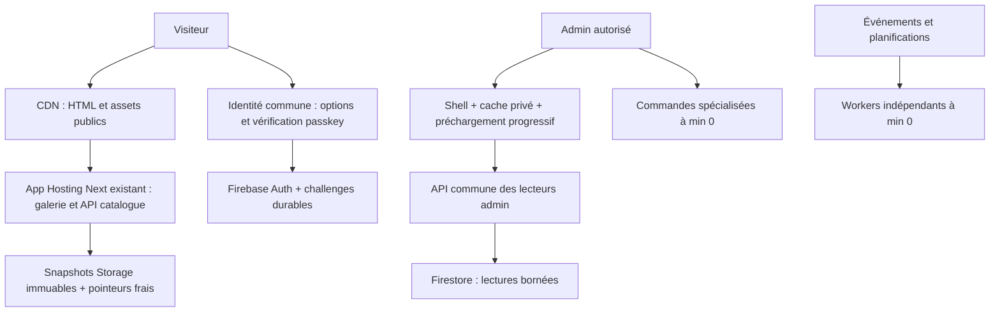

# Plan proposé — services partagés et premiers accès rapides

**Remplacé après clarification du budget par le [plan à un seul service public chaud](PLAN_PUBLIC_CHAUD.md).**
Le texte ci-dessous conserve les variantes initialement étudiées ; les deux
socles chauds et l'identité chaude séparée ne sont plus la cible proposée.

Statut : **proposition, non implémentée et non déployée**. Base factuelle et
prix dans le [rapport](README.md), destinations provisoires dans
[l'inventaire exhaustif](INVENTAIRE.md). Aucun changement de production prévu.

## Architecture et choix de budget

Ce dessin préserve trois frontières mais n'impose pas trois instances chaudes.

| Variante | Next | Identité fusionnée | API lecteurs admin | Socle approximatif |
|---|---|---|---|---:|
| Budget minimal | min 0, CDN | min 1 | min 0, préchargée | 9,86 $/mois |
| Priorité première galerie | min 1 | min 1 | min 0, préchargée | 19,71 $/mois |
| Public et admin tous deux chauds | Next + identité dans le même runtime, min 1 | incluse, si frontière commune validée | min 1 | 19,71 $/mois |

Hypothèse 1 CPU/512 MiB par service chaud, repos sans franchises ni activité.
Si conserver une identité isolée ET un admin chaud ET Next chaud est exigé,
il y aurait trois socles (~29,57 $), pas deux. Ne pas masquer ce coût.

Les paiements Stripe, signatures webhook, PDF, images, emails, OAuth Meta,
changements de droits et reconstructions catalogue restent séparés au début.
Ils ont des secrets, comptes techniques et durées différents. Le dossier
`functions/index.js` ou une codebase Firebase unique ne suffit pas à mutualiser
les instances. Une application HTTP multi-routes le permet, en exécutant les
handlers sur place. [Support Express dans Functions](https://firebase.google.com/docs/functions/http-events).

## Lot 0 — contrat et mesures comparables

- Photographier le Git livré, la révision servant le trafic, les min/max CPU
  mémoire et IAM avant chaque intervention ; enregistrer un rollback précis.
- Distinguer opérations logiques, OPTIONS et HTTP rejetées dans les tableaux.
  Mesurer démarrage, vérification Auth/App Check/AAL2, Firestore, fournisseurs,
  sérialisation et durée totale. Logs structurés sans données client ; identifiant
  d'opération fixe pour éviter des labels de métriques non bornés.
- Sur le client : temps shell utilisable, données utiles, origine de cache,
  octets et LCP/INP. Aucune donnée admin absente assimilée à zéro.
- Comparer premier accès après repos, répétition, navigation retour et
  simultanéité de plusieurs admins. Mesures après changement sur même jeu
  de données et réseau comparable, en distinguant chaud/froid.

Sortie : baseline reproductible. Le rapport présent constitue la baseline
infrastructure, pas une baseline complète de performance navigateur.

## Lot 1 — cache public et travail répété

Points d'entrée : `materializedCatalog.js`, `materializedCatalogValidation.cjs`,
`api/catalog/version`, `GalleryRoutePage`, `GalleryServerView`,
`CatalogVersionSyncIsland`, `GalleryGridActionsIsland`.

- Mémoriser la validation des releases immuables après succès, par chemin et
  empreinte, avec taille maximale ; mutualiser les promesses en cours.
  Ne jamais mémoriser une erreur durablement ni rendre périmé un pointeur.
- Étudier un contrat version léger validé lors de publication ; choisir entre
  cela et la mémoïsation précédente après mesure. Préserver l'ETag existant,
  fallback et confirmation de disponibilité effective. Ne pas mettre un TTL
  long sur `current`, `previous`, `last-known-good`.
- Mesurer ce qui compose les 798 ko d'HTML et les scripts initiaux ; réduire
  les répétitions et différer les îlots non nécessaires à l'interaction initiale.
  Conserver le rendu SSR visible, les variantes d'images, focus et scroll mobile.
- Borner l'anticipation aux produits visibles/intention de clic ; respecter
  SaveData et réseau. Ne pas télécharger toute la galerie « pour chauffer ».
- Vérifier cache CDN sur `/`, catégories, produits, assets et invalidation
  après publication/rollback. Une réponse privée ou personnalisée reste no-store.

Tests : intégrité release, changement de pointeur, corruption + secours,
publication simultanée, ETag 304, invalidation, retour produit ; comparaison
poids et navigation réelle après autorisation du lot de construction.

## Lot 2 — lecteurs admin dans un service

Commencer par les huit lecteurs qui expliquent les captures : ventes, devis,
retours physiques, demandes de retour, factures, liens, promotions, livraison.
Puis intégrer les autres lecteurs du groupe B après vérification des droits.

- Extraire des handlers métier indépendants du transport, sans importer le
  graphe `functions/index.js`, Stripe, PDF ou email pour une simple liste.
- Exécuter directement les handlers dans une API admin ; une route proxy
  appelant l'ancienne Function ne remplit pas l'objectif.
- Reproduire les contrôles existants : token Auth valide, App Check, claim ET
  registre actif, session AAL2, bornes de pagination, formats d'erreur et audit.
  En HTTP ordinaire, `enforceAppCheck` du wrapper callable n'est plus automatique.
- Un appel de lecture Liens ne doit pas exiger des secrets Stripe/HMAC inutiles
  au lecteur ; vérifier le code avant retrait du contrat. Un compte technique
  lecteur n'acquiert pas les privilèges de remboursement/administration Auth.
- Conserver le cache privé de session et son invalidation après mutation,
  changement d'utilisateur, retrait de droits. Aucune Map serveur globale
  indifférenciée contenant des données d'admins différents.
- Réutiliser la file locale déjà préparée : Stats d'abord, Data puis ventes,
  retours, devis, factures, liens et promos. Un job à la fois, pause hors ligne/
  caché/SaveData, clic prioritaire. Ce mécanisme prépare des données utiles ;
  aucune boucle de ping de maintien à chaud.

Départ : min 0, 1 CPU, 512 MiB, concurrence 8, max 2 proposés et à qualifier.
Le premier lecteur réchauffe le service commun pour les suivants. L'instance
peut néanmoins s'arrêter après inactivité. Réévaluer min 1 uniquement si le
premier accès admin reste gênant et si le budget l'autorise.

Tests : contrats de réponses/cursors, refus anonyme/client, registre retiré,
session faible, App Check absent, déduplication et invalidation, concurrence
de lectures/mutations. Vérifier qu'aucun export/PDF/historique massif ne part
au simple survol ou préchargement.

## Lot 3 — identité mutualisée

Déplacer les deux handlers passkey authentication dans une application commune,
en conservant `auth-login-runtime`, vérification WebAuthn locale, origines/RP,
challenges à usage unique, compteur, idempotence et `loginWithCustomToken` avant
succès client. Les handlers sont déjà exportés séparément du transport dans
`functions/src/auth/passkeys.js` : point d'extraction naturel, pas preuve de
compatibilité immédiate d'une nouvelle API.

Les opérations registration et OTP ne sont pas ajoutées automatiquement : OTP
implique transport mail et secrets, registration une autre identité technique.
Les intégrer seulement après comparaison de droits, dépendances et mémoire.
Google Sign-In et le service Firebase Auth géré ne deviennent pas des handlers
que nous pouvons déplacer dans notre instance.

Départ proposé : min 1, 1 CPU/512 MiB, concurrence 8, max 2, facturation requête.
Mettre les deux anciennes Functions à min 0 après bascule et observation,
en conservant temporairement leur compatibilité pour les clients anciens.
Sinon la nouvelle instance s'ajoute aux deux anciennes dans la facture.

Tests : login local WebAuthn complet, échec origine/challenge, répétition
concurrente, compte sans passkey, idempotence, création custom token avec le
compte technique livré. Ne pas demander de PIN ou secret dans le chat.

## Lot 4 — décision sur les deux socles

Pour le budget minimal, terminer après lots 1–3 et mesurer le premier accès.
Si la priorité est « la première galerie ne doit pas attendre le démarrage »,
passer App Hosting à min 1 dans sa configuration gérée, sans modifier directement
une révision que le prochain rollout écraserait. Garder max 10 au départ et
surveiller l'activité ; min 1 ne signifie pas réserver 10 instances.

Pour la cible public+admin : porter les handlers identité dans Next uniquement
après revue du périmètre IAM commun et des secrets. Garder les routes de login
dynamiques no-store, les pages publiques statiques sans lecture de cookies
serveur, et les checks d'App Check/origine/tokens intacts. Si l'isolation reste
nécessaire, choisir la variante trois frontières / deux socles ; ne pas appeler
discrètement l'ancien service identité chaud et annoncer un total de deux.

## Monitoring et montée en charge

À mettre en place, **aucune alerte créée par l'audit** :

| Indicateur | Décision / seuil initial proposé |
|---|---|
| Latence p50/p95 par opération et chaud/froid | Lecteurs chauds : viser p95 < 800 ms ; alerter si > 1 s sur 15 min avec au moins 30 mesures |
| Attente et erreurs | Détecter 429, 5xx et file d'attente ; seuil d'alerte 5xx > 1 % avec minimum de volume |
| CPU et concurrence | Croiser CPU > 60 % durable, occupation et p95 avant augmentation ; laisser autoscaling créer les répliques |
| Mémoire / OOM | Alerte à 75 % durable ; augmenter RAM ou réduire concurrence/empreinte avant les OOM |
| CDN | Taux HIT/MISS, octets et attente origine par famille de routes publiques |
| Dépendances | Temps et quantité de lectures Firestore, latence Storage/Auth/Stripe, reprises de tâches |
| Coût | Temps facturable, nombre d'instances, trafic réseau, budget mensuel et anomalies ; alerte budget ≠ plafond dur |

Les seuils sont des points de départ, pas des mesures actuelles ou engagements
déjà satisfaits. Sur faible trafic, regarder aussi chaque parcours lent : un
p95 calculé sur quelques requêtes n'est pas stable.

Une réplique supplémentaire exécute toutes les routes de son service. Google
répartit les requêtes entre répliques ; on n'affecte pas « ventes à instance 1,
retours à instance 2 ». Les Maps mémoire ne sont pas partagées entre instances :
les caches doivent rester reconstructibles, les verrous/challenges/états métier
durables et transactions idempotentes.

Avant augmenter maxInstances : test de charge sandbox borné en **lecture**,
par paliers 1/4/8/16 requêtes simultanées, arrêt sur erreurs ou dégradation,
aucun achat/remboursement/email. Vérifier la pression sur la base et non seulement
le CPU. Un max plus élevé est une permission de capacité supplémentaire, pas
une facture permanente, mais il autorise davantage de dépense sous charge.

## Bascule et retour arrière

Chaque lot doit avoir un déploiement ciblé explicitement autorisé. Conserver
anciens endpoints et formats durant la transition ; un drapeau de transport
permet de revenir aux anciens lecteurs. Ne pas lancer ancien et nouveau handler
en parallèle pour des écritures et ne pas rejouer automatiquement une mutation
financière ambiguë. Les comparaisons doubles sont réservées aux lectures sans
effets et bornées pour ne pas doubler durablement les coûts.

Après bascule : vérifier 100 % de la révision prévue, Auth/App Check, latences,
cache et coûts ; prouver que les anciens min 1 ont disparu. Retrait d'endpoints
uniquement après observation de clients anciens et autorisation distincte.
Rollback : transport précédent + révision précédente + configuration min/max
capturée, sans modifier les données métier.
