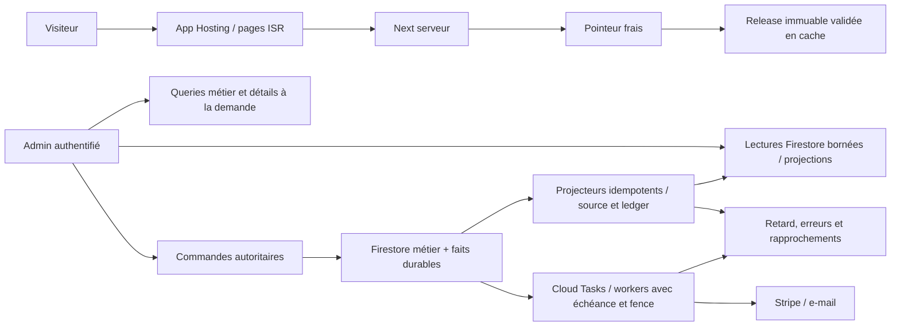

# Audit backend Firebase et Next.js — 5 septembre 2026

**Verdict : le socle mérite d’être conservé, mais il n’est pas encore possible
de qualifier toutes les données admin de fiables ni la capacité de suffisante
pour une montée en charge.**
Les gains prioritaires sont la correction de cinq défauts reproduits, la
réduction du travail chargé au démarrage et la simplification des chemins de
lecture. Une nouvelle migration générale ou un abandon de Firebase ne se
justifient pas par les preuves recueillies.

Statut : `AUDIT_LIVRE — CORRECTIONS_NON_IMPLEMENTEES`.
Auteur : revue d’architecture Codex, à la demande du propriétaire.
Code examiné : commit `2c6c5b4358bffbb04674ddc8b869e3239f74ff2d`, worktree
partagé avec des changements documentaires préexistants préservés.
Date française : 5 septembre ; lectures cloud réalisées le 4 septembre UTC,
autour de 21:55–22:10. Les dates UTC des fenêtres figurent dans les preuves.

Livrables : [plan proposé](PLAN_BACKEND_2026-09-05.md),
[inventaire expurgé](preuves/backend-2026-09-05-inventaire.json),
[reproductions exécutables](preuves/backend-2026-09-05-reproductions.cjs),
[méthode des prochains audits](README.md).

## 1. Ce que cet audit établit

### Périmètre et force des preuves

| Surface | Travail effectué | Limite |
| --- | --- | --- |
| Functions | Exports, wrappers Gen2, configuration réellement listée, chaîne d’imports, queues et schedulers | Les 161 implémentations n’ont pas toutes été exercées ; octets cloud non comparés aux archives source |
| Données admin | Stats, Data, sessions, commandes, retours, newsletter, factures, devis, Performance et badges | Pas de parcours navigateur dans cette campagne |
| Commerce | Lecture du chemin inbox → worker → effets transactionnels, outbox, réservations et requêtes admin ; tests métier/fautes/propriétés | Aucun paiement, remboursement, e-mail ou rejeu réel |
| Catalogue/Next | Pointeurs, releases, validation, builder, API catalogue/version, cache et autorisation API | Pas de build ni de mesure CDN/ISR hébergée nouvelle |
| Sécurité | Helpers Auth, API Next, Rules Firestore/Storage, purge des caches, IAM projet sélectionné, protection Firestore | Revue ciblée, pas audit de sécurité exhaustif ; Rules déployées non téléchargées ; pas de scan de dépendances |
| Coût/exploitation | Monitoring Firestore 24 h, logs de requêtes ciblés, inventaires TTL/index/queues/schedulers | Pas d’export Billing, attribution par collection ou test de charge |

Les scénarios de corruption ci-dessous sont démontrés **sur le code local avec
des dépendances en mémoire**. Ils ne prouvent pas une corruption actuelle des
données hébergées. Aucun contenu de commande/client n’a été téléchargé.

### Photographie vérifiée

| Élément | Observation |
| --- | --- |
| Packages installés | Next 16.3.0, React 19.2.7, Firebase Web 11.10.0, Admin 13.10.0 |
| Cible Node | 22 ; validations exécutées sous 22.23.2. Le `node` du shell est 26.7.0, et ne constitue pas la cible |
| Functions locales/cloud | 161 exports / 158 ressources cloud |
| Gen2 | 155, toutes listées `ACTIVE`, runtime Node 22 |
| Gen1 | `grantAdminOnAuth`, `onRegisteredUserCreated`, `onRegisteredUserDeleted` |
| CPU Gen2 | 136 ressources à CPU fractionnaire ; 19 à un CPU |
| Concurrence Gen2 | 154 à 1 ; traitement image à 4 |
| Plafond Gen2 | 152 à une instance ; statut catalogue et incidents système à 2 ; images à 4 |
| Instances minimales Gen2 | Aucun minimum positif remonté par l’inventaire |
| App Hosting | `secondevie-next-sandbox-build-2026-09-04-004`, trafic 100 %, min 0 / max 10, 1 CPU, 512 MiB, concurrence 80, startup CPU boost actif |
| Firestore | `(default)`, multirégion `eur3`, transactions `PESSIMISTIC`, PITR et protection de suppression activés |
| Index | 17 composites et 44 overrides dans le dépôt ; 45 configurations de champs listées côté cloud, sans comparaison exhaustive de chaque composite |
| TTL | 17 politiques actives ; nouvelles projections Data exemptées d’index, index `lastActivityAt DESC` des cartes `READY` |
| Schedulers EU | 10 jobs listés, tous activés ; outbox/réservations/catalogue de secours à 60 min, analytics à 15 min |

**Les trois Gen1 restantes ne sont pas une migration oubliée.** La documentation
Firebase précise que les triggers Auth de création/suppression concernés ne
sont pas supportés par les mêmes événements Gen2. Les conserver est cohérent.
[Firebase, triggers Auth](https://firebase.google.com/docs/functions/1st-gen/auth-events).

`europe-west1` est aussi une localisation cohérente avec Firestore `eur3` selon
la table officielle. Déplacer toutes les Functions vers App Hosting
`europe-west4` n’est donc pas une optimisation démontrée.
[Firebase, choix des régions](https://firebase.google.com/docs/functions/locations).

### Mesures de cette campagne

Monitoring projet, du **2026-09-03 21:59:41 UTC au 2026-09-04 21:59:41 UTC** :
17 857 lectures, 2 221 écritures et 21 suppressions remontées par les métriques
`firestore.googleapis.com/document/*_count`, une fenêtre agrégée, sans pagination
résiduelle. Ces volumes incluent l’activité du projet, pas seulement les
visiteurs ou l’admin. Ils ne permettent pas d’isoler les coûts de recette.

Logs HTTP ciblés, fenêtre de 24 h finissant à **22:01:10 UTC**, 131 lignes,
limite 5 000 non atteinte :

| Service / méthode | n | Médiane ms | p95 observé ms | Maximum ms |
| --- | ---: | ---: | ---: | ---: |
| Agrégateur sessions / POST Eventarc | 52 | 275,1 | 3 374,4 | 4 540,7 |
| Liste commandes / OPTIONS | 5 | 2 344,6 | — | 3 908,8 |
| Liste commandes / POST | 6 | 1 066,4 | — | 2 281,0 |
| Liste retours / OPTIONS | 1 | 2 559,3 | — | 2 559,3 |
| Liste retours / POST | 1 | 717,5 | — | 717,5 |
| Analytics admin / OPTIONS | 11 | 4,1 | — | 4 385,0 |
| Analytics admin / POST | 14 | 215,2 | — | 598,0 |
| Sync session / OPTIONS | 16 | 6,4 | — | 4 611,0 |
| Sync session / POST | 23 | 193,2 | 992,4 | 1 255,9 |

Ces p95 sont des statistiques descriptives d’un petit échantillon, **pas des
SLO établis**. Aucun p95 n’est calculé ici sous vingt observations. Les appels
ne sont pas corrélés individuellement aux journaux de démarrage ; leur maximum
ne permet donc pas d’affirmer « cold start confirmé ». La fenêtre traverse des
livraisons. Le délai Eventarc avant réception et le rendu navigateur ne sont pas
inclus. Les OPTIONS et POST de lignes différentes ne sont pas additionnés.
Le service beacon n’est pas couvert par cette extraction.

Analytics admin a 10 réponses POST 200 et 4 réponses 404, dont la cause n’a pas
été recherchée avec les payloads. Une seconde recherche de logs Cloud Run de
sévérité ERROR ou supérieure, fenêtre de 24 h finissant à 22:07:57 UTC, retourne
zéro ligne. Cela ne prouve ni absence d’erreurs applicatives silencieuses ni
absence de corruption de compteur.

## 2. Les points solides à préserver

- **Commerce autoritaire et transactionnel.** Les workers relisent les objets
  Stripe, vérifient le périmètre et appliquent les effets avec inbox, leases,
  faits, mouvements et outbox. Le worker ne confond pas paiement réussi et
  retour physique. Les tests de fautes couvrent déjà des reprises utiles.
  Sources : [webhookWorker](../../functions/src/commerce/domain/webhookWorker.js),
  [paymentEffectApplier](../../functions/src/commerce/domain/paymentEffectApplier.js),
  [refundEffectApplier](../../functions/src/commerce/domain/refundEffectApplier.js).
- **Catalogue public séparé de Firestore.** Les releases immuables, empreintes,
  publication CAS et pointeurs de secours évitent un accès métier par visite.
  Une panne de publication peut laisser servir une release saine.
- **Vraies projections admin.** Stats lit trois documents critiques ; Data
  deux agrégats et dix cartes. La finance conserve les centimes et les sources
  versionnées. Le projecteur de commandes relit la source et calcule son delta
  depuis le ledger : c’est le bon modèle à réutiliser ailleurs.
- **Données absentes contrôlées sur plusieurs vues.** Les agrégats Data et Stats
  sont validés et rejettent les régressions ; ce comportement doit être étendu
  aux exceptions identifiées en BA-12.
- **Droits serveur explicites.** Claim, registre actif, assurance de session,
  App Check pour les callables concernées et contrôle renforcé des API Next.
  Les signatures Stripe restent nécessaires, distinctes d’App Check.
- **Maintenance et stockage pensés.** Les queues ont des bornes ; les TTL
  anciens sont actifs ; les nouveaux histogrammes n’ont pas d’index inutiles ;
  les caches admin dédupliquent les requêtes en vol. PITR est réellement activé.

Le problème n’est donc pas « tout est mal conçu ». Il existe des traitements
robustes, mais leurs garanties ne sont pas uniformes sur tous les producteurs.

## 3. Registre des constats

P1 = correction importante de fiabilité ou de reprise ; P2 = optimisation,
limite de capacité ou cohérence d’interface. Le niveau ne signifie pas qu’un
incident a été observé en production.

| ID | Niveau / preuve | Constat | Moment recommandé |
| --- | --- | --- | --- |
| BA-01 | P1, reproduit | Badge Retours incorrect si les transitions arrivent dans le désordre | Avant qualification des compteurs admin |
| BA-02 | P1, reproduit | Compteur Newsletter confond absence de ledger et contact de baseline | Avant qualification Newsletter |
| BA-03 | P1, reproduit | Faits analytics historiques régressifs malgré le nouveau projecteur robuste | Avant confiance dans les insights |
| BA-04 | P1, reproduit + code | Beacon et sync peuvent écraser un état plus récent ; résultat négatif ignoré côté client | Avant qualification Data |
| BA-05 | P2, cloud + chargement local | Gen2 conserve presque partout une capacité sérielle et un chargement global lourd | Premier lot performance |
| BA-06 | P2, code | Projections analytics peu coûteuses à lire, mais plusieurs écritures globales et CPU par événement | Avant hausse de trafic |
| BA-07 | P2, code + TTL cloud | Auxiliaires Data durables sans cycle de compaction implémenté | Avant accumulation prolongée |
| BA-08 | P2, code | Lectures N+1, listes tronquées et chargements inutiles d’ateliers admin | Avant croissance du back-office |
| BA-09 | P1, reproduit + queue cloud | Outbox : échéance non contrôlée à la prise et reprise infra potentiellement lente | Avant qualification des e-mails |
| BA-10 | P2, code | La petite API de version valide encore tout le catalogue ; builder intégral | Performance public et grand catalogue |
| BA-11 | P2, code | Purge du cache admin attachée à l’UID d’un composant, pas à la durée réelle des droits | Durcissement du lecteur admin |
| BA-12 | P2, code | Absence/refus parfois présentés comme zéro/vide ; fraîcheur mal distinguée | Avant démonstration des métriques |
| BA-13 | P2, configuration | Exemptions d’index incomplètes sur les anciens faits et agrégats | Lot coût mesuré |

### BA-01 — Compter depuis le ledger, pas depuis le delta de l’événement

[actionSummaryProjection.js](../../functions/src/admin/actionSummaryProjection.js),
lignes 33–100 : `delta` est calculé avec `before/after`, puis un événement plus
ancien que `ledger.sourceUpdateTime` est ignoré. `ledger.active` est écrit mais
n’est pas utilisé pour calculer le delta suivant.

Reproduction : sept autres demandes en attente ; une huitième est créée puis
traitée. Eventarc livre la résolution avant la création. Le code applique `-1`
au total sept, puis ignore la création plus ancienne. **Résultat six, attendu
sept.** Si le total est zéro, l’underflow provoque une erreur/reprise au lieu
d’un compteur silencieusement faux. Concurrence 1 ne garantit pas l’ordre.

Corriger en calculant `contributionSourceCourante - contributionLedger` dans
la transaction, avec baseline explicite, version et tombstone. Le projecteur
`orderStats.js:178–224` est une référence locale plus solide. Tester toutes les
permutations création/traitement/suppression, les doublons et les reprises.
Réparer ensuite les compteurs existants avec comptage borné et contrôle de
version ; modifier le code seul ne répare pas une éventuelle dérive historique.

L’ordre n’est pas garanti et les événements peuvent être livrés plusieurs fois.
[Contrat officiel des triggers Firestore](https://firebase.google.com/docs/functions/firestore-events).

### BA-02 — La baseline Newsletter doit identifier ce qu’elle a déjà compté

[newsletterProjectionDomain.js](../../functions/src/newsletter/newsletterProjectionDomain.js),
lignes 28–30 ; [newsletterProjection.js](../../functions/src/newsletter/newsletterProjection.js),
lignes 58–66 ; [bootstrap](../../scripts/bootstrap-newsletter-summary-sandbox.cjs),
lignes 19–50.

Sans ledger, le domaine utilise `previousPresent` de l’événement. Le bootstrap
écrit uniquement le total, sans contributions individuelles. Cela permet un
retrait d’un contact préexistant, mais ne distingue pas ce contact d’un nouvel
abonnement dont la création n’a pas encore été traitée.

Reproduction : vingt contacts déjà comptés, un nouveau créé puis supprimé ;
suppression livrée en premier. **Résultat dix-neuf, attendu vingt.** Le test
existant vérifie la suppression d’un contact de baseline, pas ce cas ambigu.

Corriger avec une baseline reprenable et des ledgers de présence cohérents,
ou un mécanisme explicite prouvant l’appartenance à la baseline. Ne pas simplement
remplacer `previousPresent` par `false` : cela casserait les retraits de contacts
anciens non dotés de ledger. Séparer comptage initial et activation du projecteur
avec rattrapage des mutations survenues pendant le bootstrap.

### BA-03 — L’ancien producteur analytics reste moins robuste que le nouveau

[rollups.js](../../functions/src/analytics/rollups.js), lignes 381–419 et
1122–1153. La partie Data temps réel relit source/exclusion dans sa transaction.
La partie `materializeSessionFact`, en revanche, reçoit `after` de l’événement,
ne relit ni source ni exclusion et ne compare pas de version source. Son hash
déduplique un état identique, sans reconnaître un état ancien.

Reproduction : matérialiser une fermeture de 120 s, puis une ancienne fermeture
de 60 s. **Le fait et sa contribution repassent à 60 s.** Une livraison ancienne
après exclusion/suppression peut aussi recréer un fait, suivant l’ordre des
traitements. Cette seconde conséquence est déduite du chemin de code, pas
exercée contre le cloud.

Conséquence : Data peut être correcte tandis que les insights Stats et les
rollups historiques divergent. Le flag temps réel n’a pas supprimé le producteur
historique utilisé pour les vues produits/devis et l’archivage.

Corriger par lecture transactionnelle source/exclusion/ledger avec version,
tombstone et contribution absolue. Unifier les règles de correction des deux
circuits. Les HLL historiques uniquement incrémentaux méritent aussi un test de
correction d’identité : retirer une ancienne identité ne se réduit pas à ajouter
la nouvelle.

Autre limite vérifiée : un retrait de fait relit jusqu’à **2 001 faits du jour**
avant de refuser au-delà de 2 000, bien que seuls les faits du shard concerné
servent à la reconstruction (`rollups.js:437–469`). Pour grandir, requête par
jour **et shard**, puis reconstruction reprenable si nécessaire. Le plafond doit
protéger l’opération, pas bloquer définitivement une exclusion légitime.

### BA-04 — La version Firestore ne corrige pas un payload client régressif

[sessions.js](../../functions/src/analytics/sessions.js), lignes 308–342 et
435–459 ; [AnalyticsProvider.jsx](../../src/kit/shared/AnalyticsProvider.jsx),
lignes 225–271 et 411–450.

Les deux endpoints sync/beacon font un `update()` de compteurs absolus, durée,
parcours et état actif. Aucun numéro de séquence n’est comparé. Le verrou de
sync côté React n’englobe pas `sendBeacon`, envoyé à une autre Function.

Reproduction avec les vrais handlers et un stockage mémoire : fermeture beacon
à 120 s, puis arrivée d’un ancien heartbeat à 60 s. **État final : actif,
60 s**, au lieu de fermé, 120 s. Le timestamp Firestore est récent, mais la
donnée appliquée est ancienne. Le nouveau projecteur reproduit fidèlement cette
source incorrecte. Le finaliseur d’inactivité peut ne refermer la session que
35 à 50 minutes plus tard, selon le prochain passage à 15 minutes.

En outre, la callable renvoie parfois `{success:false}` ou `{missing:true}`
dans une réponse réussie ; le collecteur attend l’appel puis retourne `true`
sans vérifier `result.data`. Une session supprimée peut donc continuer à
envoyer des synchronisations sans se réinitialiser.

Corriger avec une génération de session et une séquence monotone partagée par
sync/beacon ; accepter transactionnellement les seuls messages plus récents,
sans empêcher une vraie reprise. Tester fermeture → reprise → ancien beacon,
multi-onglets et nouveau token. Le client doit traiter les résultats métier,
conserver le buffer utile et réinitialiser une session disparue. Cette transaction
ajoute éventuellement une lecture : c’est un coût de fiabilité à mesurer,
compensable par la suppression d’une lecture d’autorisation redondante.

### BA-05 — Réduire le démarrage et choisir la capacité par charge

[functions/index.js](../../functions/index.js),
[gen2G8.js](../../functions/src/commerce/gen2G8.js):3–37,
[gen2G9.js](../../functions/src/commerce/gen2G9.js):23–35.
L’entrée importe immédiatement tous les domaines ; les wrappers chargent encore
les modules historiques et leurs définitions de Functions pour appeler `.run()`.

Mesure locale sous Node 22.23.2, réseau interdit,
`FUNCTION_TARGET=listOrdersAdminV2Gen2` : **1 735 modules chargés, 836 ms et
153 MiB RSS** pour importer l’entrée, sans servir de requête. Stripe, Sharp,
jsPDF, Nodemailer, WebAuthn et Cloud Logging sont tous chargés. C’est un
échantillon local avec cache disque possible, pas une durée de cold start cloud.
Le flag `FUNCTION_TARGET` ne restreint pas actuellement les imports.

Proposition première : conserver les exports de déploiement mais séparer les
handlers métier de leurs décorateurs, différer les dépendances lourdes jusqu’au
domaine qui les utilise, puis mesurer le graphe de chaque cible. Déplacer un
import dans le premier handler sans réduire le graphe total ne fait que déplacer
l’attente ; le gain vient du travail devenu inutile et supprimé.
[Firebase, initialisation et dépendances](https://firebase.google.com/docs/functions/tips).

Le CPU fractionnaire désactive la multiconcurrence. Un CPU entier peut permettre
de partager une instance pendant les attentes Firestore/Stripe ; **cela peut
rester avec `minInstances:0`**. La facture dépend alors du CPU, de la durée,
de la mémoire et du partage effectif, pas seulement du minimum d’instances.
[Firebase, capacité des Functions](https://firebase.google.com/docs/functions/manage-functions).

Cohortes proposées pour mesure, pas valeurs à déployer en bloc : lecteurs admin
à 1 CPU / concurrence 8–16 / max 2–3 ; checkout sur un budget distinct après
tests de concurrence ; projecteurs seulement après correction des contentions ;
SMTP avec concurrence cohérente avec son pool de deux connexions ; images
séparées. Ne pas transférer mécaniquement la concurrence 80 de Next aux Functions.

Un service avec une instance, une requête simultanée et une durée moyenne `t`
ne traite durablement qu’environ `1/t` requêtes/s, avant marge et variabilité.
C’est une relation de capacité, pas une prédiction à partir des petites séries
ci-dessus. `maxInstances:1` protège un plafond de ressources mais peut déplacer
le coût vers attente, refus et reprises. Il ne garantit pas un budget en euros.

### BA-06 — Compter le travail des producteurs, pas seulement les deux lectures Data

[liveSessions.js](../../functions/src/analytics/liveSessions.js):41–64,
[realtime.js](../../functions/src/analytics/realtime.js):142–200,
[rollups.js](../../functions/src/analytics/rollups.js):1122–1153.

Opérations applicatives nominales, hors reprises, index et lecteurs :

| Événement | Lectures du projecteur | Écritures du projecteur |
| --- | ---: | ---: |
| Heartbeat actif, carte seule modifiée | 4 | 1 |
| Parcours actif modifié, mêmes KPI | 4 | jusqu’à 2 |
| Création non-admin, circuit realtime actif | 4 + 11 | 2 + 8 |
| Fermeture avec contribution modifiée, même période | 4 + 11 + 2 historiques | jusqu’à 2 + 8 + 2 |
| Rejeu du projecteur carte à état identique | 4 | 0 |

Ajouter l’écriture de `analytics_sessions`, l’éventuelle lecture du sync token,
les invocations et les lectures des listeners. Les onze lectures realtime sont
contrôle + source + exclusion + ledger + deux résumés + cinq buckets ; les huit
écritures sont deux résumés + cinq buckets + ledger. Les événements d’exclusion
ou de changement de date peuvent suivre d’autres branches.

Le filtre de heartbeat évite le calcul KPI, mais **pas** les quatre lectures
de `projectLiveSession`, exécuté avant le filtre. Le cache d’autorisation dure
60 s, comme l’intervalle de heartbeat : sur une visite sans autre action, sa
réutilisation au heartbeat suivant n’est pas acquise. Allonger arbitrairement
un cache d’autorisation n’est pas la correction proposée.

La transaction KPI écrit toujours les deux mêmes résumés, et les buckets
mois/année partagés. Elle décompresse/recompresse des histogrammes et parcourt
1 024 × 63 rangs par bucket. Ajouter des instances ne supprime pas ces points
de contention ; cela peut augmenter les reprises transactionnelles.

Propositions graduées : fusionner les lectures source/exclusion des projecteurs
compatibles ; distinguer présence de changements métier ; conserver le détail
au clic ; fermer les écoutes d’historique lorsque leur bénéfice n’est plus utile ;
puis, si la charge le demande, contributions shardées et publication des résumés
regroupée sur une courte fenêtre. La fenêtre cible 1–5 s est un compromis proposé,
pas une garantie actuelle. Finances, commandes et alertes urgentes n’adoptent pas
cette tolérance analytics par contagion.

Les listeners sont partagés entre onglets admin internes : bon pour les retours
rapides, mais ils continuent à recevoir des changements après avoir quitté Data.
À dix cartes actives, une heure peut produire jusqu’à environ 600 mises à jour
de cartes par admin, hors déplacements dans la query et reconnexions. Ce n’est
pas forcément excessif ; rendre ce coût visible avant de modifier l’expérience.
Les règles de facturation des listeners et index doivent être comptées.
[Firestore, facturation](https://firebase.google.com/docs/firestore/pricing).

### BA-07 — Les anneaux UI sont bornés, les auxiliaires historiques ne le sont pas

[realtime.js](../../functions/src/analytics/realtime.js):124–200 écrit un ledger
par session et des buckets minute/heure/jour/mois/année. `retained()` purge les
clés dans les deux résumés, mais pas les documents de `analytics_realtime_buckets`.
Les ledgers/tombstones ne portent pas de TTL. C’est aussi déclaré dans le contrat
Data ; le mécanisme de compaction/retrait reste à réaliser.

À activité continue sur chaque minute, environ 1 465 nouveaux buckets minute,
heure et jour peuvent apparaître par jour, plus mois/année et un ledger par
session. Le nombre réel dépend de la distribution du trafic ; la taille stockée
ne se déduit pas des 256 KiB décompressés d’un histogramme.

Définir une fenêtre de correction et un avancement monotone de baseline :
contributions fermées compactées, résultat vérifié, tombstones conservés pendant
la fenêtre de rejeu, puis suppression bornée des seuls auxiliaires devenus
inutiles. Ne pas coller un TTL 90 jours sur les ledgers : une source ou un ancien
événement pourrait être recompté après disparition de sa preuve.
Le TTL n’est pas une horloge précise ni une cascade de sous-collections.
[Firestore, TTL](https://firebase.google.com/docs/firestore/ttl).

### BA-08 — Des pages bornées restent coûteuses ou incomplètes

[v2OrderQueries.js](../../functions/src/commerce/v2OrderQueries.js):150–179,
279–300, 487–510 et 586–693 ;
[adminCommerceData.js](../../src/kit/admin/adminCommerceData.js):21–48.

La page Retours lance trois callables indépendantes de cinquante lignes. La
sérialisation des demandes relit pour chaque ligne la commande et jusqu’à deux
documents liés. La liste commandes relit la dernière tentative pour chaque
commande remboursée. À pages pleines, cela peut atteindre **150 lectures de
listes + 150 documents liés + 50 tentatives = 350**, plus autorisations/curseurs,
avant même un clic de détail. Les requêtes sont parallèles, donc leurs durées
ne s’additionnent pas ; les lectures, elles, s’additionnent.

Premier gain : réponse de liste compacte avec champs utiles, partage des lectures
de commandes identiques dans la requête, `getAll` sur références distinctes,
détail/refund chargé à l’ouverture. Attention : `getAll` réduit les allers-retours,
pas le prix de chaque document distinct. Une projection de liste peut ensuite
supprimer les jointures au prix d’écritures supplémentaires par changement.

Autres plafonds fonctionnels :

- [Devis](../../functions/src/quotes/quoteRequests.js):398–407 : cent dernières
  demandes et `hasMore`, mais pas de curseur pour atteindre les suivantes depuis
  ce lecteur. Le texte UI assume cette limite ; elle bride malgré tout l’atelier.
- [Factures](../../functions/src/invoicing/manualInvoices.js):151–165 : charge
  soixante factures, trois cents produits et le profil à chaque workspace froid,
  sans pagination ni signal explicite de troncature dans la réponse. Jusqu’à
  362 lectures avec le registre admin. Charger les produits au choix des pièces,
  et permettre recherche/pagination des factures.
- [Liens de paiement](../../functions/src/commerce/v2AdminPaymentLinks.js):238–252 :
  cinquante lignes, pas de curseur exposé par cette API.
- Commandes/Retours ont bien un bouton de pagination. Recherche et export sont
  explicitement limités aux lignes chargées : ne pas les qualifier de recherche
  globale. Prévoir une recherche serveur indexée par référence et filtres utiles,
  avant d’envisager un moteur de recherche externe.
- Commandes filtre `archivedAt` **après** le `limit(50)` : des pages presque vides
  peuvent précéder des commandes actives. Une projection ou un champ requêtable
  explicite doit permettre de paginer le périmètre réellement demandé.

Une borne protectrice doit toujours avoir un moyen de poursuivre ou un état de
couverture explicite. Augmenter simplement 50 à 5 000 déplace le problème.

### BA-09 — Protéger l’échéance et séparer reprise de transport et résultat incertain

[commerceEventDispatch.js](../../functions/src/commerce/commerceEventDispatch.js):92–105,
154–181 ; [outboxRepository.js](../../functions/src/commerce/domain/outboxRepository.js):25–48.

Le task transporte `attemptCount/nextAttemptAt`, mais le handler ne vérifie que
`outboxId`. `claim()` accepte `pending/failed` sans vérifier `nextAttemptAt`.
Reproduction : une entrée `failed` prévue dans 60 s est prise immédiatement
et devient `processing`. Un ancien task livré tardivement peut donc contourner
le backoff. Les réservations vérifient déjà une version et l’échéance : appliquer
une discipline équivalente à l’outbox.

La queue cloud outbox est réellement à **une tentative**. Le mécanisme métier
réécrit `failed` et programme une nouvelle tâche après un échec normalement
persisté : ce cas est couvert. Mais un échec avant la prise, une impossibilité
d’écrire l’échec ou une terminaison brutale peut laisser le secours horaire
comme prochain traitement. Une minute de lease n’est pas une minute de reprise.

Corriger la prise transactionnelle : statut + échéance + identité de tentative,
avant tout effet externe. Distinguer échec de transport avant envoi, échec
transitoire connu et résultat incertain. Ajouter quelques reprises de transport
seulement après cette protection. Garder `delivery_unknown` hors rejeu automatique.
Une interruption après acceptation SMTP et avant `markSent` ne peut être rendue
exactement-once par le seul ledger Firestore. Le sender Gmail a déjà des timeouts
bornés et un pool ; cela ne crée pas une idempotence fournisseur.

Cloud Tasks peut livrer hors ordre et exceptionnellement plusieurs fois : le
worker doit protéger son effet, indépendamment de l’identifiant de tâche.
[Cloud Tasks, limites](https://docs.cloud.google.com/tasks/docs/common-pitfalls).
Le changement de fournisseur e-mail reste un chantier différé, pas un prérequis
imposé à cette correction.

### BA-10 — Mettre en cache la validation immuable et alléger le signal catalogue

[materializedCatalog.js](../../src/lib/server/materializedCatalog.js):51–99 ;
[API version](../../app/api/catalog/version/route.js):8–12 ;
[buildCatalogSnapshot.js](../../functions/src/catalog/buildCatalogSnapshot.js):291–308.

Même pour répondre « la version n’a pas changé », le lecteur charge manifest,
catalogue complet et cartes, puis valide les empreintes et produits. Les objets
de release sont cachés, mais la validation globale est répétée. Le 304 est décidé
après ce travail. Une requête produit ou une page de cartes parcourt aussi le
snapshot complet ; le builder relit toute la collection métier à chaque build.

Gain immédiat proposé : cache borné du **snapshot validé**, identifié par chemin
immuable et empreinte, tout en relisant le pointeur à chaque requête. Mutualiser
les appels concurrents de validation d’une même release. Le signal de version
peut utiliser cette preuve en cache ; en cas de nouvelle release ou de cache
absent, valider avant de l’annoncer saine. Ne pas remplacer cette preuve par un
simple pointeur qui pourrait désigner une release endommagée.

À grande volumétrie : manifest par segments/cartes/détails, accès direct par ID,
impact incrémental et reconstruction intégrale de secours. Cela ajoute des
contrats et n’est pas prioritaire pour un petit atelier sans mesure de taille.
Les pointeurs frais, CAS, fallback et absence de Firestore public restent requis.

Le modèle Next utilisé est cohérent avec le guide installé
`node_modules/next/dist/docs/01-app/02-guides/caching-without-cache-components.md`.
Les appels Admin SDK ne deviennent pas automatiquement des fetch cachés.
`revalidatePath` et invalidation CDN ne sont pas synonymes : la politique de
cache App Hosting doit être vérifiée sur les réponses servies. Next 16.3 n’est
pas listé comme version active dans la table App Hosting consultée ; conserver
des preuves d’intégration spécifiques, sans affirmer une incompatibilité.
[Support App Hosting](https://firebase.google.com/docs/app-hosting/frameworks-tooling).

### BA-11 — L’autorisation et le cache n’ont pas la même durée de vie

[adminDataCache.js](../../src/kit/admin/adminDataCache.js):3–7, 62–64 ;
[AdminAppIsland.jsx](../../app/admin/AdminAppIsland.jsx):239–251 ;
[authStore.js](../../src/kit/auth/authStore.js):117–170.

Le cache est global ; la référence servant à détecter le changement d’UID est
locale au composant admin. Il n’y a pas de purge générique sur perte du claim,
de l’assurance ou sur `permission-denied`, ni depuis le store Auth partagé.
Quitter `/admin`, se déconnecter ailleurs puis remonter un nouvel admin ne
garantit pas de comparer l’ancien propriétaire global du cache.

Cela **ne contourne pas les protections des nouvelles lectures/mutations**,
mais peut conserver et réafficher des données d’une session admin antérieure.
Les stores Data gèrent mieux leur propriétaire ; généraliser ce principe.

Attacher `ownerUid` et une génération d’autorisation au cache global, invalider
depuis la transition Auth commune et les refus d’autorisation, annuler/ignorer
les réponses tardives. Tester perte de claim à UID identique, logout hors admin,
retour par navigation, puis nouvelle session. Ne pas ajouter un cache long du
registre actif côté serveur pour économiser une lecture de sécurité.

### BA-12 — « Reçu du serveur » ne veut pas dire « complet et à jour métier »

[AdminAppIsland.jsx](../../app/admin/AdminAppIsland.jsx):326–330 et 359–363 :
un résumé Retours absent devient zéro ; un résumé système absent devient une
liste vide. [AdminOrders.jsx](../../src/kit/admin/AdminOrders.jsx):85–100 laisse
la liste initiale vide et arrête le chargement sur erreur, sans état de lecture
en erreur dédié. Cela contredit l’invariant « donnée absente ≠ zéro ».

Data valide version et forme, mais ne sait pas à lui seul si le projecteur est
en retard : recevoir un document ancien depuis le serveur est une lecture
fraîche d’une projection éventuellement obsolète. Ne pas déclarer en panne un
compteur inchangé depuis une journée sans ventes ; comparer plutôt dernière
source attendue, dernière source projetée et retard de queue.

Les insights historiques ont aussi leur propre horloge : maintenance toutes
les quinze minutes, et mois/année recalculés une fois par jour
(`rollups.js:857–888`). Les afficher comme des fenêtres actualisées à la seconde
serait incorrect. Une correction sur une date ancienne demande propagation aux
mois/années et insights correspondants, pas seulement `compactDay(date)`.

Ajouter des états explicites indisponible/vide/partiel/cache confirmé, et une
couverture par domaine avec dernière projection. Réutiliser un diagnostic borné
et la supervision existante, sans créer un polling Firestore global.

### BA-13 — Finir l’exemption des champs non interrogés

[firestore.indexes.json](../../firestore.indexes.json) protège correctement les
nouveaux histogrammes et cartes, ainsi que les gros payloads webhook/outbox.
Les anciennes structures `analytics_session_facts.contribution`,
`summary_shards.hours/productViews/productViewSessions`, plusieurs maps des
rollups et champs de compteurs de session restent sans exemption explicite
globale dans la configuration examinée.

Faire un inventaire champ → requête → index, puis exempter ce qui n’est jamais
filtré/trié. Ne pas désindexer toute `contribution` sans préserver la requête
existante sur `contribution.dateKey` utilisée par les réparations. Une alternative
est de faire converger ces requêtes sur le champ racine `dateKey` déjà écrit,
avec index jour/shard et migration vérifiée.

Le gain concerne stockage d’index et travail d’écriture ; **un index supprimé
ne supprime pas une écriture de document facturée**. Query Explain servira à
mesurer les entrées parcourues des requêtes importantes, avec périmètre borné.
Les limites séquentielles documentées concernent certains champs indexés,
pas une limite générale de Firestore à 500 écritures/s.
[Bonnes pratiques Firestore](https://firebase.google.com/docs/firestore/best-practices).

## 4. Architecture recommandée



### Garder plusieurs chemins adaptés, éviter une seconde couche d’appels à froid

Pour les agrégats et petites listes expurgées, les listeners Firestore protégés
évitent une Function interactive supplémentaire. Pour les détails métier et
opérations, conserver des handlers autoritaires. Une API Next pour regrouper
des lectures admin est envisageable avec le helper d’autorisation existant,
si elle appelle directement des services de lecture partagés. Un proxy Next
qui appelle ensuite trois Functions froides ajoute un saut sans résoudre la cause.

Regrouper quelques **lecteurs** dans un service peut partager leur chaleur et
leur pool ; cela concentre aussi IAM et panne. Ne pas fusionner aveuglément les
155 Gen2, ni scinder le seul codebase juste pour changer l’arborescence. Le
codebase contrôle le packaging/déploiement ; il n’est pas un pool partagé
d’instances entre Functions.

### Zéro instance chaude : contrat réaliste

Conserver `minInstances:0` est compatible avec des accès admin beaucoup plus
rapides grâce aux projections, caches de session, imports ciblés et capacité
concurrente. **Cela ne garantit pas un premier accès dynamique instantané après
inactivité.** Le rapport ne promet donc ni « infaillible » ni un facteur
d’accélération arbitraire.

Si, après correction, la première ouverture reste en dehors du besoin cliente,
comparer le coût d’une instance chaude sur **un chemin critique regroupé** avec
le coût utilisateur de l’attente. Ce choix resterait explicite et mesuré.
Des pings périodiques ajoutent du trafic, ne garantissent pas l’absence de
démarrage et ne sont pas proposés comme solution.

### Coût : arbitrer avec des unités vérifiables

Pour un écran consulté `V` fois sur une période, qui lit `N` documents complets,
le modèle naïf coûte environ `V × N` lectures, plus sécurité et reprises.
Une projection de `K` documents mise à jour `M` fois déplace le coût vers
`V × K` lectures initiales, `M × lectures_producteur`,
`M × écritures_producteur` et les changements livrés aux `A` admins connectés.
Elle devient intéressante selon `V`, `M`, `N`, `K`, `A`, pas par principe.

Budgets nominaux de première ouverture, hors cache local, index et Rules :

| Surface | Budget actuellement lisible dans le code |
| --- | --- |
| Shell admin | 3 résumés ; billing gate supplémentaire pour admin non propriétaire |
| Stats critique | 3 documents ; 5 commandes récentes selon montage, insights/historique différés |
| Data première page | 2 KPI + jusqu’à 10 cartes ; un détail au clic |
| Newsletter | 1 résumé + page de 50 contacts |
| Commandes | page 50 + dernières tentatives conditionnelles + registre |
| Retours | trois pages, jusqu’à ~350 documents avec enrichissements, hors registres |
| Factures | jusqu’à 362 lectures au workspace, dont 300 produits |
| Performance | cache partagé 15 min, 3 documents possibles par période ; auth et lease, appels Monitoring sur manque |

Les factures ne sont pas forcément fréquemment ouvertes : le classement final
en euros doit utiliser le trafic réel. De même, PITR, Storage, transferts, logs,
builds, Eventarc et Artifact Registry peuvent dépasser le coût des lectures.
[Composantes de coût App Hosting](https://firebase.google.com/docs/app-hosting/costs).
Ne pas retirer les sauvegardes pour gagner une ligne de facture.

## 5. Sécurité et exploitation : conclusion proportionnée

Les contrôles locaux examinés sont substantiels ; je n’ai pas démontré de
contournement de paiement ou de droits serveur dans ce périmètre. Cela ne vaut
pas certification. L’IAM projet lu ne montre pas de binding `roles/editor` ;
de nombreux comptes runtime possèdent `roles/datastore.user`. Ce rôle donne un
accès de données large : des comptes nommés par domaine ne prouvent pas une
isolation Firestore par collection. Les SDK serveur contournent les Rules ;
une future mutualisation doit préserver les contrôles dans les handlers.

La politique locale qualifie Google de `aal2` dès
`sign_in_provider=google.com`. C’est une convention du projet, **pas une preuve
que Google a demandé un second facteur pour cette session**. Préserver le
parcours existant ; documenter le niveau attendu et, avant production, décider
si une politique Google 2SV/MFA ou une passkey vérifiée est nécessaire.

La version courante App Hosting expose 549 tags de révisions dans l’inventaire.
C’est une dette d’exploitation à inventorier avec les politiques de rétention,
pas la preuve de 549 instances chaudes ou d’un coût donné. Aucune suppression
d’archive, tag, image Storage ou ressource n’est autorisée par ce constat.

La synchronisation de déploiement du shell fait un GET HTML complet `/admin`
au montage, `focus`, `pageshow` et `visibilitychange`, sans mutualisation en vol
(`AdminAppIsland.jsx:194–230`). Petit gain complémentaire : une seule vérification
concurrente avec délai minimum, puis éventuellement un marqueur de build léger
correctement exclu du cache. Mesurer aussi cet aller-retour sur l’admin cliente,
pas seulement sur le super-admin qui court-circuite le billing gate.

## 6. Ce qui a été validé et ce qui reste ouvert

**366 tests existants passent sous Node 22.23.2** : 57 projections/cache/Data,
148 commerce unitaires, 3 propriétés commerce, 46 fautes commerce,
78 Auth, 14 catalogue cœur et 20 résilience catalogue. Les suites commerce
utilisent le garde réseau du dépôt.

Les 57 tests ciblés proviennent de `admin-dashboard-projections.test.cjs`,
`newsletter-projection.test.cjs`, `analytics-rollups-contract.test.cjs`,
`analytics-realtime.test.mjs`, `analytics-live-sessions.test.mjs`,
`financial-history-projection.test.cjs`, `function-metrics.test.mjs` et
`admin-data-cache-contract.test.mjs`, sous `tests/`. Les autres correspondent
aux scripts `test:commerce:unit`, `test:commerce:property`,
`test:commerce:faults`, `test:auth`, `test:catalog:core` et
`test:catalog:resilience` du package ; leurs commandes ont été exécutées avec
l’exécutable Node 22 explicite, sans utiliser le Node 26 du shell.

**Cinq défauts reproduits hors ligne**, résultats dans le script de preuve :
BA-01, BA-02, BA-03, BA-04 et la prise prématurée BA-09. Les assertions de ce
script constatent les comportements défectueux actuels ; leur succès n’est
évidemment pas une validation du correctif. Les convertir en régressions métier
qui attendent l’état correct lors des lots d’implémentation.

Pour relire les cinq reproductions, depuis la racine et avec Node 22 sélectionné :

```sh
node _DOCS/audits/preuves/backend-2026-09-05-reproductions.cjs
```

Le garde réseau est chargé par ce script ; les valeurs et identifiants sont
synthétiques. Vérification finale : `git diff --check`, syntaxe du script,
JSON d’inventaire et 120 liens locaux dans les neuf documents concernés passent.

Non exécutés : build, serveur, navigateur, Playwright, Emulator, achats/refunds,
e-mails, test de charge, Query Explain avec exécution, rapprochement des données
réelles, restauration PITR, audit de dépendances, pipeline CI complet et soak
de sept jours. Aucun secret lu pour être affiché, aucun changement cloud,
commit, push ou déploiement.

Pour la présentation : le rapport ne demande pas une refonte totale préalable.
Corriger d’abord les transitions et états trompeurs, qualifier les écrans
réellement montrés et accepter explicitement la latence du premier accès avec
min zéro. Avant ouverture à davantage de trafic, fermer capacité, reprise des
workers, compaction et mesures de coût. Le [plan](PLAN_BACKEND_2026-09-05.md)
définit les lots et critères de réception ; aucune ancienne gate n’est fermée
par ce seul audit.
