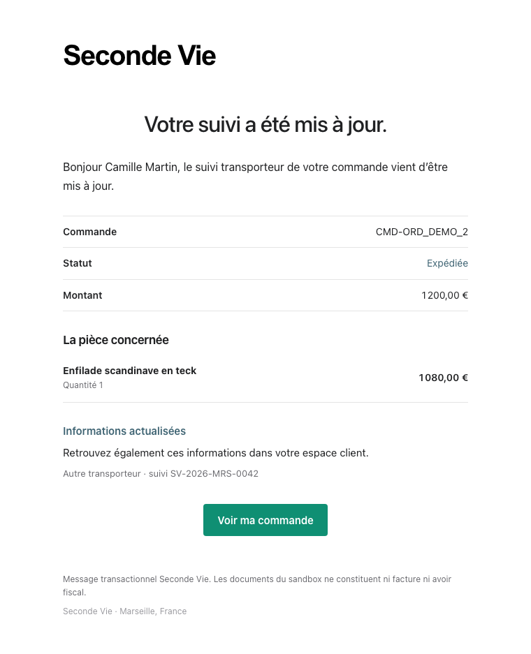
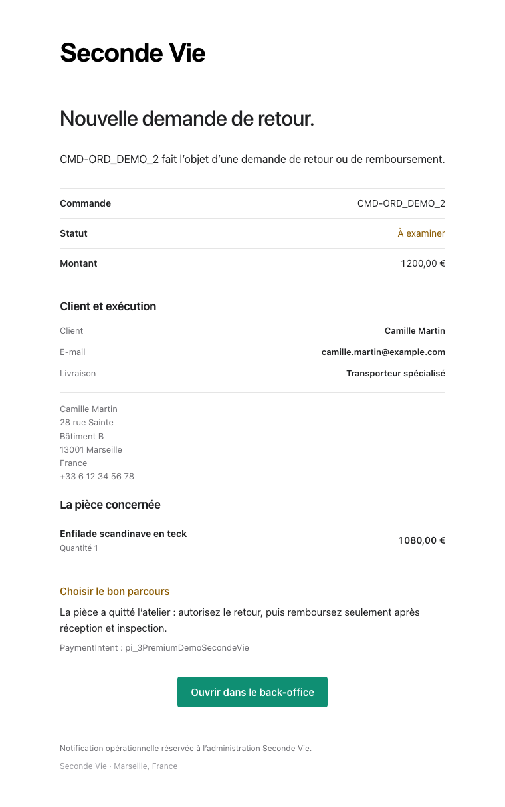
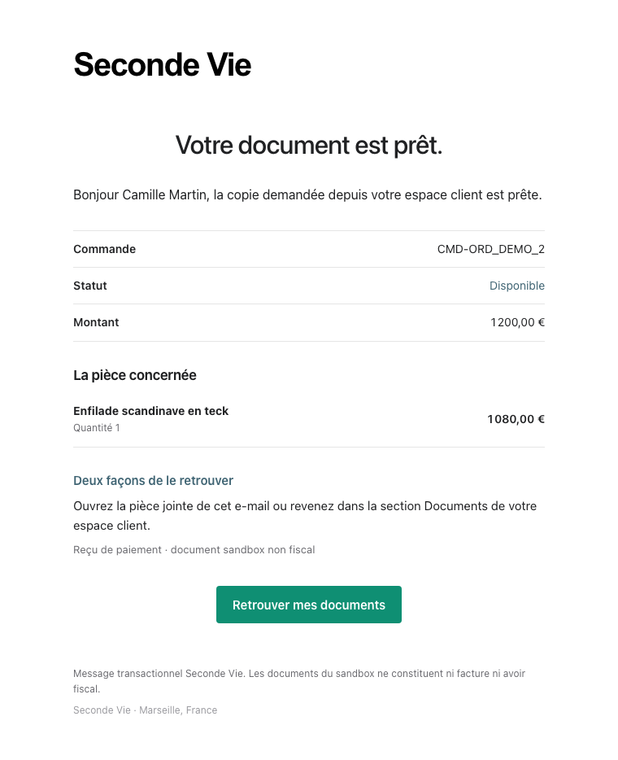
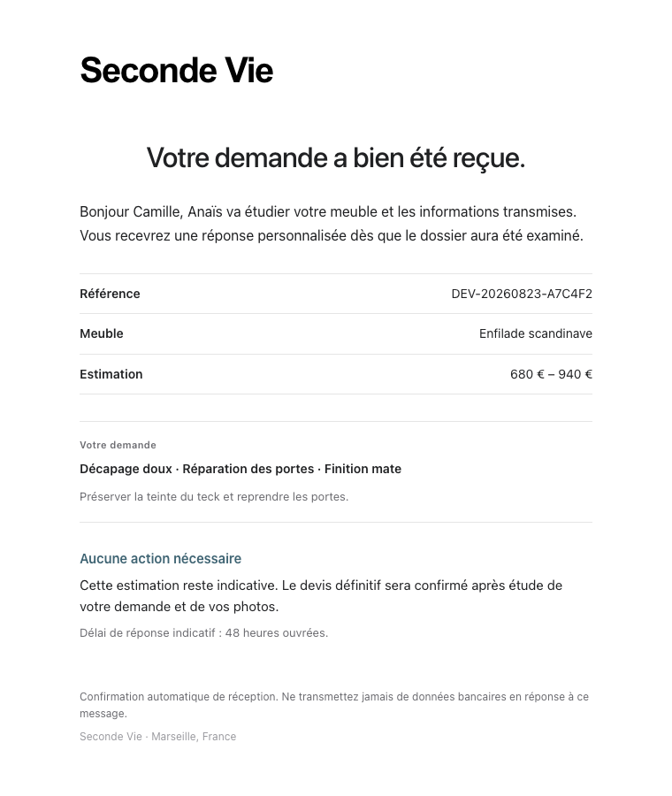
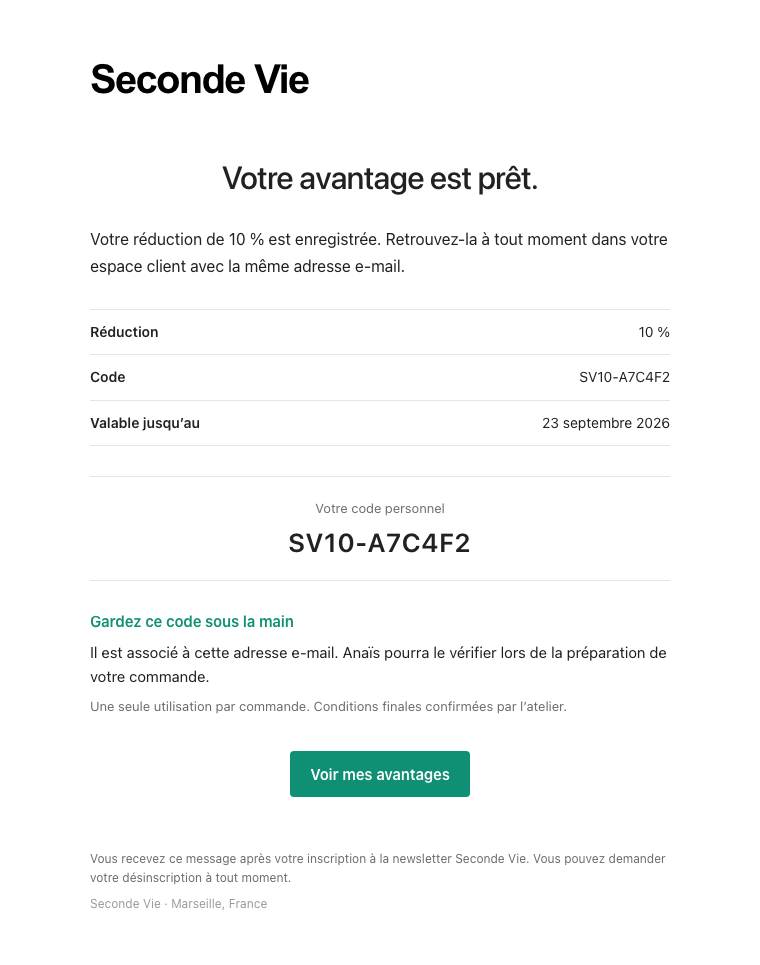
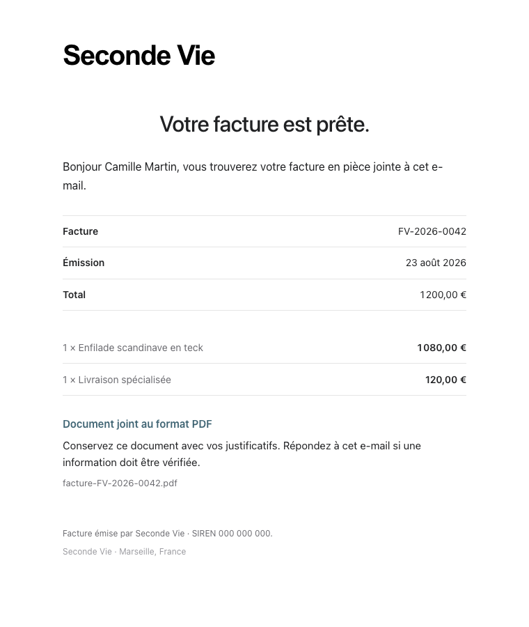

# E-mails transactionnels - Seconde Vie

Derniere mise a jour: 2026-08-25
Statut: `PREPROD_READY`
Perimetre: Auth OTP, paiement, cycle de commande v2, remboursements, copie de document, retour client, réception de devis, avantage newsletter, facture manuelle et compatibilité legacy

## 1. Role

Ce chapitre est la reference canonique du cycle de vie des e-mails
transactionnels de Seconde Vie. Il documente:

- les messages visibles par le client;
- les notifications operationnelles administrateur;
- les evenements qui creent chaque message;
- les informations attendues;
- le systeme graphique commun;
- les captures de reference conservees avec la documentation.

Les captures utilisent des donnees fictives. Aucun OTP reel, secret, token,
mot de passe, donnee de carte ou donnee personnelle de recette n'y figure.

Les preuves d'envoi peuvent conserver le destinataire dans le document metier
prive lorsqu'il est necessaire au support et a l'idempotence. Les logs Cloud
des triggers historiques de commande ne recopient plus l'adresse e-mail du
client et reduisent les erreurs fournisseur a leur nom et code bornes.

## 2. Etat de reference

La bibliotheque metier actuelle regroupe 19 rendus canoniques. Huit variantes
supplementaires restent envoyables par les triggers de compatibilite des
anciennes commandes et par les actions manuelles d'exploitation. Le depot
controle donc 27 rendus HTML au total. La verification initiale d'adresse
envoyee par Firebase Auth est un vingt-huitieme message observable, mais son
HTML appartient au template Firebase configure hors du depot.

La refonte visuelle du 2026-08-23 couvre localement les 19 rendus canoniques et
les huit rendus de compatibilite/exploitation. Elle n'est pas consideree comme
deployee tant qu'un deploiement cible et une recette Gmail n'ont pas ete
explicitement autorises puis executes.

| Famille | Nombre | Audience |
| --- | ---: | --- |
| OTP | 2 | client |
| paiement | 2 | client + administrateur |
| cycle de commande | 6 | client |
| remboursement | 4 | client + administrateur |
| copie de document | 1 | client |
| demande de retour | 1 | administrateur |
| réception de devis | 1 | client |
| avantage newsletter | 1 | client |
| facture manuelle | 1 | client |
| **Total canonique** | **19** | - |

Les huit rendus non canoniques mais encore actifs sont:

| Famille de compatibilite/exploitation | Variantes | Audience |
| --- | ---: | --- |
| creation de commande legacy | 2 | client + administrateur |
| expedition legacy | 1 | client |
| livraison legacy | 1 | client |
| statut de remboursement manuel legacy | 3 | client |
| diagnostic du fournisseur e-mail | 1 | administrateur |
| **Total compatibilite/exploitation** | **8** | - |

Le lot a ete deploye le 2026-07-30:

- 15 Functions Auth/commerce `ACTIVE` en `europe-west1`;
- App Hosting `build-2026-07-30-019` `READY`;
- rollout sandbox `SUCCEEDED`;
- liens `/mes-commandes` et `/admin?order_id=...` verifies en HTTP `200`;
- aucun rail Stripe live, domaine final ou environnement production active.

## 3. Systeme graphique

Tous les messages controles par le depot utilisent desormais un langage de
correspondance transactionnelle tres epure, inspire des meilleurs e-mails de
produits logiciels sans reprendre leur marque:

- page blanche continue, sans carte exterieure, ombre ni chassis SaaS;
- colonne centrale bornee a 580 px et grands espaces de respiration;
- marque texte `Seconde Vie` alignee a gauche, noire et fortement composee a
  la maniere d'un wordmark produit, sans bandeau ni sous-titre decoratif;
- pile typographique native Apple/Windows avec replis e-mail standards;
- titres directs de 28 a 32 px, sans eyebrow, slogan ou formulation marketing;
- corps de 15 a 16 px, contraste fort et paragraphes courts;
- informations commande, statut, montant et facture alignees par lignes fines,
  jamais dans des tuiles ou cartes multiples;
- couleurs limitees au bouton vert de marque et aux etats qui exigent une
  distinction semantique;
- encarts remplaces par du texte structure; aucune couleur de fond repetitive;
- bouton principal rectangulaire de 4 px de rayon, centre sur desktop et pleine
  largeur sur mobile;
- aucun emoji decoratif, serif theatrale, gradient ou accumulation de badges;
- HTML par tables compatible avec les clients e-mail, responsive sur mobile;
- partie texte de repli et echappement des donnees dynamiques conserves.

Le code proprietaire est:

```text
functions/src/email/emailDesignSystem.js
|-- shell responsive
|-- couleurs et statuts
|-- resume et encarts
`-- echappement HTML

functions/src/email/otpEmailTemplates.js
`-- OTP connexion + OTP checkout

functions/src/email/commerceEmailTemplates.js
`-- paiement + fulfillment + remboursement + copie document client/admin

functions/src/invoicing/manualInvoiceEmailTemplate.js
`-- facture manuelle, rendu pur partage par le worker et la galerie

functions/src/email/orderEmails.js
`-- rendus legacy et diagnostic alignes sur le meme shell
```

## 4. Galerie complete

Cette planche rassemble les 19 rendus canoniques generes depuis leurs sources
executables. Elle sert a la revue visuelle locale; sa presence ne prouve ni un
deploiement ni une reception chez Gmail.


## 5. OTP

### 5.1 Connexion client

Evenement: demande de connexion par e-mail.

Informations:

- code a six chiffres;
- expiration apres dix minutes;
- usage unique;
- avertissement de ne jamais partager le code;
- retour direct vers Seconde Vie.


### 5.2 Validation de commande

Evenement: verification de l'adresse e-mail pendant le checkout invite.

Le rendu reste commun avec l'OTP de connexion, mais l'objet et le texte
expliquent explicitement la validation de commande.


## 6. Paiement

Le paiement durable `succeeded` cree atomiquement deux intentions outbox
distinctes. L'administrateur ne recoit plus une copie BCC du message client.

### 6.1 Confirmation client

Modele: `order-paid`

Informations:

- reference humaine canonique `C<orderNumber>` (jamais l'ID Firestore opaque);
- statut paye;
- montant total;
- article et quantite;
- methode et adresse de livraison;
- prochaine etape;
- bouton vers `/mes-commandes` pour une commande authentifiee;
- pour le rail admin sans compte `admin_payment_link`, le meme recapitulatif
  est envoye a l'adresse collectee mais l'action revient vers la galerie: elle
  ne pretend pas donner acces a un espace client sans UID.


### 6.2 Notification administrateur

Modele: `order-paid-admin`

Informations:

- coordonnees du client;
- adresse et telephone;
- methode de livraison;
- lignes et montant;
- PaymentIntent Stripe;
- action recommandee;
- bouton direct vers `/admin?order_id=...`.


## 7. Cycle de commande v2

Chaque transition est creee atomiquement avec la commande admin correspondante.
Le rejeu du meme `commandId` ne cree pas un second message.

| Transition | Modele | Contenu specifique |
| --- | --- | --- |
| mise en preparation | `order-preparing` | preparation atelier et prochaine etape |
| prete au retrait | `order-ready-for-pickup` | adresse et consigne de prise de rendez-vous |
| retrait confirme | `order-picked-up` | confirmation de remise et fin de commande |
| expedition | `order-shipped` | numero de suivi lorsqu'il existe |
| suivi corrige | `order-tracking-updated` | transporteur et numero actualises, sans nouvelle expedition |
| livraison | `order-delivered` | confirmation de livraison et support |

### 7.1 En preparation


### 7.2 Prete au retrait


### 7.3 Retrait confirme


### 7.4 Expediee


Le modele reprend le transporteur et le numero saisis dans la modale admin.
Pour Colissimo/La Poste, Chronopost et Mondial Relay, la page de suivi est
derivee cote serveur. Une expedition sans numero contient un repli explicite.
Une correction ulterieure utilise `order-tracking-updated` et ne renvoie pas
la confirmation d'expedition.



### 7.5 Livree


### 7.6 Nouvelle demande client de retour

Modele: `customer-return-requested-admin`

La creation durable d'une demande depuis `/mes-commandes` programme une seule
notification operationnelle vers l'adresse administrateur du provider
transactionnel. Le message contient la commande, le client, le motif et un
bouton vers le back-office. Il indique le parcours conseille selon la garde
serveur: remboursement direct si la piece est encore a l'atelier, sinon retour
physique avant remboursement. L'e-mail n'est jamais la source de verite; le
dossier `customer_return_requests` reste visible meme si l'envoi echoue.



## 8. Remboursements

Un remboursement confirme ou echoue cree deux messages distincts: un pour le
client et une notification operationnelle pour l'administrateur.

Les evenements asynchrones `refund.created`, `refund.updated` et
`refund.failed` sont consommes par le webhook v2 apres relecture autoritaire
de l'objet Refund dans son compte Connect. Les deux intentions d'echec sont
creees avec la transition durable; aucun montant echoue n'est comptabilise
comme un remboursement financier reussi.

Stripe peut exceptionnellement invalider de facon asynchrone un Refund d'abord
observe `succeeded`. Les intentions `order-refunded` et
`order-refunded-admin` attendent donc cinq minutes avant de devenir eligibles.
Au moment exact de l'envoi, le dispatcher relit la tentative
`orders/{orderId}/refunds/{refundRequestId}` et exige encore le meme Refund en
`succeeded`. Une tentative entre-temps passee `failed` supprime l'intention
obsolete en `suppressed_stale`; seuls M12/M13 partent. Les faits et documents
historiques restent append-only et l'etat financier autoritaire n'est pas
modifie par cette garde de communication.

Le remboursement financier ne remet jamais automatiquement le meuble en stock.
La remise en vente reste conditionnee a une disposition physique admissible.

### 8.1 Remboursement confirme - client

Modele: `order-refunded`

Le client voit le montant, la reference Stripe et le delai bancaire indicatif.


### 8.2 Remboursement confirme - administrateur

Modele: `order-refunded-admin`

La notification rappelle l'identifiant Stripe, les coordonnees client et
l'absence de restock automatique.


### 8.3 Anomalie de remboursement - client

Modele: `order-refund-failed`

Le texte indique qu'aucun remboursement n'a ete confirme, qu'aucun nouveau
debit n'a ete cree et que le dossier est repris sans action demandee au client.


### 8.4 Anomalie de remboursement - administrateur

Modele: `order-refund-failed-admin`

L'administrateur recoit la reference Stripe et une consigne explicite de ne
pas relancer aveuglement afin d'eviter un double remboursement.


## 9. Copie de document

Modele: `commerce-document-copy`.

Le clic client sur un document appelle `prepareCommerceDocumentDelivery`.
Apres verification Auth/App Check et UID proprietaire, la Function materialise
le PDF prive et cree une intention outbox deterministe. Le message contient:

- la reference humaine `C<orderNumber>` et le montant de la commande;
- un rappel `document sandbox non fiscal`;
- une piece jointe PDF strictement identique a celle ouverte sur le site;
- un bouton authentifie vers la section Documents de `/mes-commandes`.

La destination provient exclusivement du snapshot e-mail de la commande. Le
navigateur ne fournit jamais une adresse libre. Une fenetre de deduplication
de dix minutes absorbe doubles clics et rechargements; un compteur backend
borne les nouvelles intentions a 24 par UID et par jour. La piece jointe est
chargee en memoire par le worker: Gmail conserve `disableFileAccess` et
`disableUrlAccess`; Resend recoit le contenu Base64. Le transport refuse les
types autres que PDF et plafonne les pieces jointes a 5 Mio.

Ce modele est inclus dans la galerie locale. La recette de la piece jointe
reelle reste distincte et exige un envoi sandbox explicitement autorise.



## 10. Accusé de réception de devis

Modele: `quote-request-received`.

La finalisation durable d'une demande sous `/devis` declenche un message au
client uniquement. Il contient la reference, le meuble, les prestations et la
fourchette indicative, puis rappelle qu'aucun prix contractuel n'est confirme
automatiquement. Aucun e-mail operationnel n'est envoye vers une adresse
Seconde Vie tant que la boite metier n'existe pas.

Le trigger intervient apres `intakeStatus=submitted`. L'echec du provider est
inscrit sous `confirmationEmail.status` et n'annule jamais la demande deja
visible dans `AdminQuotes`. Les photos ne sont jamais jointes au message et
restent dans le stockage prive.

Recette sandbox reelle du 2026-08-10: soumission publique, persistance admin
et reception Gmail client validees avec la meme reference, sans adresse
metier Seconde Vie configuree.



## 11. Avantage newsletter

Modele: `newsletter-reward`.

Le choix d'une carte appelle d'abord `drawNewsletterReward`: le pourcentage
est décidé côté serveur et reste stable pour la partie. Après consentement,
`claimNewsletterReward` crée le code et l'abonnement dans la même transaction,
puis envoie la confirmation au client. Le message reprend exactement le code
durable, sa réduction, son échéance et un lien vers
`/mes-commandes#avantages`.

Un échec du transport ne supprime jamais le code. Son état `sending`, `sent`
ou `failed` reste attaché à `newsletter_rewards`; l'interface confirme alors
que le gain est conservé même si l'e-mail est retardé. La lecture dans
l'espace client exige une session Firebase dont l'e-mail est vérifié et
correspond au hash du gain.

Le code annonce est desormais consommable dans le checkout. Il est materialise
dans le registre promotionnel backend-only, lie au meme hash d'e-mail et limite
a une utilisation. L'apercu client ne remplace jamais la revalidation atomique
effectuee avant Stripe; le gain passe a `used` seulement apres confirmation du
paiement et reste consomme apres un remboursement.

Recette sandbox reelle du 2026-08-10: tirage, reclamation, reception Gmail et
lecture dans `Mes avantages` valides avec le meme pourcentage, le meme code et
la meme echeance. Les valeurs de recette ne sont pas conservees dans la
documentation.



## 12. Livraison et idempotence

L'onglet admin Factures ajoute un envoi operationnel hors cycle de commande:
le callable `sendManualInvoiceAdmin` emet et verrouille le brouillon, genere le
PDF serveur puis l'envoie avec le meme adaptateur Gmail/Resend. Chaque demande
porte un `sendRequestId`; son etat `sending`, `sent`, `failed` ou
`delivery_unknown` est conserve sous la facture. Le destinataire libre saisi
par l'administratrice est valide serveur et n'est persiste que sous forme de
hash. Ce rendu ne fait pas partie de la galerie historique des e-mails
commerce tant qu'aucune recette visuelle sandbox ne l'a accepte.



Les e-mails commerce v2 passent par `commerce_outbox`:

```text
evenement durable
  -> intention outbox deterministe dans la transaction metier
  -> commerceOutboxDispatcher
  -> rendu HTML + texte
  -> adaptateur Gmail actif ou Resend futur
  -> sent / failed / delivery_unknown
```

Regles:

- un echec e-mail n'inverse jamais un paiement ou un remboursement;
- le paiement et le remboursement creent une intention par audience;
- les changements d'etat creent une intention client;
- la copie de document est idempotente dans sa fenetre et ne conditionne
  jamais l'acces au PDF;
- Gmail ambigu devient `delivery_unknown` sans retry automatique;
- une erreur provider explicitement non reprenable, notamment Gmail `EAUTH`,
  passe directement en `dead_letter` au premier essai; elle exige une
  correction du secret avant toute reprise bornee;
- apres observation du message exact dans la boite de recette, l'operateur
  peut utiliser `scripts/reconcile-commerce-outbox-delivery.mjs`: dry-run par
  defaut, cible sandbox/outbox/commande stricte, confirmation explicite et
  passage a `sent` avec preuve `gmail_admin_m11_observed`, sans aucun renvoi;
- un succes de remboursement devenu obsolete est `suppressed_stale` avant
  tout appel Gmail;
- les identifiants techniques servent a l'idempotence sans exposer de secret.

La sante commerce compte separement les outbox `failed` et `dead_letter`.
Le lecteur d'exploitation relit ces deux compteurs en direct afin qu'une
projection horaire encore verte ne masque pas une panne apparue entre deux
reconciliations.

Les deux triggers legacy `onOrderCreated` et `onOrderUpdated` restent separes
de l'outbox v2, mais le lot local G2-A4 leur ajoute le meme niveau de garde:
ledger backend-only `legacy_order_email_deliveries`, identifiant derive par
hash commande/type, claim transactionnel, lease, huit tentatives au maximum et
etats `sent`, `failed`, `dead_letter` ou `delivery_unknown`. Une erreur Gmail
ambigue n'est jamais renvoyee automatiquement; Resend conserve sa cle
idempotente fournisseur. Un lease Gmail expire devient aussi
`delivery_unknown`: un crash apres acceptation fournisseur ne peut donc pas
declencher un second envoi automatique. Chaque trigger est borne a
concurrence/max 1 et vise
le futur SA `legacy-order-email-worker`, avec acces aux trois secrets nommes
uniquement. Le ledger porte `purgeAt` a 90 jours; sa policy TTL, l'identite et
le code ne deviennent actifs qu'en G2-B ciblee. La policy TTL `purgeAt` est
ACTIVE depuis G2-B10, apres preuve que le ledger contenait zero document et
zero expiration; son activation n'a donc supprime aucune donnee. Aucun e-mail
n'a ete envoye pendant cette preparation. Le rollout cible G2-B10 active
`onordercreated-00029-zul` avec runtime/build/Eventarc dedies, retry actif et
concurrence/max 1. La quiet-window passive de 314 secondes conserve un ledger
vide, sans invocation metier, e-mail, warning, erreur ou drift. Aucun faux
e-mail de qualification n'est cree. Le rollback exact restaure le bundle
`onordercreated-00028-dov`, le runtime/trigger compute, concurrence 80,
max 20 et retry off; la TTL, les secrets et les IAM dedies restent preserves.
G2-B11 applique ensuite la meme configuration a `onOrderUpdated` en revision
`onorderupdated-00029-moj`, avec le filtre update exact `orders/{orderId}`.
La quiet-window passive de 307 secondes reste sans invocation metier, ledger,
e-mail, warning ou erreur. Son rollback restaure la revision 28 et les limites
precedentes sans retirer la TTL, les secrets ou les IAM dedies.

## 13. Limites et production

Le contenu et le transport Gmail sandbox ont ete qualifies, avec SPF, DKIM et
DMARC valides. Gmail peut toutefois classer le message de recette en spam.
Cette limite externe reste suivie dans `anomalies.md` sous `A-010`.

La livraison production attend:

- le domaine final;
- Resend actif;
- SPF, DKIM et DMARC du domaine final;
- une montee en reputation;
- une recette multi-fournisseurs.

## 14. Regeneration des captures

Commande:

```bash
node scripts/render-email-previews.cjs
```

Le script produit d'abord les apercus temporaires dans
`logs/email-previews/`. Lorsqu'un changement visuel est accepte, les PNG
valides doivent etre recopies dans `_DOCS/email/captures/` dans le meme
changement que ce chapitre.

Avant remplacement:

1. regenerer les rendus source;
2. inspecter la galerie et les captures individuelles;
3. verifier les donnees, liens, statuts et identifiants attendus;
4. lancer les tests Auth et commerce;
5. remplacer les captures documentaires;
6. executer `git diff --check`.
