# E-mails transactionnels - Seconde Vie

Derniere mise a jour: 2026-07-30
Statut: `PREPROD_READY`
Perimetre: Auth OTP, paiement, cycle de commande v2 et remboursements

## 1. Role

Ce chapitre est la reference canonique du cycle de vie des e-mails
transactionnels de Seconde Vie. Il documente:

- les messages visibles par le client;
- les notifications operationnelles administrateur;
- les evenements qui creent chaque message;
- les informations attendues;
- le systeme graphique commun;
- les captures de reference conservees avec la documentation.

Les captures utilisent des donnees fictives. Aucun OTP reel, secret, token,
mot de passe, donnee de carte ou donnee personnelle de recette n'y figure.

## 2. Etat de reference

La bibliotheque active regroupe 13 rendus:

| Famille | Nombre | Audience |
| --- | ---: | --- |
| OTP | 2 | client |
| paiement | 2 | client + administrateur |
| cycle de commande | 5 | client |
| remboursement | 4 | client + administrateur |
| **Total** | **13** | - |

Le lot a ete deploye le 2026-07-30:

- 15 Functions Auth/commerce `ACTIVE` en `europe-west1`;
- App Hosting `build-2026-07-30-019` `READY`;
- rollout sandbox `SUCCEEDED`;
- liens `/mes-commandes` et `/admin?order_id=...` verifies en HTTP `200`;
- aucun rail Stripe live, domaine final ou environnement production active.

## 3. Systeme graphique

Tous les nouveaux messages utilisent le meme langage visuel:

- fond chaud et carte blanche;
- bandeau sombre `Seconde Vie.`;
- titres editoriaux en serif;
- informations metier en sans-serif;
- grille commande, statut et montant;
- encarts semantiques vert, bleu, ambre ou rouge;
- bouton principal noir;
- HTML responsive et partie texte de repli;
- donnees dynamiques echappees avant insertion HTML.

Le code proprietaire est:

```text
functions/src/email/emailDesignSystem.js
|-- shell responsive
|-- couleurs et statuts
|-- resume et encarts
`-- echappement HTML

functions/src/email/otpEmailTemplates.js
`-- OTP connexion + OTP checkout

functions/src/email/commerceEmailTemplates.js
`-- paiement + fulfillment + remboursement client/admin
```

## 4. Galerie complete

Cette planche rassemble les 13 rendus de reference.

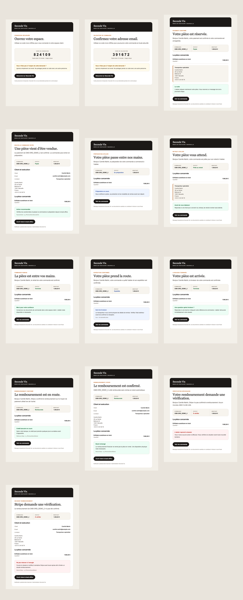

## 5. OTP

### 5.1 Connexion client

Evenement: demande de connexion par e-mail.

Informations:

- code a six chiffres;
- expiration apres dix minutes;
- usage unique;
- avertissement de ne jamais partager le code;
- retour direct vers Seconde Vie.

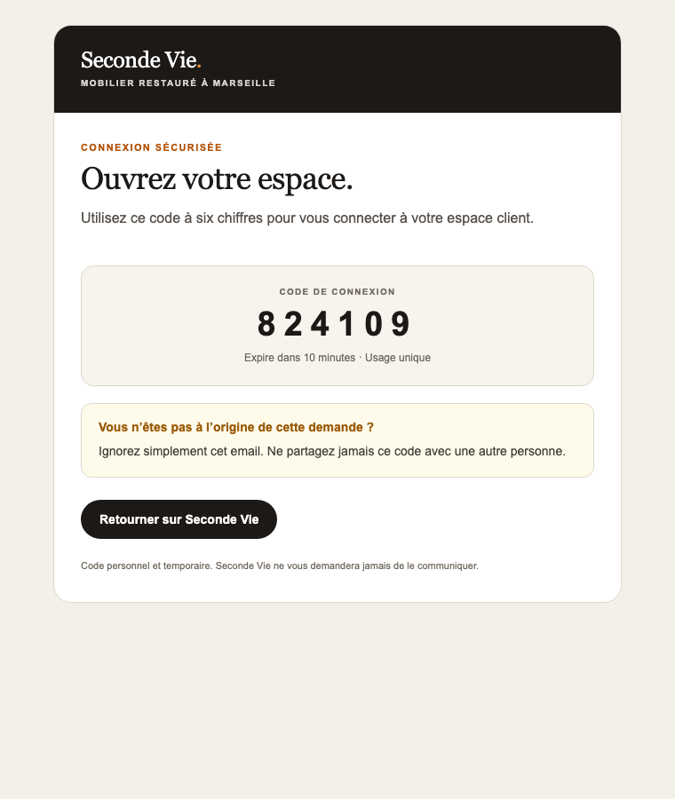

### 5.2 Validation de commande

Evenement: verification de l'adresse e-mail pendant le checkout invite.

Le rendu reste commun avec l'OTP de connexion, mais l'objet et le texte
expliquent explicitement la validation de commande.

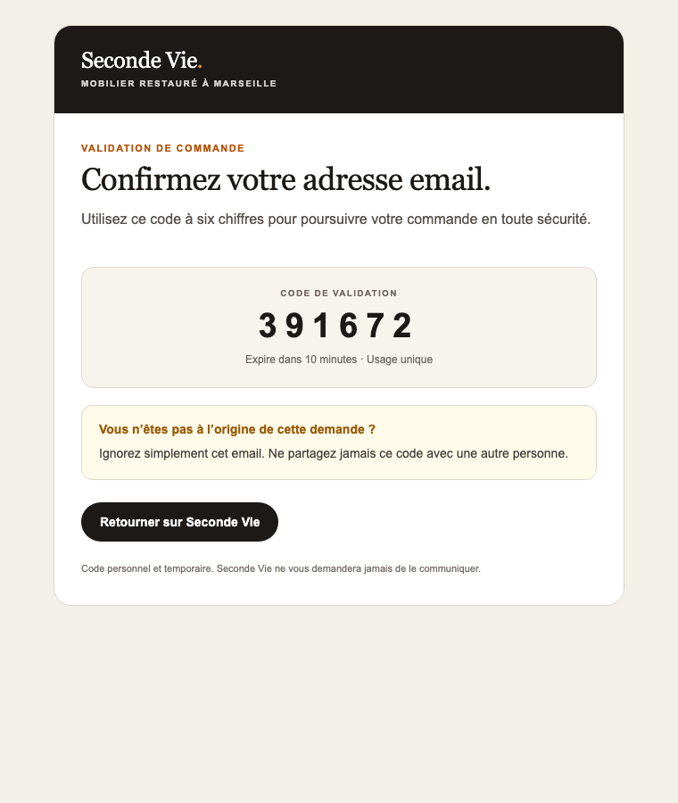

## 6. Paiement

Le paiement durable `succeeded` cree atomiquement deux intentions outbox
distinctes. L'administrateur ne recoit plus une copie BCC du message client.

### 6.1 Confirmation client

Modele: `order-paid`

Informations:

- reference de commande;
- statut paye;
- montant total;
- article et quantite;
- methode et adresse de livraison;
- prochaine etape;
- bouton vers `/mes-commandes`.

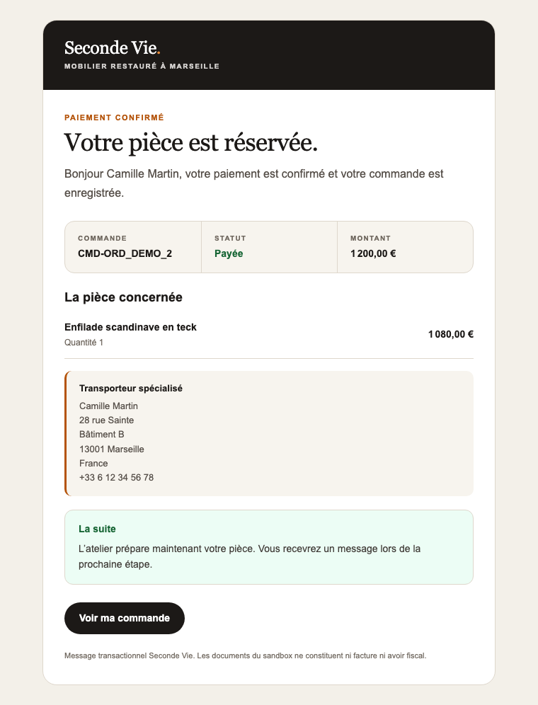

### 6.2 Notification administrateur

Modele: `order-paid-admin`

Informations:

- coordonnees du client;
- adresse et telephone;
- methode de livraison;
- lignes et montant;
- PaymentIntent Stripe;
- action recommandee;
- bouton direct vers `/admin?order_id=...`.

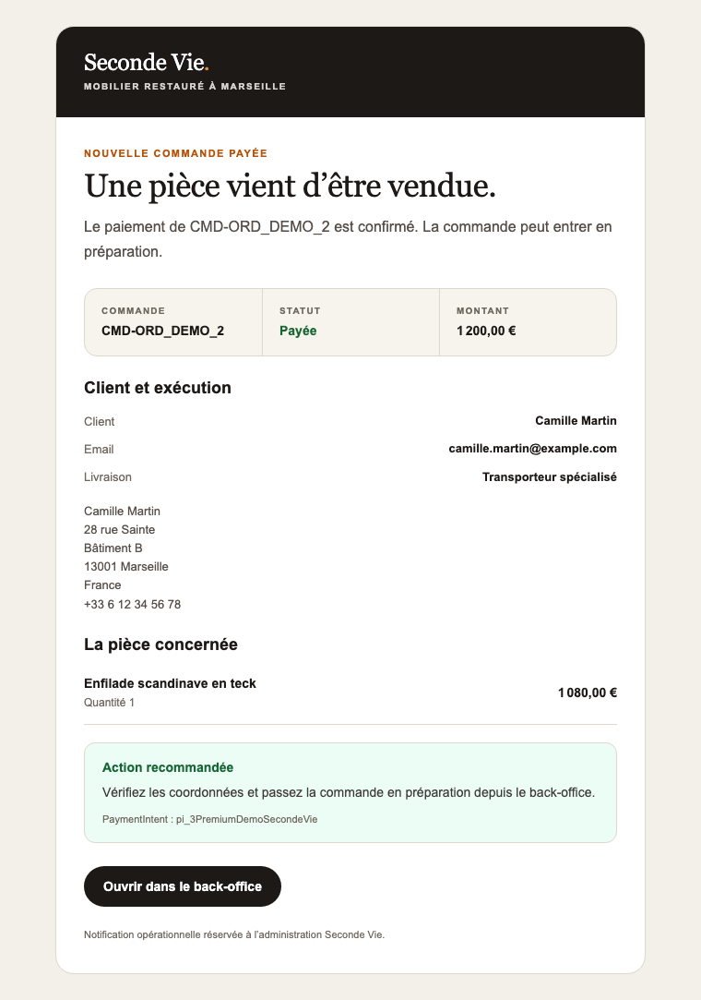

## 7. Cycle de commande v2

Chaque transition est creee atomiquement avec la commande admin correspondante.
Le rejeu du meme `commandId` ne cree pas un second message.

| Transition | Modele | Contenu specifique |
| --- | --- | --- |
| mise en preparation | `order-preparing` | preparation atelier et prochaine etape |
| prete au retrait | `order-ready-for-pickup` | adresse et consigne de prise de rendez-vous |
| retrait confirme | `order-picked-up` | confirmation de remise et fin de commande |
| expedition | `order-shipped` | numero de suivi lorsqu'il existe |
| livraison | `order-delivered` | confirmation de livraison et support |

### 7.1 En preparation

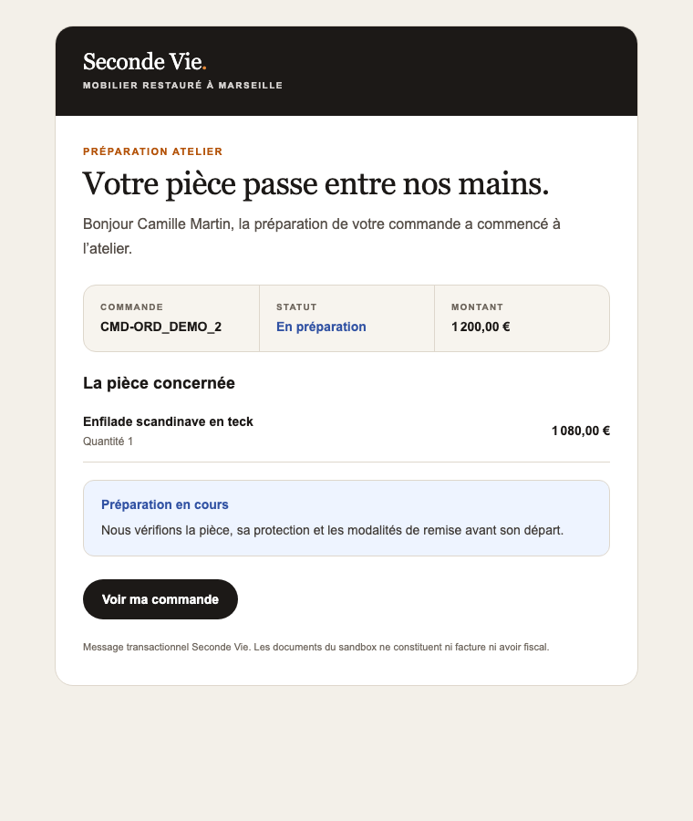

### 7.2 Prete au retrait

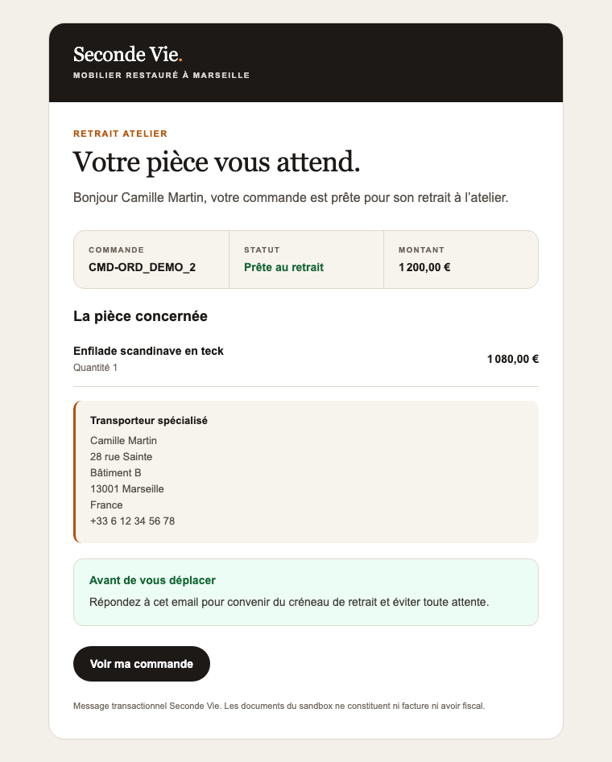

### 7.3 Retrait confirme

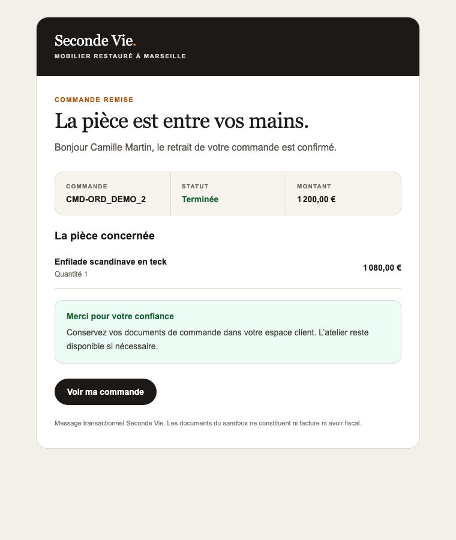

### 7.4 Expediee

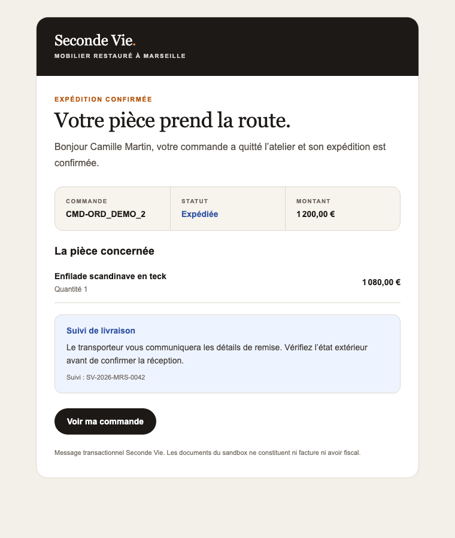

### 7.5 Livree

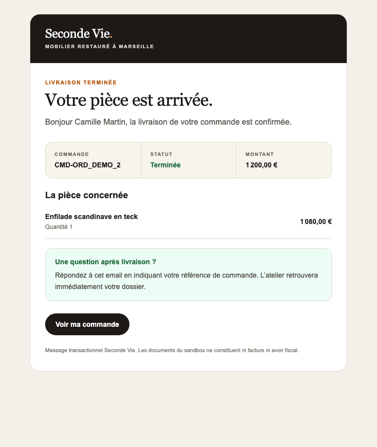

## 8. Remboursements

Un remboursement confirme ou echoue cree deux messages distincts: un pour le
client et une notification operationnelle pour l'administrateur.

Les evenements asynchrones `refund.created`, `refund.updated` et
`refund.failed` sont consommes par le webhook v2 apres relecture autoritaire
de l'objet Refund dans son compte Connect. Les deux intentions d'echec sont
creees avec la transition durable; aucun montant echoue n'est comptabilise
comme un remboursement financier reussi.

Le remboursement financier ne remet jamais automatiquement le meuble en stock.
La remise en vente reste conditionnee a une disposition physique admissible.

### 8.1 Remboursement confirme - client

Modele: `order-refunded`

Le client voit le montant, la reference Stripe et le delai bancaire indicatif.

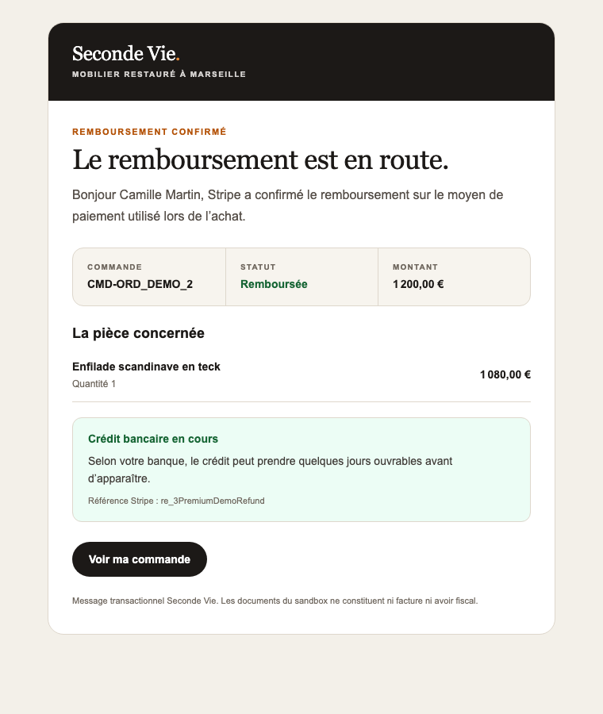

### 8.2 Remboursement confirme - administrateur

Modele: `order-refunded-admin`

La notification rappelle l'identifiant Stripe, les coordonnees client et
l'absence de restock automatique.

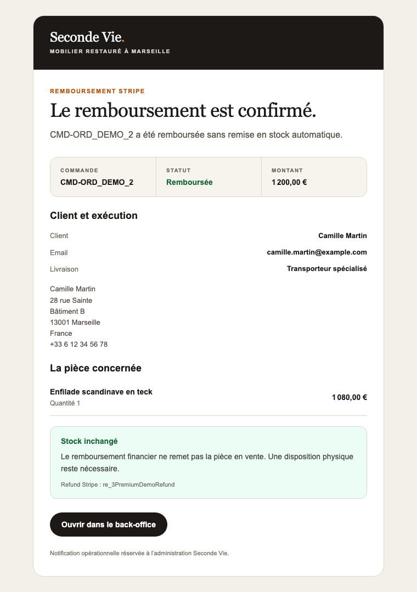

### 8.3 Anomalie de remboursement - client

Modele: `order-refund-failed`

Le texte indique qu'aucun remboursement n'a ete confirme, qu'aucun nouveau
debit n'a ete cree et que le dossier est repris sans action demandee au client.

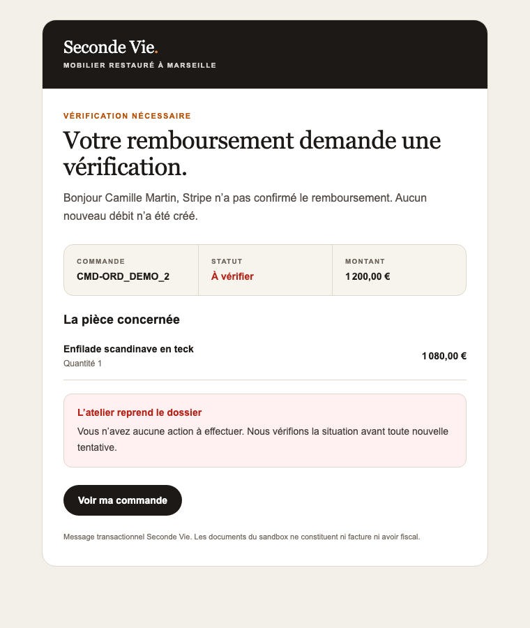

### 8.4 Anomalie de remboursement - administrateur

Modele: `order-refund-failed-admin`

L'administrateur recoit la reference Stripe et une consigne explicite de ne
pas relancer aveuglement afin d'eviter un double remboursement.

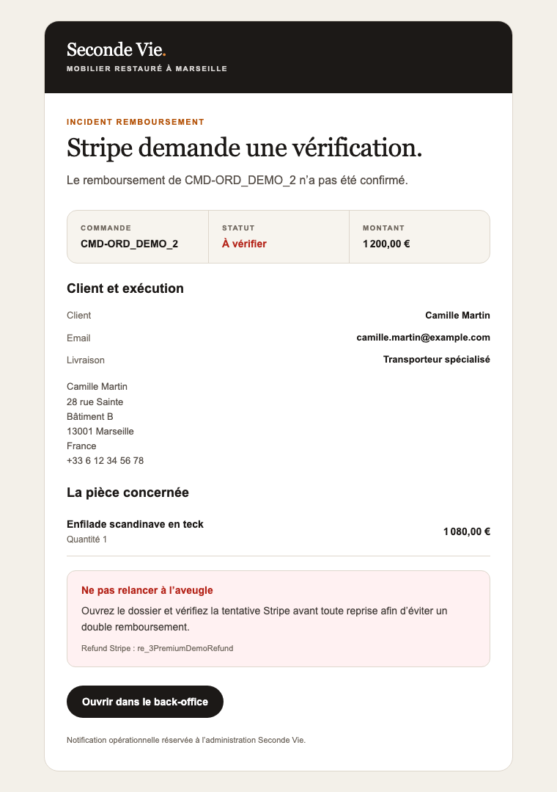

## 9. Livraison et idempotence

Les e-mails commerce v2 passent par `commerce_outbox`:

```text
evenement durable
  -> intention outbox deterministe dans la transaction metier
  -> commerceOutboxDispatcher
  -> rendu HTML + texte
  -> adaptateur Gmail actif ou Resend futur
  -> sent / failed / delivery_unknown
```

Regles:

- un echec e-mail n'inverse jamais un paiement ou un remboursement;
- le paiement et le remboursement creent une intention par audience;
- les changements d'etat creent une intention client;
- Gmail ambigu devient `delivery_unknown` sans retry automatique;
- les identifiants techniques servent a l'idempotence sans exposer de secret.

## 10. Limites et production

Le contenu et le transport Gmail sandbox ont ete qualifies, avec SPF, DKIM et
DMARC valides. Gmail peut toutefois classer le message de recette en spam.
Cette limite externe reste suivie dans `anomalies.md` sous `A-010`.

La livraison production attend:

- le domaine final;
- Resend actif;
- SPF, DKIM et DMARC du domaine final;
- une montee en reputation;
- une recette multi-fournisseurs.

## 11. Regeneration des captures

Commande:

```bash
node scripts/render-email-previews.cjs
```

Le script produit d'abord les apercus temporaires dans
`logs/email-previews/`. Lorsqu'un changement visuel est accepte, les PNG
valides doivent etre recopies dans `_DOCS/email/captures/` dans le meme
changement que ce chapitre.

Avant remplacement:

1. regenerer les 13 rendus;
2. inspecter la galerie et les captures individuelles;
3. verifier les donnees, liens, statuts et identifiants attendus;
4. lancer les tests Auth et commerce;
5. remplacer les captures documentaires;
6. executer `git diff --check`.
