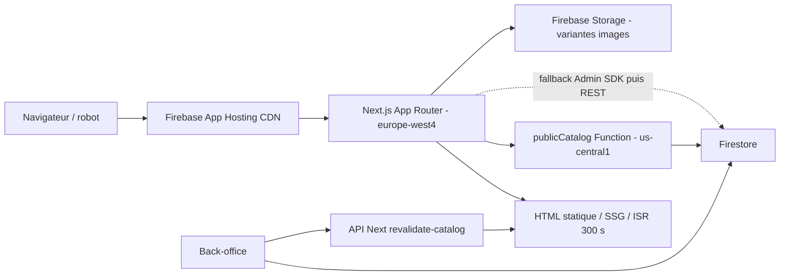

# Audit situationnel Next.js + Firebase App Hosting

Date de l'audit : 2026-07-10  
Périmètre : dépôt local, build Next de production en environnement sandbox, artefacts `.next`, configuration Firebase/App Hosting, règles Firestore/Storage et vérifications HTTP du backend public configuré.  
Positionnement : audit indépendant du code actif. Les anciens rapports n'ont pas servi de preuve ni de base de notation. `NEXT_NATIVE_ARCHITECTURE_BASELINE.md` a uniquement été lu parce que les consignes du dépôt l'imposent pour toute passe architecture/SEO/performance.

## Verdict exécutif

Le choix **Next.js App Router + Firebase App Hosting** est cohérent pour ce projet de catalogue/e-commerce : **8,5/10 comme choix de stack**.

L'implémentation actuelle obtient **7,1/10**. Le rendu public est techniquement solide : pages finales présentes dans le HTML, SSG/ISR effectivement prouvés au build, données et métadonnées serveur, canonicals, sitemap, JSON-LD, cache CDN et invalidation à la publication. Le projet n'est donc plus une SPA maquillée pour le SEO.

En revanche, la **préparation à une vraie production** ne dépasse pas **5,5/10** à la date de l'audit. Le dépôt décrit et déploie un rail sandbox, sans projet/backend/domaine/Stripe live de production, sans CI versionnée, avec un lint local cassé, des budgets front en échec, des en-têtes de sécurité non appliqués par App Hosting et plusieurs pages de faible qualité actuellement indexables.

La conclusion objective est la suivante :

- le SSR/SSG/ISR n'est pas le problème principal ; cette partie est bien conçue ;
- le SEO technique est bon, mais le SEO réel est limité par la qualité des données indexées ;
- les performances sont fonctionnelles mais pas encore optimisées au niveau d'un excellent site marchand ;
- l'infrastructure observée est un sandbox robuste, pas un rail de production terminé.

## Note détaillée

| Domaine | Note | Constat |
| --- | ---: | --- |
| Architecture Next et modes de rendu | 18/20 | App Router natif, frontières serveur/client saines, statique/SSG/ISR réellement produits |
| SEO technique | 16/20 | Métadonnées, canonicals, sitemap, robots, JSON-LD et maillage serveur présents |
| Qualité des contenus indexables | 8/15 | Produit de test indexé, titres dupliqués, catégories vides ou très minces |
| Performance front | 8/15 | ISR/CDN et variantes images utiles, mais budgets JS/CSS et poids HTML trop élevés |
| Firebase, cache et données | 12/15 | Bonne résilience et invalidation, mais topologie multirégion perfectible et plusieurs couches de cache |
| Sécurité et exploitation | 7/10 | Règles et App Check bien structurés dans le code ; en-têtes App Hosting et observabilité non prouvés |
| Reproductibilité/CI | 2/5 | Build sans lint valide, mais lint cassé, deux lockfiles, runtime racine non fixé et aucune CI trouvée |
| **Total situationnel** | **71/100** | **Bonne architecture applicative, industrialisation et qualité SEO à finir** |

## Architecture réellement observée

Cette architecture favorise correctement les lectures publiques mises en cache. Elle ajoute toutefois une liaison App Hosting `europe-west4` vers `publicCatalog` codé en `us-central1`, alors que les autres Functions clientes sont configurées en `europe-west1`. La localisation Firestore n'a pas pu être vérifiée depuis le dépôt ; aucune conclusion n'est donc formulée sur ce dernier point.

## Preuve des modes de rendu

Le build Next 15.5.20 exécuté avec `next build --no-lint` a compilé et généré 58 pages statiques. La table de build et `.next/prerender-manifest.json` confirment les comportements suivants :

| Route | Mode prouvé | Cache | Avis |
| --- | --- | --- | --- |
| `/` | statique | ISR 300 s | Très bon choix pour la home catalogue |
| `/galerie` | statique | ISR 300 s | Alias correct, canonical vers `/` |
| `/a-propos` | statique | ISR 300 s | Mieux qu'un SSR à chaque requête pour ce contenu |
| `/devis` | statique | ISR 300 s | Formulaire interactif isolé côté client |
| `/recherche` | statique | ISR 300 s | `noindex, follow`, résultats chargés par API |
| `/categorie/[categoryId]` | SSG | ISR 300 s, `dynamicParams=true` | 13 catégories pré-générées |
| `/produit/[slugOrId]` | SSG | ISR 300 s, `dynamicParams=true` | 35 produits pré-générés ; nouveaux produits générables à la demande |
| `/sitemap.xml` | statique | ISR 300 s | 51 URL observées en local et en ligne |
| `/admin`, `/checkout`, `/wishlist`, `/mes-commandes` | dynamique | `private, no-store` en ligne | Correct pour des tunnels privés |
| `/api/search`, `/api/revalidate-catalog` | dynamique | cache public seulement pour la recherche | Correct |

Il n'est pas nécessaire de rendre chaque page en SSR à chaque visite pour obtenir un bon SEO. Pour ce catalogue, SSG + ISR est généralement le meilleur compromis : HTML complet pour le robot, réponse CDN rapide et rafraîchissement contrôlé. Le SSR dynamique est réservé aux surfaces qui en ont réellement besoin.

## Points forts vérifiés

### 1. HTML public réellement indexable

Les artefacts générés contiennent des `title`, descriptions, canonicals, H1, liens produits/catégories et données structurées avant hydratation. La home ne dépend pas d'un gros rendu client de remplacement. Les gates confirment aussi que les graphes de dépendances des routes SEO ne remontent pas vers `cookies()`, `headers()`, `draftMode()` ou des `searchParams` serveur.

### 2. Bonne utilisation des primitives SEO Next

- `metadataBase` et métadonnées par route ;
- canonicals absolus cohérents, avec `/galerie` consolidé vers `/` ;
- Open Graph et Twitter Cards ;
- sitemap dynamique avec dates de mise à jour ;
- robots statique ;
- JSON-LD `CollectionPage`, `ItemList`, `BreadcrumbList`, `Product`, `LocalBusiness` et services selon la route ;
- `notFound()` pour les produits/catégories absents ;
- tunnels privés et recherche marqués `noindex`.

### 3. Cache et invalidation bien pensés

La chaîne combine :

- ISR Next à 300 secondes ;
- tags `catalog`, `products`, `category:*`, `product:*` et `sitemap` ;
- endpoint d'invalidation protégé par vérification d'un token Firebase Admin ;
- `revalidateTag()` et `revalidatePath()` après les mutations produit ;
- version `catalogVersion` dans Firestore pour invalider le cache mémoire de `publicCatalog` ;
- cache HTTP court sur `publicCatalog` et ETag ;
- fallback Admin SDK limité à 1,8 seconde, puis Firestore REST.

La redondance améliore la disponibilité. Elle augmente aussi le nombre de chemins de lecture à maintenir et doit rester couverte par des tests d'invalidation.

### 4. Bon cloisonnement Firebase

- deux codebases Functions séparées : publique et privée/commerce ;
- `firebase-admin` enfermé dans des modules `server-only` côté Next ;
- règles Firestore restrictives sur les commandes, utilisateurs, analytics et métadonnées sensibles ;
- écritures Storage réservées aux claims admin/super-admin, aux formats image listés et aux fichiers de moins de 10 Mo ;
- App Check initialisé avant les services clients selon le gate statique ;
- secrets Functions séparés de la configuration publique App Hosting.

## Ecarts prioritaires

### P0 avant toute mise en production : construire un rail prod distinct

Le depot est explicitement un sandbox :

- `.firebaserc` ne contient qu'un projet par defaut ;
- `firebase.json` ne declare que le backend `secondevie-next-sandbox` ;
- `apphosting.yaml` utilise le domaine sandbox et une cle Stripe `pk_test` ;
- `.env.production` ne contient pas de projet Firebase, domaine HTTPS final, cle App Check ou cle Stripe live exploitables ;
- aucun domaine commercial final n'est visible dans la configuration auditee.

Ce n'est pas un defaut pour un sandbox. En revanche, l'etat actuel ne doit pas etre qualifie de production-ready. Le domaine final doit etre fixe avant indexation afin d'eviter une migration de canonicals et de sitemap apres lancement.

### P1 : assainir ce qui est indexable

La mecanique SEO est meilleure que les donnees qu'elle publie :

- le produit `hello` est public, pre-genere, indexable, present dans le sitemap live et possede son canonical et ses schemas ;
- sur 35 produits, seulement 17 titres de page sont uniques ;
- 10 fiches partagent exactement `Buffet | Seconde Vie`, 4 partagent `Commode | Seconde Vie` et 4 `Paire de chevets | Seconde Vie` ;
- une description produit ne fait que 3 caracteres et celle de `hello` 11 caracteres ;
- 2 categories indexables n'ont aucun lien produit (`deco`, `eclairage`) ;
- 5 autres categories n'ont qu'un ou deux produits ;
- 13 categories ne produisent que 12 titres uniques, avec `deco` et `decorations` en concurrence ;
- plusieurs titres ont une formulation generique ou grammaticalement faible, par exemple `ARMOIRES restaures`.

Le filtre `isSeoIndexableProduct` ne suffit pas : il exclut quelques noms de test connus, mais laisse passer `hello` et tous les produits trop generiques. Tant que ce point n'est pas traite, Google recoit beaucoup de pages techniquement propres mais peu differenciees.

Action recommandee : ajouter un statut SEO/publication explicite, des exigences minimales de titre/description/image, un controle de duplication et une politique `noindex` ou 404 pour les categories vides et les contenus de test.

### P1 : ramener les budgets front dans les limites du projet

Le gate `perf:budget` echoue :

- home : 190,43 kB JS gzip pour un budget de 135 kB ;
- categorie : 194,11 kB pour 130 kB ;
- a-propos : 200,75 kB pour 170 kB ;
- devis : 191,28 kB pour 125 kB ;
- CSS public initial : 58,43 kB gzip pour 55 kB ;
- plus gros fichier CSS : 373,52 kB brut / 57,37 kB gzip.

Le HTML pre-rendu est egalement lourd dans l'echantillon local : environ 855 kB pour la home et 1,39 Mo pour `/categorie/meubles`. Ces tailles sont non compressees, mais elles signalent une duplication importante entre HTML et payload RSC ainsi qu'un catalogue initial dense.

Le projet dispose de variantes d'images Storage et de `srcset`, ce qui est positif. En revanche, aucun composant actif n'importe `next/image` alors que `next.config.mjs` configure `images.unoptimized: true`, `formats`, `qualities`, tailles et TTL. Une partie de cette configuration est donc sans effet sur le chemin d'image reel et peut induire en erreur.

Action recommandee : traiter en premier les imports client communs, le CSS global et la quantite de donnees/produits serialisee dans les pages categories, puis mesurer les Core Web Vitals sur le domaine final.

### P1 : appliquer les en-tetes au vrai serveur App Hosting

Le live App Hosting ne renvoie pas les en-tetes suivants sur `/` lors du controle :

- `Content-Security-Policy` ;
- `Strict-Transport-Security` ;
- `X-Content-Type-Options` ;
- `X-Frame-Options` ;
- `Referrer-Policy` ;
- `Permissions-Policy`.

Il expose aussi `X-Powered-By: Next.js`.

Ces en-tetes existent en partie dans la section `hosting.headers` de `firebase.json`, mais cette section concerne Firebase Hosting classique, pas le backend Next App Hosting servi. Ils doivent etre definis dans la configuration Next active, avec une CSP compatible avec les scripts et services reels.

### P1 : rendre le build reproductible et obligatoire

- Le build complet a echoue sur ESLint 9.39.4 / `eslint-config-next` 15.5.20 dans l'environnement local Node 24.14.0.
- Le build `--no-lint` reussit, ce qui prouve le rendu mais pas la qualite statique du code.
- Le projet racine ne fixe pas de version Node dans `engines`, contrairement aux deux dossiers Functions qui fixent Node 22.
- `package-lock.json` et `pnpm-lock.yaml` coexistent et ne resolvent pas exactement les memes versions (`next` 15.5.18 contre 15.5.20, React 19.2.6 contre 19.2.7).
- Les dependances principales utilisent des plages larges avec `^`.
- Aucun workflow `.github/workflows` n'est present pour imposer build, lint et gates avant deploiement.

Action recommandee : choisir un gestionnaire et un lockfile, fixer Node, reparer ESLint sous ce runtime, puis rendre obligatoires build, lint, `next:routes`, controles infra et budget avant promotion.

### P1 : reduire la dispersion regionale

Le domaine App Hosting est en `europe-west4`, les Functions clientes sont configurees en `europe-west1`, mais `publicCatalogUrl()` appelle explicitement `us-central1`. Chaque regeneration Next depend donc potentiellement d'un aller-retour Europe -> Etats-Unis avant acces aux donnees. Le cache masque souvent ce cout, mais les cold starts et revalidations restent concernes.

La localisation Firestore n'est pas prouvable depuis le depot ; aucune hypothese n'a ete faite sur ce point.

Action recommandee : mesurer la latence de `publicCatalog`, puis aligner App Hosting, Function publique et Firestore dans une topologie regionale documentee si la migration est possible.

### P2 : supprimer l'ambiguite Firebase Hosting / App Hosting

`firebase.json` conserve une configuration Hosting classique vers `dist`, des Functions SEO historiques et un fallback SPA `index.html`, en parallele d'App Hosting. Elle n'est pas utilisee par le site Next live audite, mais un deploiement ou un operateur peut facilement confondre les deux rails.

Action recommandee : documenter explicitement le proprietaire de chaque domaine puis supprimer ou isoler le Hosting historique quand il n'a plus de consommateur.

### P2 : ajouter observabilite et objectifs de service

Le depot contient des logs et des scripts d'audit, mais aucune preuve codee de tableau de bord, alerte, healthcheck, taux de cache hit, latence p95, erreurs ISR, erreurs Functions ou budget de cout. Ces elements peuvent exister dans la console Google Cloud, mais ils n'ont pas pu etre verifies.

Action recommandee : suivre au minimum erreurs 5xx, latence App Hosting et `publicCatalog`, cold starts, taux d'echec de revalidation, App Check, cout Firestore/Functions et Web Vitals terrain.

## Plan recommande

| Ordre | Action | Impact | Effort indicatif |
| ---: | --- | --- | --- |
| 1 | Retirer/noindexer `hello`, categories vides et donnees faibles ; imposer une qualite SEO a la publication | Tres fort | Faible a moyen |
| 2 | Creer le projet/backend/domaine/secrets prod separes | Bloquant production | Moyen |
| 3 | Reparer lint, fixer Node et un seul lockfile, ajouter une CI de promotion | Fort | Moyen |
| 4 | Faire appliquer les en-tetes de securite par Next/App Hosting | Fort | Moyen |
| 5 | Reduire JS/CSS et le poids HTML/RSC des categories | Fort | Moyen a eleve |
| 6 | Aligner ou mesurer les regions App Hosting / Function / Firestore | Moyen a fort | Moyen |
| 7 | Retirer ou isoler le Hosting historique | Moyen | Faible |
| 8 | Ajouter alertes, SLO et couts | Moyen | Moyen |

## Reponse directe a la question SEO

Oui, les pages sont globalement bien architecturées pour le SEO avec Next.js : les crawlers recoivent du HTML complet, les pages catalogue importantes sont statiques/SSG avec ISR, les metadonnees et schemas sont serveur, et les espaces prives sont exclus de l'index. Le projet a donc un **socle SEO technique fort**.

Non, on ne peut pas encore parler de SEO puissant au sens global. Le moteur de rendu est pret, mais il publie trop de pages faibles ou dupliquees, les budgets front sont depasses et aucun domaine de production final n'est configure. Aujourd'hui, le plafond SEO vient davantage des contenus, de la performance et de l'exploitation que de Next.js ou Firebase.

## Journal des validations

| Validation | Résultat | Portée |
| --- | --- | --- |
| `next build` | Échec | Étape ESLint incompatible dans l'environnement Node 24.14.0 audité |
| `next build --no-lint` | Réussite | Compilation, types, collecte des données et génération des routes validées |
| `scripts/check-next-route-classification.cjs` | Réussite | Artefacts statiques, SSG/ISR, tunnels dynamiques et absence d'API request-time sur les routes SEO |
| `scripts/check-mobile-marketplace-contract.cjs` | Réussite | Contrat du rendu galerie mobile et shell SSR |
| `scripts/check-performance-budget.cjs` | Échec | Dépassements JS/CSS détaillés dans ce rapport |
| `scripts/audit-infra-env.cjs` | Réussite avec avertissements | Rail prod absent et variables métier manquantes dans App Hosting |
| `scripts/audit-infra-deploy.cjs` | Réussite avec avertissement | Configuration sandbox cohérente, Hosting SEO historique encore présent |
| `scripts/audit-app-check-paths.cjs` | Réussite | Aucun chemin client contournant l'initialisation App Check détecté |
| Contrôles HTTP du backend App Hosting | Réussite avec constats | 200, cache ISR, canonicals, sitemap et noindex vérifiés ; en-têtes de sécurité absents |
| `git diff --check` | Réussite | Aucun défaut d'espaces ou de fin de ligne dans les changements de documentation |

## Limites de l'audit

N'ont pas ete verifies :

- la console Firebase/App Hosting, les valeurs qui peuvent surcharger `apphosting.yaml` et les rollouts ;
- l'enforcement App Check reel cote console ;
- la region Firestore, IAM, facturation, quotas, sauvegardes et restauration ;
- Google Search Console, index reel, logs Googlebot, backlinks et donnees de trafic ;
- Core Web Vitals terrain, Lighthouse/PageSpeed sur le futur domaine final ;
- les secrets Stripe/email et leur separation effective ;
- un audit de securite offensif complet.

La note devra etre revue apres creation du rail prod, nettoyage des contenus indexables et mesure terrain.
