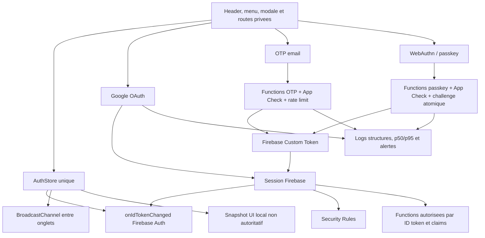

# Roadmap de robustesse du systeme d'authentification

Date: 2026-07-11
Statut: roadmap active, phases 0 a 2 validees, phase 3 autorisee sur sandbox
Branche de travail: `codex/connexion`

Suivi d'execution:

- phase 0: `VALIDE CONDITIONNELLEMENT SANDBOX` - closeout `_DOCS/security/AUTH_PHASE0_CONDITIONAL_CLOSEOUT_2026-07-11.md`;
- phase 1: `VALIDEE` - closeout `_DOCS/security/AUTH_PHASE1_AUTHSTORE_CLOSEOUT_2026-07-11.md`;
- phase 2: `VALIDEE` - closeout `_DOCS/security/AUTH_PHASE2_PASSKEY_PORTABILITY_CLOSEOUT_2026-07-11.md`;
- phase 3: `EN VALIDATION PHYSIQUE SUR SANDBOX` - code et Functions deployes; recette Windows Hello requise avant closeout;
- phases 4 a 10: `EN ATTENTE`;

Preuves intermediaires phase 3 du 2026-07-11:

- quatre callables passkey avec App Check, deployes dans les regions existantes;
- appel sans App Check refuse en `401 UNAUTHENTICATED`;
- origines exactes, wildcard `.hosted.app` retiree;
- challenges consommes transactionnellement;
- limites IP/email/UID et cinq essais maximum par challenge;
- maximum dix passkeys par compte;
- options factices pour ne plus enumerer les comptes;
- validation bornee des challenges, credentials et reponses;
- TTL `expireAt` actif pour `passkey_challenges` et `sys_ratelimit`;
- reprise idempotente unique d'un echec de creation Custom Token, sans stockage du token;
- contrats automatises Auth cumules: `15/15` apres ajout du test de reprise;
- closeout phase 3 non cree tant que la ceremonie physique et le replay deploye ne sont pas verifies.
- chaque phase concluante produit un document de closeout date dans `_DOCS/security/` ou `_DOCS/perf/`, reference ici avant le demarrage de la suivante.

Preuve partielle phase 0:

- `_DOCS/perf/AUTH_PHASE0_UI_BASELINE_2026-07-11.md`: 30/30 ouvertures UI reussies; cold p50 `1 181 ms`, p95 `1 215 ms`; warm p50 `120 ms`, p95 `216 ms`.
- 2026-07-11: Firebase CLI installee et authentifiee par le proprietaire; acces au projet `secondevienextjsssr` confirme par `firebase projects:list`; alias local actif confirme par `firebase use secondevienextjsssr`. Aucune credential n'est conservee dans la documentation.
- 2026-07-11: Node `22.23.1`, npm `10.9.8`, Firebase CLI `15.23.0` et Google Cloud SDK `575.0.1` installes; sessions Firebase et gcloud actives; projet courant gcloud et Firebase confirme comme `secondevienextjsssr`. Les comptes et credentials ne sont pas recopies dans cette roadmap.

## 1. Objectif

Cette roadmap transforme l'audit manuel du parcours de connexion en plan d'implementation ordonne.

Le resultat attendu est un systeme d'authentification:

- coherent: le header, le menu, les routes privees et Firebase partagent le meme etat;
- fiable: une panne partielle ne laisse pas l'interface dans un faux etat connecte ou deconnecte;
- portable: une passkey peut etre proposee depuis un autre navigateur ou appareil quand son fournisseur le permet;
- securise: les challenges, tokens, claims et fonctions sensibles sont limites, verifies et revocables;
- rapide: la modale s'affiche immediatement et ne telecharge que les briques necessaires au mode choisi;
- observable: les latences et erreurs sont mesurees par etape, avec des alertes et un runbook;
- testable: les flux reels OTP, Google, passkey, claims et deconnexion sont couverts sans se limiter a un faux evenement UI.

Cette roadmap ne remplace pas `_DOCS/security/SECURITY_STRATEGIC_AUDIT_2026-07-08.md`. L'audit recense les risques de securite generaux; ce document pilote specifiquement l'authentification client, Firebase Auth, OTP, Google, passkeys et administration.

## 2. Contraintes d'architecture a conserver

Les contraintes de `NEXT_NATIVE_ARCHITECTURE_BASELINE.md` restent prioritaires.

- Les routes publiques `/`, `/galerie`, `/categorie/[categoryId]`, `/produit/[slugOrId]`, `/a-propos` et `/devis` restent serveur/SSG/ISR selon leur contrat actuel.
- L'authentification publique reste une ile client bornee. Elle ne doit pas rendre les pages publiques dynamiques.
- Ne pas ajouter `cookies()`, `headers()`, `draftMode()` ou une lecture serveur de session aux routes publiques dans le seul but de personnaliser le header.
- Les donnees et actions sensibles restent protegees par Firebase Auth, les Security Rules et les Cloud Functions; l'etat visuel du menu n'est jamais une autorisation.
- `/admin`, `/checkout`, `/wishlist` et `/mes-commandes` restent des tunnels dynamiques.
- Les modifications de performance Auth ne doivent pas reintroduire une grosse ile client globale.

## 3. Perimetre

### Inclus

- `src/kit/contexts/AuthContext.jsx`;
- `src/kit/marketplace/HeaderAccountIsland.jsx`;
- `src/kit/marketplace/GlobalMenuTriggerIsland.jsx` et le menu global;
- `src/kit/marketplace/LegacyLoginModalFullIsland.jsx`;
- `src/kit/commerce/LoginView.jsx` et la connexion admin;
- `/wishlist`, `/mes-commandes`, `/checkout` et `/admin`;
- `src/kit/config/firebaseCore.js`, `firebaseLazy.js` et `firebase.js`;
- `functions/src/auth/customerLoginOtp.js`;
- `functions/src/auth/guestCheckoutOtp.js`;
- `functions/src/auth/passkeys.js`;
- `functions/src/auth/adminManagement.js` et `grantAdmin.js`;
- regions Cloud Functions, App Check, AuthDomain et observabilite;
- tests unitaires, emulators, Playwright et matrice navigateurs/appareils.

### Hors perimetre direct

- refonte graphique generale du site;
- migration globale de toutes les Cloud Functions non liees a l'authentification;
- changement de base de donnees;
- remplacement de Firebase Auth;
- correction du budget CSS/JS global hors cout directement attribuable a l'authentification.

## 4. Etat actuel resume

### Parcours clients

1. Google via popup, avec redirect pour iOS installe en mode PWA.
2. Code OTP a six chiffres envoye par Gmail SMTP.
3. Passkey WebAuthn apres creation d'un compte ou connexion existante.
4. Chaque OTP ou assertion passkey valide produit un Firebase Custom Token.
5. Le client echange ce Custom Token avec `signInWithCustomToken()` pour creer la session Firebase locale.

### Parcours administrateur

1. Google ou email/mot de passe.
2. L'autorisation est fondee sur les Custom Claims `admin` et `superAdmin`.
3. Les Security Rules et les Functions verifient ces claims.

### Points deja solides

- OTP genere avec `crypto.randomInt()`;
- OTP hache par HMAC et compare avec `timingSafeEqual()`;
- expiration, usage unique et limites d'envoi OTP;
- App Check actif sur les callables OTP et checkout;
- verification WebAuthn serveur du challenge, de l'origine, du RP ID et de la signature;
- cle privee passkey jamais stockee par le site;
- Security Rules restrictives sur les donnees privees;
- `signInWithCustomToken()` maintenant attendu avant fermeture de la modale dans le parcours passkey;
- menu resynchronise a l'ouverture comme filet de securite.

### Dette principale

- plusieurs sources d'etat Auth concurrentes;
- passkey affichee selon un marqueur `localStorage`, donc peu portable entre navigateurs;
- fonctions passkey sans App Check ni vraie limitation d'abus;
- challenges passkey non consommes atomiquement;
- domaine sandbox utilise comme RP ID;
- Google redirect cross-origin fragile en PWA;
- regions Functions incoherentes;
- revocation admin incomplete;
- OTP dependant de Gmail et non idempotent apres validation;
- cout initial de la modale trop eleve;
- tests passkey non representatifs du vrai flux Firebase/WebAuthn.

## 5. Architecture cible



### Regle centrale

`AuthStore` devient l'unique source d'etat applicatif. `window.__svAuthUser` peut rester temporairement comme pont de migration, mais ne doit plus etre la source primaire.

Le store publie au minimum:

```text
status: unknown | anonymous | authenticated | error
user: FirebaseUser | null
claims: admin, superAdmin
claimsStatus: idle | loading | ready | error
lastAuthMethod: google | email_otp | passkey | password | null
authReady: boolean
```

`unknown` est necessaire pour eviter d'afficher "Se connecter" pendant que Firebase restaure une session existante.

## 6. Niveaux de priorite

- `P0`: contournement d'autorisation, prise de compte ou blocage production confirme.
- `P1`: risque serieux de fiabilite, securite ou compatibilite a corriger avant mise en production.
- `P2`: durcissement important a planifier juste apres les P1.
- `P3`: optimisation, confort ou hygiene.

Les tailles `S`, `M`, `L` expriment une complexite relative, pas une duree contractuelle:

- `S`: modification locale et tests concentres;
- `M`: plusieurs fichiers ou migration de donnees limitee;
- `L`: changement d'architecture, console cloud ou deploiement progressif.

## 7. Phase 0 - Decisions bloquantes et baseline mesurable

Priorite: `P1`
Taille: `M`
Dependance: aucune

### AUTH-000 - Fixer le domaine de production et le RP ID

Decider avant toute inscription client reelle:

- domaine canonique de production, par exemple `www.domaine.fr`;
- RP ID WebAuthn, normalement `domaine.fr` ou le hostname exact retenu;
- origines exactes autorisees pour production, sandbox et localhost;
- strategie de separation sandbox/prod Firebase.

Une passkey creee pour le domaine sandbox `*.hosted.app` ne peut pas etre migree vers un domaine sans lien de parente. Les utilisateurs devront creer une nouvelle passkey sur le domaine de production.

#### Decision provisoire du 2026-07-11

Le domaine client n'est pas encore achete. `AUTH-000` est donc place en attente sans bloquer l'implementation technique des phases qui peuvent etre validees sur le sandbox.

- environnement courant: sandbox App Hosting;
- RP ID courant: provisoire et reserve aux tests;
- toutes les passkeys creees avant le domaine final sont considerees comme jetables;
- ne pas inscrire de vrais clients ni presenter ces passkeys comme migrables;
- conserver une separation explicite entre origines sandbox et production;
- gate de livraison: acheter et fixer le domaine, choisir le hostname canonique, configurer AuthDomain/OAuth/App Check, remplacer la politique d'origine wildcard, puis recreer les passkeys de recette sur le RP ID final;
- la phase 0 peut obtenir un closeout conditionnel pour le sandbox, mais jamais un closeout de preparation production tant que cette gate reste ouverte.

Cette decision permet de poursuivre l'AuthStore, l'UX, les protections serveur et les tests sans figer un mauvais RP ID de production.

Critere d'acceptation:

- domaine et RP ID documentes dans ce fichier et le runbook;
- aucune wildcard `.hosted.app` en production;
- message explicite indiquant que les passkeys sandbox sont jetables.

### AUTH-001 - Verifier la configuration Firebase Console

Produire une preuve datee pour:

- fournisseurs Auth actives;
- mode "un seul compte par adresse email";
- domaines autorises;
- redirect URIs Google;
- App Check enregistrement web et enforcement reel;
- region Firestore;
- regions deploiement Functions;
- TTL Firestore sur les collections temporaires;
- Identity Platform/MFA si utilise;
- quotas Firebase Auth et Functions.

Ne jamais copier de secret dans le rapport.

### AUTH-002 - Capturer une baseline

Mesurer au minimum 30 executions par parcours, avec cold et warm separes:

- temps clic -> modale visible;
- temps modale -> Firebase/App Check pret;
- temps envoi OTP Function;
- temps livraison email;
- temps verification OTP;
- temps `signInWithCustomToken()`;
- temps generation/verification passkey hors interaction humaine;
- temps restauration session au rechargement;
- taux d'erreur par methode et navigateur.

Ne pas prendre une moyenne seule. Conserver `p50`, `p95`, maximum et volume.

### Gate phase 0

- document de decisions rempli;
- configuration console prouvee;
- baseline sauvegardee dans `_DOCS/perf/`;
- tests executes sous Node 22, version declaree par le projet.

Decision runtime du 2026-07-11: conserver Node `22.x`. Node 24 n'est pas retenu pour l'instant, car le runtime Cloud Functions for Firebase documente officiellement Node 20 et Node 22. Une migration vers Node 24 ne sera envisagee qu'apres support Firebase explicite et une passe d'upgrade dediee.

## 8. Phase 1 - Source d'etat Auth unique

Priorite: `P1`
Taille: `L`
Dependance: phase 0 pour les mesures avant/apres

### AUTH-100 - Creer un AuthStore unique

Objectif: supprimer les divergences entre "Quitter", "Mon espace" et les routes privees.

Actions:

1. Extraire l'observation Firebase dans un module/store unique.
2. Utiliser `onIdTokenChanged()` plutot que plusieurs `onAuthStateChanged()` independants.
3. Exposer un hook unique, par exemple `useAuthState()`.
4. Faire consommer ce hook par le header, le menu, les commandes, la wishlist, le checkout et l'admin.
5. Supprimer progressivement les subscriptions Firebase de `HeaderAccountIsland`.
6. Garder les evenements legacy uniquement pendant la migration.

Pourquoi `onIdTokenChanged()`:

- il signale connexion et deconnexion;
- il signale aussi le renouvellement du Firebase ID Token;
- les Custom Claims mises a jour deviennent visibles sans architecture parallele.

### AUTH-101 - Gerer explicitement l'etat `unknown`

Au premier rendu client, l'application ne sait pas encore si une session existe.

Comportement cible:

- `unknown`: afficher une icone neutre ou un placeholder stable;
- `anonymous`: afficher "Connexion";
- `authenticated`: afficher "Quitter" et "Mon espace";
- `error`: proposer "Reessayer" sans faire croire que l'utilisateur est deconnecte.

Ne pas faire clignoter "Connexion" avant "Quitter" pour un utilisateur deja connecte.

### AUTH-102 - Synchroniser les onglets

Firebase sait synchroniser la persistence locale si Auth est initialise, mais certaines pages publiques retardent volontairement cette initialisation.

Ajouter:

- `BroadcastChannel('secondevie-auth')` pour diffuser login/logout/claims-refresh;
- fallback `storage` event pour les navigateurs sans BroadcastChannel;
- snapshot applicatif minimal, sans ID token ni secret;
- verification Firebase reelle apres reception du signal.

Le snapshot n'accorde jamais un droit. Il sert seulement a eviter une UI obsolette.

### AUTH-103 - Unifier connexion et deconnexion

Toutes les methodes doivent suivre le meme pipeline:

```text
provider result -> Firebase session confirmee -> AuthStore ready -> UI fermee -> navigation de retour
```

La deconnexion suit:

```text
pending -> Firebase signOut confirme -> store anonymous -> broadcast -> UI mise a jour
```

Si `signOut()` echoue, afficher une erreur et resynchroniser avec `auth.currentUser` au lieu de conserver un faux etat local.

### Gate phase 1

- une seule subscription Firebase active par onglet;
- aucun double `getIdTokenResult(..., true)` au chargement;
- header et menu coherents apres OTP, Google, passkey, reload et deuxieme onglet;
- test de course hydratation reproductible et vert;
- aucun changement de classification des routes publiques.

## 9. Phase 2 - UX passkey portable entre navigateurs et appareils

Priorite: `P1`
Taille: `M`
Dependance: AuthStore phase 1

### AUTH-200 - Proposer la passkey apres activation locale

Decision produit revisee le 2026-07-12: le parcours grand public devient `email-first`. Le marqueur local est utilise pour choisir l'UX, jamais pour accorder un droit serveur.

Comportement cible:

- sans activation locale connue: afficher directement email + "Recevoir mon code";
- apres OTP ou Google: proposer "Activer sur cet appareil";
- apres activation locale: afficher "Connexion rapide sur cet appareil" avec l'email associe;
- ne pas afficher le bouton generique "Utiliser une passkey", qui peut ouvrir les choix QR, cle USB ou appareil distant et perturber un nouveau client;
- conserver "Recevoir un code par email" comme recuperation permanente;
- le serveur reste compatible WebAuthn, mais l'interface grand public privilegie Windows Hello, Face ID ou le code de l'appareil deja active.

### AUTH-201 - Corriger la detection de capacites

Pour l'authentification:

- verifier `window.PublicKeyCredential`;
- verifier `navigator.credentials.get`;
- verifier `window.isSecureContext`;
- ne pas rendre `isUserVerifyingPlatformAuthenticatorAvailable()` bloquant.

Ce dernier test indique seulement la presence probable d'un authentificateur integre. Il ne couvre pas une cle USB, un telephone par QR, un gestionnaire tiers ou un authentificateur distant.

### AUTH-202 - Gerer le challenge client prepare

Ajouter `createdAt` au challenge d'authentification prepare et rejeter le cache client apres quatre minutes.

Sur erreur serveur `deadline-exceeded` ou `failed-precondition`:

1. effacer le challenge prepare;
2. regenerer une seule fois;
3. relancer la ceremonie uniquement avec une action utilisateur claire;
4. ne pas boucler automatiquement.

### AUTH-203 - Retourner au contexte d'origine

Remplacer `router.push('/')` apres creation de passkey par une valeur `returnTo` validee.

Exemples:

- connexion depuis wishlist -> `/wishlist`;
- connexion depuis commandes -> `/mes-commandes`;
- connexion pendant checkout -> reprendre le checkout;
- connexion depuis galerie -> rester sur la galerie.

`returnTo` doit rester une route interne autorisee afin d'eviter un open redirect.

### AUTH-204 - Preparer Conditional UI

Etape optionnelle apres stabilisation email-first:

- credentials decouvrables;
- champ `autocomplete="username webauthn"`;
- suggestion passkey dans l'autofill;
- `allowCredentials: []` ou API correspondante;
- index global `credentialId -> uid` cote serveur.

Ne pas activer Conditional UI tant que les tests Safari/Chrome/Brave/Edge et la gestion multi-comptes ne sont pas solides.

### Gate phase 2

- une passkey disponible dans Windows Hello peut etre proposee depuis Chrome et Brave;
- nouveau navigateur sans marqueur local: parcours email + code visible, sans bouton passkey generique;
- telephone/QR et cle USB non bloques par la detection locale;
- fallback OTP toujours accessible;
- retour correct a la route d'origine.

## 10. Phase 3 - Durcissement serveur passkey

Priorite: `P1`
Taille: `L`
Dependance: domaine/RP ID phase 0

### AUTH-300 - App Check sur tous les callables passkey

Ajouter `runWith({ enforceAppCheck: true })` aux quatre Functions:

- `generatePasskeyRegistrationOptions`;
- `verifyPasskeyRegistration`;
- `generatePasskeyAuthenticationOptions`;
- `verifyPasskeyAuthentication`.

Rejouer explicitement les tests sans token, token invalide et token valide.

La replay protection App Check a un cout de latence supplementaire. Ne l'activer qu'apres mesure et seulement sur les endpoints ou le gain est justifie.

### AUTH-301 - Limitation d'abus

Ajouter des limites transactionnelles:

- generation authentication par IP;
- generation par email hache;
- verification par challenge/IP;
- registration par UID;
- nombre maximal de challenges actifs;
- nombre maximal de passkeys par compte, cible initiale: 10.

Les erreurs publiques restent generiques. Les logs internes peuvent distinguer:

- utilisateur inconnu;
- aucune passkey;
- challenge expire;
- credential inconnue;
- verification refusee;
- rate limit.

### AUTH-302 - Supprimer l'enumeration de comptes

Le endpoint ne doit pas confirmer publiquement qu'une adresse possede ou non une passkey.

Options, par ordre de preference:

1. authentication decouvrable sans email;
2. options factices pour un email inconnu puis erreur generique a la verification;
3. email-first avec message identique pour compte inconnu, compte sans passkey et erreur technique.

### AUTH-303 - Consommer les challenges de facon atomique

Probleme actuel: lecture, verification, mise a jour et suppression sont separees. Deux executions concurrentes peuvent lire le meme challenge.

Architecture cible:

1. challenge identifie par un ID aleatoire opaque;
2. verification cryptographique;
3. transaction Firestore qui relit le challenge;
4. transaction verifie `status == active` et la date;
5. transaction passe le challenge a `consumed` ou le supprime;
6. transaction met a jour le compteur de credential;
7. une seule execution peut valider la transaction.

Toute verification, reussie ou refusee, invalide le challenge selon la politique retenue. Aucun challenge ne doit permettre une seconde assertion.

### AUTH-304 - Rendre l'emission du Custom Token recuperable

La consommation du challenge et `createCustomToken()` ne peuvent pas etre une seule transaction Firestore.

Strategie recommandee:

- creer un enregistrement d'operation avec un identifiant idempotent;
- etats `verified`, `token_issued`, `failed_retryable`;
- ne jamais stocker durablement le Custom Token en clair;
- autoriser une reprise serveur bornee si le mint Firebase echoue apres verification;
- sinon demander une nouvelle ceremonie avec message clair.

### AUTH-305 - Valider strictement les entrees

Valider avant lecture Firestore:

- taille et format `challenge`;
- taille et format `credentialId` base64url;
- structure minimale de la reponse WebAuthn;
- transports autorises;
- origine exacte;
- RP ID exact;
- longueur email maximale;
- nombre de credentials retournes.

### AUTH-306 - Politique User Verification

Decision explicite a documenter:

- client grand public: `preferred` peut etre accepte, avec texte UI prudent;
- administration ou operation sensible: `required` et `requireUserVerification: true`;
- ne pas promettre "biometrie obligatoire" si le serveur accepte une verification sans UV.

### AUTH-307 - Modele de donnees cible

```text
users/{uid}/passkeys/{credentialId}
  credentialId
  publicKey
  counter
  transports[]
  deviceType
  backedUp
  label
  createdAt
  lastUsedAt
  revokedAt
  rpId

passkey_credentials/{credentialHash}
  uid
  credentialId
  status
  createdAt

passkey_challenges/{challengeHash}
  uid ou sessionId
  type: registration | authentication
  origin
  rpId
  status: active | consumed
  createdAt
  expiresAt
  attemptCount
```

L'index global ne contient pas de cle privee. Il permet de retrouver le compte depuis une credential decouvrable sans demander l'email.

### AUTH-308 - TTL reel

- `expiresAt` du challenge: 5 minutes;
- champ Firestore TTL aligne sur cette expiration, pas 30 jours;
- suppression explicite apres verification;
- job de reconciliation pour documents temporaires orphelins;
- aucune adresse email brute inutile dans les challenges globaux.

### Gate phase 3

- App Check invalide rejete;
- limites IP/email/UID testees;
- aucune enumeration observable;
- replay sequentiel et concurrent rejete;
- challenge expire rejete et nettoye;
- origine wildcard refusee;
- dix passkeys maximum ou valeur finale documentee;
- test de reprise apres erreur de mint.

## 11. Phase 4 - Fiabilite OTP et email transactionnel

Priorite: `P1`
Taille: `L`
Dependance: configuration console et observabilite de base

### AUTH-400 - Secret OTP dedie

Remplacer l'utilisation du mot de passe Gmail comme cle HMAC par un secret distinct:

- `CUSTOMER_OTP_PEPPER`;
- rotation versionnee;
- ancienne version acceptee uniquement pendant la duree maximale d'un OTP;
- jamais exposee au client ni dans les logs.

Un `pepper` est un secret serveur ajoute avant hachage. Contrairement a un `salt`, il n'est pas stocke avec la valeur hachee.

### AUTH-401 - Fournisseur email de production

Remplacer Gmail SMTP pour le rail production par un service transactionnel disposant:

- d'une API ou SMTP avec SLA;
- de webhooks livraison, bounce et plainte;
- d'une cle separee sandbox/prod;
- de SPF, DKIM et DMARC sur le domaine d'envoi;
- de limites et couts documentes;
- d'un mode de secours ou runbook de panne.

Garder Gmail uniquement pour developpement si necessaire.

### AUTH-402 - Idempotence verification -> session

Probleme actuel: l'OTP est marque utilise avant `getOrCreateCustomerUser()` et `createCustomToken()`.

Ajouter une operation de verification idempotente:

```text
otp valid -> operation verified -> user resolved -> token minted -> operation completed
```

Une relance avec le meme `operationId` doit:

- retourner le meme resultat logique si l'operation est terminee;
- reprendre une etape retryable;
- ne jamais valider deux codes differents;
- ne jamais creer deux utilisateurs.

### AUTH-403 - Limites de verification

Ajouter:

- tentatives par email;
- tentatives par IP;
- compteur qui ne revient pas automatiquement a zero lors d'un renvoi dans la meme fenetre d'abus;
- cooldown progressif;
- limite globale de protection fournisseur;
- message utilisateur non enumerant.

### AUTH-404 - Coherence des compteurs d'envoi

Aujourd'hui, un echec SMTP peut consommer les compteurs horaires.

Choisir et documenter une politique:

- reservation d'envoi puis compensation transactionnelle en cas d'echec certain;
- ou compteur `acceptedByProvider` separe de `attempted`;
- ne pas compenser un timeout ambigu si le fournisseur a peut-etre accepte le message.

### AUTH-405 - Delivrabilite et contenu

- version HTML et texte;
- objet stable sans contenu suspect;
- code lisible et copiable;
- expiration annoncee;
- aucune information indiquant si le compte existe;
- locale francaise correcte;
- adresse reply-to surveillee ou explicitement no-reply;
- lien d'aide en cas de demande non initiee.

### AUTH-406 - Checkout OTP

Durcir le token checkout:

- comparaison constante des hashes;
- liaison email + UID eventuel + identifiant de tentative checkout;
- consommation apres creation de commande reussie;
- idempotence compatible avec une reprise Stripe;
- expiration courte conservee;
- aucune reutilisation pour un autre panier si la politique finale l'interdit.

### Gate phase 4

- panne fournisseur simulee;
- timeout ambigu simule;
- double verification concurrente;
- meme UID apres creation puis reconnexion;
- aucune creation multiple;
- statistiques livraison/bounce visibles;
- temps de livraison p50/p95 disponible.

## 12. Phase 5 - Google OAuth, PWA et liaison des fournisseurs

Priorite: `P1`
Taille: `L`
Dependance: domaine production phase 0

### AUTH-500 - AuthDomain same-site

Le site App Hosting utilise actuellement un `authDomain` `firebaseapp.com`, donc cross-origin.

Pour `signInWithRedirect()`:

- choisir un domaine Auth servi sous le meme site;
- ou mettre en place un reverse proxy transparent `/__/auth/*` vers le helper Firebase;
- ajouter le redirect URI exact dans Google Cloud/Firebase;
- tester Safari, Firefox, Chrome avec stockage tiers bloque et iOS PWA.

Un redirect HTTP 302 ne remplace pas un reverse proxy transparent.

### AUTH-501 - Strategie popup/redirect

Politique cible:

- desktop compatible: popup;
- mobile/PWA: redirect si le helper same-site est prouve;
- popup bloquee: proposer un bouton de relance, pas une boucle automatique;
- retour de redirect traite une seule fois;
- etat pending en `sessionStorage` avec TTL;
- bouton Google desactive pendant l'operation.

### AUTH-502 - Liaison de comptes

Tester les sequences:

- OTP puis Google avec meme email;
- Google puis OTP;
- passkey ajoutee apres Google;
- passkey ajoutee apres OTP;
- compte Google Workspace;
- erreur `account-exists-with-different-credential`.

Si Firebase renvoie un credential en attente, implementer une liaison explicite et ne jamais creer silencieusement un second UID contenant des commandes ou une wishlist separees.

### Gate phase 5

- Google desktop Chrome/Brave/Firefox/Safari;
- Google Android/iOS;
- Google iOS PWA installee;
- stockage tiers bloque;
- meme UID quel que soit l'ordre OTP/Google;
- aucune erreur `requestStorageAccess` non traitee.

## 13. Phase 6 - Administration, claims, revocation et MFA

Priorite: `P1`
Taille: `L`
Dependance: AuthStore et regions alignees

### AUTH-600 - Revocation complete

Lors d'un retrait admin:

1. refuser le retrait du proprietaire configure;
2. mettre `admin: false`;
3. mettre `superAdmin: false` pour toute autre cible;
4. appeler `revokeRefreshTokens(uid)`;
5. mettre a jour Firestore;
6. ecrire l'audit securite;
7. invalider ou forcer le refresh des sessions actives.

### AUTH-601 - Propagation des claims

- `onIdTokenChanged()` cote client;
- refresh explicite apres promotion de l'utilisateur courant;
- message "Vos droits ont change, reconnectez-vous" si necessaire;
- aucune boucle de `getIdToken(true)`;
- retry borne lors du premier login proprietaire si le trigger `onCreate` n'a pas encore termine.

### AUTH-602 - Invitation admin

Remplacer le statut pending implicite par un flux clair:

- invitation creee par super-admin;
- email cible et role souhaité;
- expiration;
- utilisateur se connecte et verifie son email;
- callable d'acceptation recente;
- attribution des claims;
- audit de l'acceptation;
- suppression/expiration de l'invitation.

Ne pas dependre uniquement de `auth.user().onCreate`, car un compte deja cree puis verifie plus tard ne redeclenche pas `onCreate`.

### AUTH-603 - MFA administrateur

Politique recommandee:

- priorite a Google avec MFA imposee sur le compte administrateur;
- si email/mot de passe reste actif, ajouter TOTP via Identity Platform;
- reauthentification recente pour promotion/revocation, remboursement et maintenance;
- methode de recuperation proprietaire documentee et testee;
- pas d'OTP client comme methode admin.

Attention: les connexions par Firebase Custom Token ne se combinent pas directement avec tous les flux MFA Firebase natifs. L'architecture admin doit donc rester distincte du parcours passkey client tant que cette contrainte n'est pas resolue.

### AUTH-604 - Stats utilisateurs paginees

- `getUserStats` protege par App Check;
- pagination Auth et Firestore;
- aucun chargement complet de tous les utilisateurs par defaut;
- PII minimale;
- export explicite et audite;
- erreurs internes non retournees brutes au client.

### Gate phase 6

- admin retire perd l'acces sur token refresh et au plus vite sur session active;
- invitation existante acceptee apres verification email;
- MFA proprietaire prouve;
- operation sensible refusee si `auth_time` trop ancien;
- tests Rules et callables claims verts.

## 14. Phase 7 - Regions, runtime et performance

Priorite: `P1/P2`
Taille: `L`
Dependance: region Firestore verifiee

### AUTH-700 - Aligner les regions

Apres verification de la region Firestore:

- choisir une region primaire Functions proche des donnees et utilisateurs;
- initialiser le SDK client avec cette region;
- migrer `adminManagement`, `updateUserSessions` et les callables Auth restants;
- garder temporairement la region legacy seulement pendant la migration;
- supprimer la duplication une fois les clients anciens expires.

Eviter une hypothese: la meilleure region depend d'abord de l'emplacement Firestore, qui n'est pas prouve par le depot.

### AUTH-701 - Evaluer Functions v2

Benefices potentiels:

- concurrence configurable;
- meilleure gestion des instances chaudes;
- options `minInstances`, CPU et memoire plus explicites;
- migrations regionales mieux structurees.

Migrer par endpoint, avec nom/version ou strategie de coexistence, pas en une bascule globale.

### AUTH-702 - Politique de cold start

Ne pas activer `minInstances: 1` partout.

Procedure:

1. mesurer p50/p95 cold et warm;
2. identifier les endpoints critiques;
3. chiffrer le cout mensuel;
4. garder une instance chaude uniquement si le gain justifie le cout;
5. reevaluer apres changement de fournisseur email et region.

Candidats eventuels apres mesure:

- verification OTP;
- generation/verification passkey;
- jamais les endpoints rarement utilises sans preuve.

### AUTH-703 - Alleger la modale

Actions prioritaires:

- remplacer l'import eager `functions` depuis `firebase.js` par `getCallableFunction()`;
- ne plus charger Firestore pour ouvrir la connexion;
- separer le shell visuel du runtime Firebase;
- charger Google, OTP ou WebAuthn selon l'action choisie;
- conserver le prechargement sur intent desktop;
- ajouter `pointerdown`/ouverture menu pour mobile sans declencher de Function avant choix utilisateur.

### AUTH-704 - Video de connexion

- remplacer la video 6,6 Mo par un poster optimise ou un fichier beaucoup plus petit;
- `preload="none"`;
- attacher la source apres affichage de la modale et hors chemin critique;
- image statique pour `/admin` si la video n'apporte pas de valeur fonctionnelle;
- respecter `prefers-reduced-motion` et economiseur de donnees.

### Cibles initiales de performance

Ces valeurs sont des objectifs de depart a confirmer par la baseline:

- clic -> shell modale visible p95 <= 150 ms;
- restauration session locale p95 <= 500 ms sur appareil moyen;
- cout backend passkey cumule hors geste utilisateur p95 <= 800 ms warm;
- `signInWithCustomToken()` p95 <= 700 ms;
- Function envoi OTP p95 <= 2 s hors livraison;
- email OTP recu p95 <= 10 s;
- taux d'erreur technique Auth <= 1 %;
- annulations utilisateur WebAuthn comptabilisees separement des erreurs techniques.

### Gate phase 7

- zero chunk Firestore charge uniquement pour ouvrir la modale;
- mesure production chunk Auth documentee;
- video hors chemin critique;
- aucune Function cliente appelee dans une region inexistante;
- comparaison p50/p95 avant/apres.

## 15. Phase 8 - UI, accessibilite et erreurs

Priorite: `P2`
Taille: `M`
Dependance: phases 1 et 2

### AUTH-800 - Dialogue accessible

- focus initial sur le premier choix utile ou le titre;
- focus trap dans la modale;
- touche Escape ferme si aucune operation irreversible n'est en cours;
- retour du focus au bouton declencheur;
- `aria-labelledby` et description associee;
- fond rendu inerte;
- backdrop utilisable au clavier ou gere par un composant dialog conforme.

### AUTH-801 - Etats asynchrones

- `aria-live="polite"` pour progression et succes;
- `role="alert"` ou `aria-live="assertive"` pour erreur bloquante;
- `aria-busy` sur la zone en cours;
- bouton desactive pendant Google, OTP, passkey et sign-out;
- libelles stables: preparation, interaction appareil, verification serveur, ouverture de session.

### AUTH-802 - Taxonomie d'erreurs

Classer les erreurs sans exposer les details internes:

- annulation utilisateur;
- navigateur non compatible;
- passkey indisponible sur cet appareil;
- challenge expire;
- connexion reseau;
- App Check indisponible;
- rate limit;
- fournisseur email indisponible;
- configuration serveur;
- session/claims expires.

Chaque classe definit:

- message utilisateur;
- action de reprise;
- niveau de log;
- code metrique;
- information sensible a masquer.

### AUTH-803 - Entrees et navigation coherentes

- "Se connecter" du footer ouvre la connexion client, jamais `/admin`;
- wishlist ouvre la modale client;
- "Creer un compte" utilise le meme parcours OTP/Google;
- supprimer ou renommer "Mes annonces" si cette fonction n'existe pas;
- "Mon espace" pointe vers une route client claire;
- les routes legales utilisent de vrais liens.

### AUTH-804 - Texte passkey

Preferer:

- "Connexion rapide sur cet appareil" uniquement apres activation locale;
- "Activez Windows Hello, Face ID ou le code de votre appareil" apres une connexion reussie;
- "Recevoir mon code" comme entree universelle et recuperation.

Eviter:

- "Connexion locale" si la passkey peut etre synchronisee;
- "biometrie obligatoire" si PIN ou cle physique sont possibles;
- les choix techniques QR/cle USB/appareil distant dans le parcours de premiere connexion grand public.

### Gate phase 8

- navigation clavier complete;
- lecteur d'ecran annonce les etapes;
- double clic impossible;
- liens legales fonctionnels;
- tests desktop et mobile;
- aucun renvoi client vers `/admin`.

## 16. Phase 9 - Strategie de tests

Priorite: `P1`
Taille: `L`
Dependance: continue pendant toutes les phases

### AUTH-900 - Isoler les runners

Probleme actuel: `tests/auth-claims.test.cjs` utilise `node:test` mais se trouve dans le `testDir` Playwright et pollue la decouverte.

Actions:

- separer `tests/unit/`, `tests/functions/` et `tests/e2e/`;
- configurer `testMatch`/`testIgnore` Playwright;
- ajouter scripts distincts;
- executer le tout sous Node 22 en CI.

### AUTH-901 - Tests unitaires Functions

Couvrir:

- OTP valide/invalide/expire/utilise;
- limites email/IP;
- panne fournisseur;
- idempotence;
- blocage email admin;
- claims ajoute/retrait;
- revocation refresh tokens;
- challenge passkey expire;
- origine/RP ID refuses;
- limite de credentials;
- replay sequentiel et concurrent;
- App Check manquant/invalide.

### AUTH-902 - Emulator Suite

Utiliser Firebase Auth et Firestore Emulator pour:

- creer un compte sans toucher au sandbox;
- verifier le meme UID entre methodes;
- tester Security Rules;
- simuler claims;
- tester transactions et concurrence;
- remettre l'etat a zero entre tests.

### AUTH-903 - E2E WebAuthn reel

Utiliser un authentificateur virtuel Playwright/CDP ou un navigateur compatible.

Scenario minimal:

1. ouvrir la modale;
2. se connecter par OTP fixture ou compte test;
3. enregistrer une passkey;
4. verifier la credential serveur;
5. se deconnecter;
6. se reconnecter par passkey;
7. attendre `signInWithCustomToken()`;
8. verifier le meme UID;
9. verifier simultanement "Quitter" et "Mon espace";
10. recharger et verifier la persistence;
11. se deconnecter dans un deuxieme onglet et verifier la propagation.

Le test ne doit pas se limiter a ecrire `window.__svAuthUser` ou a emettre un CustomEvent.

### AUTH-904 - Matrice navigateurs et appareils

Matrice obligatoire avant activation generale:

| Plateforme | Navigateurs | Scenarios |
| --- | --- | --- |
| Windows 11 | Chrome, Brave, Edge, Firefox | Windows Hello, autre navigateur, QR telephone, cle USB |
| macOS | Safari, Chrome, Brave, Firefox | iCloud Keychain, gestionnaire tiers, autre navigateur |
| Android | Chrome, Brave | Google Password Manager, changement appareil, Play Services |
| iOS/iPadOS | Safari, PWA installee | iCloud, Google redirect, reprise apres fermeture |
| Navigation privee | navigateurs principaux | aucune indication locale, fallback OTP, passkey toujours proposee |

### AUTH-905 - Tests de panne

Injecter de maniere controlee:

- Function indisponible;
- Firestore timeout;
- App Check refuse;
- email 429;
- email timeout ambigu;
- custom token mint en erreur;
- challenge expire entre generation et verification;
- perte reseau apres WebAuthn;
- claims admin pas encore propages;
- popup fermee ou bloquee.

### AUTH-906 - Gates CI cibles

Scripts cibles a creer:

```bash
npm run test:auth:unit
npm run test:auth:functions
npm run test:auth:rules
npm run test:auth:passkey
npm run test:auth:smoke
npm run test:auth:hosted
npm run perf:auth
npm run appcheck:audit:functions
```

`appcheck:audit:functions` doit scanner les exports Functions et verifier l'option runtime; le gate actuel `appcheck:audit` ne controle que les imports client.

### Gate phase 9

- aucun test `node:test` execute par Playwright;
- tous les tests claims atteignent leurs assertions;
- vrai E2E passkey vert;
- matrice documentee;
- preuves de panne conservees;
- smoke UI et test de securite serveur clairement separes.

## 17. Phase 10 - Observabilite, SLO et exploitation

Priorite: `P1/P2`
Taille: `M`
Dependance: instrumentation de chaque phase

### AUTH-1000 - Logs structures

Chaque operation Auth emet:

- `operation`;
- `phase`;
- `result`;
- `elapsedMs`;
- `region`;
- `coldStart` si disponible;
- `authMethod`;
- `errorClass`;
- identifiant de correlation;
- email/UID uniquement hashes si necessaires.

Ne jamais logger:

- OTP;
- Custom Token;
- ID Token;
- Refresh Token;
- assertion WebAuthn complete;
- cle publique complete si non necessaire;
- adresse email brute dans les logs de performance.

### AUTH-1001 - Metriques

Creer des metriques log-based ou une collecte equivalente:

- volume par methode;
- succes/annulation/erreur technique;
- p50/p95/p99 par phase;
- 429 et rate limits;
- erreurs App Check;
- erreurs par navigateur/OS;
- delai fournisseur email;
- taux passkey `backedUp` et multi-device;
- cold starts par region;
- changements de claims et revocations.

### AUTH-1002 - SLO

Un SLO est un objectif de niveau de service mesurable sur une periode.

SLO initiaux proposes, a ajuster apres baseline:

- disponibilite technique login client >= 99,9 % sur 30 jours;
- succes technique passkey >= 97 % hors annulation utilisateur;
- livraison OTP sous 30 s >= 99 %;
- p95 modal shell <= 150 ms;
- p95 backend passkey warm <= 800 ms;
- aucune divergence header/menu connue pendant plus d'un cycle UI;
- revocation admin prise en compte avant expiration du token et forcee par refresh-token revoke.

### AUTH-1003 - Alertes

Alertes minimales:

- taux d'erreur > 3 % pendant 10 minutes;
- hausse des `resource-exhausted`;
- fournisseur email indisponible;
- p95 OTP ou passkey double par rapport a la baseline;
- App Check rejects anormalement eleves;
- Function appelee dans une mauvaise region/CORS;
- echec du test synthetique programme;
- echec de revocation admin.

### AUTH-1004 - Runbook incident

Documenter:

- panne email: activer fallback Google/passkey, message statut, fournisseur secours;
- panne passkey: maintenir OTP/Google, desactiver l'amorcage passkey par feature flag;
- panne Google: maintenir OTP/passkey;
- App Check bloque les utilisateurs legitimes: verifier score/quota/domaine avant de desactiver;
- fuite ou compromission admin: revoke tokens, claims, audit et rotation;
- changement de domaine: annoncer recreation passkey;
- rollback d'une Function regionale/v2.

### Gate phase 10

- dashboard p50/p95 disponible;
- alertes testees;
- runbook relu;
- test synthetique non destructif;
- proprietaire des alertes identifie.

## 18. Gestion des passkeys par l'utilisateur

Priorite: `P2`
Taille: `M`

Ajouter une section "Securite du compte":

- liste des passkeys;
- nom modifiable: "PC Windows", "iPhone", "Cle USB";
- date de creation;
- derniere utilisation;
- indication synchronisee/sauvegardee si connue;
- revocation;
- ajout d'une deuxieme passkey;
- avertissement avant suppression de la derniere methode forte;
- fallback OTP/Google confirme avant revocation totale;
- reauthentification recente avant suppression.

Le serveur ne peut pas connaitre le nom commercial exact du gestionnaire dans tous les cas. Ne pas inventer une information non fournie par WebAuthn.

## 19. Strategie de deploiement et rollback

### Feature flags proposes

- `authStoreV2`;
- `passkeyAlwaysVisible`;
- `passkeyServerHardeningV2`;
- `authDomainSameSite`;
- `transactionalEmailProvider`;
- `adminMfaRequired`.

Les flags sensibles sont controles cote serveur quand ils changent une verification; un simple flag client ne doit jamais desactiver une protection serveur.

### Ordre de rollout

1. instrumentation et tests;
2. AuthStore V2 avec compatibilite events legacy;
3. passkey toujours visible;
4. App Check/rate limits/origines exactes;
5. challenge atomique;
6. domaine/AuthDomain production;
7. fournisseur email;
8. claims/revocation admin;
9. Conditional UI;
10. suppression des ponts legacy.

### Rollback

- conserver OTP et Google pendant toute la migration passkey;
- versionner les callables si le contrat change;
- ne pas supprimer l'ancien index credential avant backfill et validation;
- ne pas changer RP ID apres rollout;
- pouvoir desactiver l'inscription passkey sans desactiver l'authentification des passkeys existantes;
- ne jamais rollback vers une verification moins stricte sans decision documentee.

## 20. Backlog priorise compact

| ID | Priorite | Taille | Action | Depend de |
| --- | --- | --- | --- | --- |
| AUTH-000 | P1 | M | Domaine production et RP ID | - |
| AUTH-001 | P1 | M | Preuves Firebase Console | - |
| AUTH-002 | P1 | M | Baseline p50/p95 | - |
| AUTH-100 | P1 | L | AuthStore unique | AUTH-002 |
| AUTH-101 | P1 | S | Etat `unknown` | AUTH-100 |
| AUTH-102 | P1 | M | Synchronisation onglets | AUTH-100 |
| AUTH-200 | P1 | M | Email-first puis connexion rapide locale | AUTH-100 |
| AUTH-201 | P1 | S | Detection WebAuthn non bloquante | AUTH-200 |
| AUTH-203 | P1 | S | `returnTo` interne | AUTH-100 |
| AUTH-300 | P1 | S | App Check passkey | AUTH-001 |
| AUTH-301 | P1 | M | Rate limits passkey | AUTH-300 |
| AUTH-302 | P1 | M | Anti-enumeration | AUTH-301 |
| AUTH-303 | P1 | L | Challenge atomique | AUTH-300 |
| AUTH-400 | P1 | S | Secret OTP dedie | - |
| AUTH-401 | P1 | L | Email transactionnel | AUTH-002 |
| AUTH-402 | P1 | L | Idempotence OTP/session | AUTH-400 |
| AUTH-500 | P1 | L | AuthDomain same-site | AUTH-000 |
| AUTH-502 | P1 | M | Liaison fournisseurs | AUTH-100 |
| AUTH-600 | P1 | M | Revocation admin complete | AUTH-100 |
| AUTH-603 | P1 | L | MFA admin | AUTH-001 |
| AUTH-700 | P1 | L | Regions Functions | AUTH-001 |
| AUTH-703 | P1 | M | Retirer Firestore du chunk login | AUTH-002 |
| AUTH-704 | P2 | S | Video hors chemin critique | AUTH-703 |
| AUTH-800 | P2 | M | Focus trap et dialog accessible | AUTH-100 |
| AUTH-900 | P1 | S | Isoler runners de tests | - |
| AUTH-903 | P1 | L | Vrai E2E WebAuthn | AUTH-303 |
| AUTH-1000 | P1 | M | Logs structures | AUTH-002 |
| AUTH-1002 | P2 | S | SLO Auth | AUTH-1000 |

## 21. Definition of Done globale

Le systeme peut etre qualifie de robuste quand toutes les conditions suivantes sont satisfaites:

- domaine production et RP ID figes;
- AuthStore unique deploye;
- header/menu/routes coherents sur login/logout/reload/multi-onglet;
- passkey proposee sans dependre du navigateur d'inscription;
- App Check et rate limits actifs sur toutes les Functions Auth publiques;
- challenge WebAuthn a usage unique meme en concurrence;
- aucune enumeration simple de compte/passkey;
- OTP non couple au mot de passe Gmail;
- fournisseur email de production observable;
- emission de session OTP recuperable/idempotente;
- Google PWA fonctionne avec stockage tiers bloque;
- regions client/Functions alignees;
- admin revoke + MFA + recent auth prouves;
- shell de modale p95 conforme;
- Firestore absent du premier chargement login inutile;
- vrai E2E passkey vert;
- tests claims, OTP, Rules et pannes verts;
- dashboards, SLO, alertes et runbook actifs;
- rollback documente et teste;
- aucune regression des routes publiques Next natives.

## 22. Glossaire technique

### App Check

Mecanisme Firebase qui atteste qu'un appel provient probablement d'une instance legitime de l'application. Il reduit les abus automatises, mais ne remplace ni Firebase Auth, ni les Security Rules, ni le rate limiting.

### AuthDomain

Domaine utilise par Firebase Auth pour servir les helpers OAuth, iframe et redirect handler. S'il est cross-origin par rapport au site, les navigateurs qui bloquent le stockage tiers peuvent casser `signInWithRedirect()`.

### AuthStore

Store client central qui expose l'etat de connexion a tous les composants. Il evite que le header, le menu et les routes entretiennent chacun une copie divergente.

### BroadcastChannel

API navigateur permettant a plusieurs onglets de la meme origine de s'envoyer des messages. Ici, elle sert a signaler login, logout et refresh de claims.

### Challenge WebAuthn

Valeur aleatoire creee par le serveur et signee par l'authentificateur. Elle doit expirer rapidement et n'etre utilisable qu'une fois pour empecher le replay.

### Cold start

Demarrage d'une nouvelle instance serverless avant d'executer la Function. Il ajoute de la latence, contrairement a une instance deja chaude.

### Conditional UI

Mode WebAuthn ou le navigateur propose les passkeys dans l'autofill d'un champ de connexion, sans imposer d'abord un bouton ou un email complet.

### Credential decouvrable

Credential WebAuthn stockee par l'authentificateur avec assez d'information pour que le navigateur puisse proposer le compte sans que le serveur fournisse d'abord `allowCredentials` pour un email.

### Custom Claims

Petits attributs signes dans le Firebase ID Token, par exemple `admin` et `superAdmin`. Ils servent a l'autorisation mais ne se propagent au client qu'apres emission ou refresh d'un ID Token.

### Custom Token

Jeton court cree par Firebase Admin SDK. Le navigateur l'echange via `signInWithCustomToken()` contre une vraie session Firebase. Ce n'est pas lui qui doit etre conserve comme session longue.

### DKIM

Signature cryptographique des emails sortants publiee via DNS. Elle aide les destinataires a verifier que le message vient bien du domaine annonce.

### DMARC

Politique DNS indiquant comment traiter les emails qui echouent SPF/DKIM, avec rapports de fraude et delivrabilite.

### Firebase ID Token

JWT signe par Firebase, generalement valable environ une heure. Il contient l'identite et les claims utilises par Rules et Functions.

### Firebase Refresh Token

Secret longue duree utilise par le SDK pour obtenir de nouveaux ID Tokens. `revokeRefreshTokens(uid)` permet d'invalider la capacite future de renouvellement.

### HMAC

Code d'authentification fonde sur un hash et un secret. Il permet de verifier un OTP sans stocker le code en clair.

### Hybrid / Cross-Device Authentication

Connexion ou le navigateur d'un ordinateur utilise un telephone comme authentificateur, souvent apres scan d'un QR code et verification de proximite Bluetooth.

### Idempotence

Propriete garantissant qu'une meme operation relancee produit le meme resultat logique sans creer de doublon ni consommer deux fois une ressource.

### MFA

Authentification multifacteur. Elle combine plusieurs categories de preuves, par exemple possession d'un appareil et PIN/biometrie.

### `minInstances`

Configuration serverless qui garde des instances pretes afin de reduire les cold starts. Elle augmente le cout meme sans trafic.

### `onAuthStateChanged()`

Observer Firebase declenche principalement lors d'une connexion ou deconnexion. Il n'est pas le meilleur signal unique pour suivre la mise a jour des ID Tokens et claims.

### `onIdTokenChanged()`

Observer Firebase declenche pour connexion, deconnexion et renouvellement du token. Il est adapte a un store qui doit suivre les Custom Claims.

### Origin

Triplet protocole + hostname + port, par exemple `https://www.domaine.fr`. WebAuthn verifie l'origine exacte de la ceremonie.

### OTP

One-Time Password: code a usage unique, ici six chiffres et dix minutes. Il prouve l'acces a l'adresse email mais n'est pas resistant au phishing comme WebAuthn.

### Passkey

Credential WebAuthn basee sur une paire de cles. Le serveur stocke la cle publique; la cle privee reste dans l'appareil, une cle de securite ou un gestionnaire synchronise.

### `p50`, `p95`, `p99`

Percentiles de latence. `p95 = 800 ms` signifie que 95 % des operations mesurees terminent en 800 ms ou moins. Ils sont plus utiles qu'une moyenne pour detecter les utilisateurs lents.

### Rate limiting

Limitation du nombre d'actions sur une fenetre de temps, par IP, email hache, UID ou challenge. Elle protege contre abus, enumeration et couts.

### Reauthentication recente

Exigence qu'une operation sensible soit precedee d'une authentification suffisamment recente, verifiable avec `auth_time` ou un nouveau geste fort.

### Replay

Reutilisation malveillante d'une preuve valide deja capturee. Un challenge atomiquement consomme empeche le meme paquet WebAuthn d'ouvrir plusieurs sessions.

### RP ID

Relying Party Identifier WebAuthn, generalement le domaine du service. Une passkey est liee au RP ID; elle ne fonctionne pas automatiquement sur un domaine sans lien.

### Security Rules

Regles Firebase executees cote serveur pour autoriser/refuser les lectures et ecritures Firestore/Storage. Masquer un bouton dans l'UI ne remplace jamais ces regles.

### SLO

Service Level Objective: objectif chiffre de disponibilite, latence ou succes sur une periode, utilise pour piloter l'exploitation.

### SPF

Enregistrement DNS indiquant quels serveurs peuvent envoyer des emails pour un domaine.

### TOTP

Time-based One-Time Password: code temporaire genere par une application d'authentification a partir d'un secret partage et de l'heure.

### Transaction Firestore

Bloc de lectures/ecritures atomiques reexecute en cas de concurrence. Il garantit qu'un seul appel peut faire passer un challenge de `active` a `consumed`.

### User Verification / UV

Indicateur WebAuthn montrant que l'authentificateur a verifie l'utilisateur localement, par PIN, mot de passe appareil ou biometrie. `preferred` demande cette verification si possible; `required` l'impose.

## 23. References officielles

- Firebase Auth persistence: https://firebase.google.com/docs/auth/web/auth-state-persistence
- Firebase Google sign-in: https://firebase.google.com/docs/auth/web/google-signin
- Firebase redirect best practices: https://firebase.google.com/docs/auth/web/redirect-best-practices
- Firebase App Check Functions: https://firebase.google.com/docs/app-check/cloud-functions
- Firebase Functions regions: https://firebase.google.com/docs/functions/locations
- Firebase Functions runtime/min instances: https://firebase.google.com/docs/functions/manage-functions
- Firebase session revocation: https://firebase.google.com/docs/auth/admin/manage-sessions
- Firebase Custom Claims: https://firebase.google.com/docs/auth/admin/custom-claims
- Firebase account linking: https://firebase.google.com/docs/auth/web/account-linking
- SimpleWebAuthn passkeys: https://simplewebauthn.dev/docs/advanced/passkeys/
- SimpleWebAuthn server: https://simplewebauthn.dev/docs/packages/server/
- WebAuthn Level 3: https://www.w3.org/TR/webauthn-3/
- NIST SP 800-63B authenticators: https://pages.nist.gov/800-63-4/sp800-63b/authenticators/
- Microsoft passkeys: https://learn.microsoft.com/en-us/windows/security/book/identity-protection-passwordless-sign-in
- Chrome passkeys: https://support.google.com/chrome/answer/13168025
