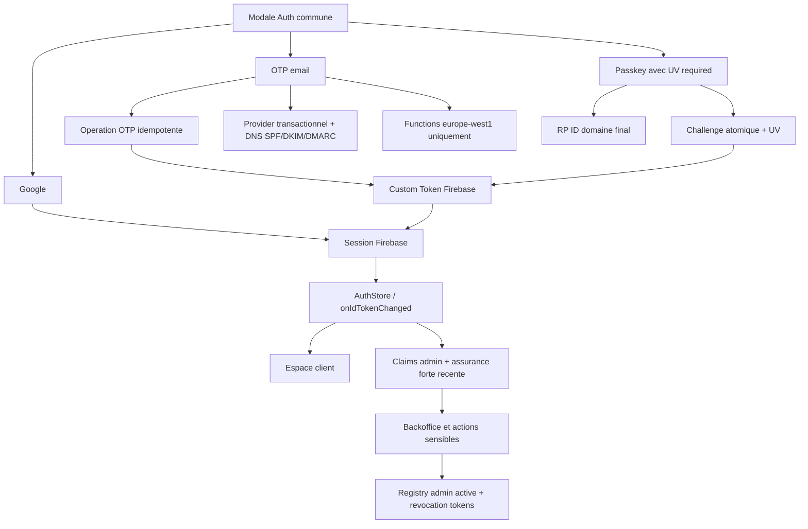

# Roadmap de hardening Auth vers la production

Date de creation: 2026-07-12  
Statut: `PREPROD_READY - PRODUCTION DIFFEREE`  
Branche de reference initiale: `main` au commit `f0b8331`  
Roadmap parente: [`AUTHENTICATION_ROBUSTNESS_ROADMAP_2026-07-11.md`](./AUTHENTICATION_ROBUSTNESS_ROADMAP_2026-07-11.md)  
Journal d'execution obligatoire: [`AUTH_PRODUCTION_HARDENING_PROGRESS_2026-07-12.md`](./AUTH_PRODUCTION_HARDENING_PROGRESS_2026-07-12.md)
Plan ferme de cloture de la passe Auth avant demonstration: [`AUTH_DEMO_PATCH_CLOSEOUT_PLAN_2026-07-13.md`](./AUTH_DEMO_PATCH_CLOSEOUT_PLAN_2026-07-13.md)

## 1. Role de ce document

Ce document est la specification d'implementation pour fermer les risques de production encore ouverts apres les phases Auth 0 a 3.

Il couvre sept chantiers imposes:

1. exiger la verification locale WebAuthn;
2. imposer une assurance forte pour l'administration tout en gardant une interface de connexion commune;
3. rendre la verification OTP et l'emission de session idempotentes;
4. terminer la revocation des administrateurs;
5. fixer le domaine final, l'AuthDomain et le RP ID;
6. converger toutes les Functions Auth vers `europe-west1`;
7. remplacer Gmail SMTP et separer le secret HMAC OTP, avec SPF, DKIM et DMARC.

La roadmap est normative. Le journal lie est factuel: aucune phase ne peut etre marquee terminee ici sans preuves inscrites dans le journal.

### 1.1 Cadre de livraison actuel

> L'idee est d'arriver a un etat pre-prod de presentation du site et que toutes les plus grosses fonctionnalites soient deja codees.

Cette cible distingue deux niveaux de fini:

- **preproduction de presentation**: parcours Auth complets et demonstrables sur le domaine sandbox, code de bascule Resend present mais inactif, securite serveur implementee, tests automatises verts et aucun blocage majeur hors dependances de livraison;
- **production sur domaine client**: domaine final, AuthDomain, RP ID, nouvelles passkeys, SPF/DKIM/DMARC, delivrabilite Resend, retrait Gmail, suppression des copies regionales legacy et recette cliente.

L'absence de domaine final ne doit donc pas bloquer le codage des grosses fonctionnalites ni le closeout de preproduction. Elle interdit seulement de declarer H5, H7 et H8 `VALIDEE_PRODUCTION`.

## 2. Etat de depart verifie

### 2.1 Socle conserve

- Firebase Auth reste le moteur de session.
- `AuthStore` reste l'unique observateur applicatif via `onIdTokenChanged()`.
- OTP et passkey retournent un Firebase Custom Token, ensuite echange avec `signInWithCustomToken()`.
- les autorisations restent fondees sur les Custom Claims, les Security Rules et les verifications serveur;
- App Check reste obligatoire sur les callables Auth publiques;
- les routes publiques Next restent statiques/ISR selon `NEXT_NATIVE_ARCHITECTURE_BASELINE.md`;
- `/admin`, `/checkout`, `/wishlist` et `/mes-commandes` restent dynamiques.

### 2.2 Risques encore ouverts

| ID | Risque | Etat initial | Impact production |
| --- | --- | --- | --- |
| PH-UV | UV WebAuthn non exigee | `preferred` + `requireUserVerification: false` | assertion acceptee sans garantie PIN/biometrie |
| PH-ADMIN | OTP admin sans step-up fort | interface unifiee, `auth_time` seulement | operation admin sensible possible apres preuve email seule |
| PH-OTP | OTP consomme avant emission de session | transaction puis Auth Admin SDK | bon code perdu sur panne intermediaire |
| PH-REVOKE | revocation admin partielle | claims retires, refresh tokens conserves | ancienne session encore utilisable temporairement |
| PH-DOMAIN | domaine/RP ID final inconnu | hostname `hosted.app` | credentials sandbox non migrables |
| PH-REGION | deux regions Auth publiees | `us-central1` + `europe-west1` | double surface, logs et correctifs ambigus |
| PH-MAIL | Gmail et secret reutilise | SMTP Gmail + mot de passe comme HMAC | disponibilite, rotation et delivrabilite fragiles |

### 2.3 Preuves initiales

- quatre suites contractuelles Auth passent: AuthStore `4/4`, OTP `3/3`, passkey client `4/4`, passkey serveur `7/7`;
- la suite claims admin echoue au chargement, car son mock ne fournit pas `functions.runWith()`;
- l'audit local phase 0 identifie encore `AUTH-000` comme bloqueur de production;
- le client cible `europe-west1`, mais `regionalFunctions()` publie aussi `us-central1`;
- Identity Platform n'est pas active et aucun MFA Firebase natif n'est prouve.

## 3. Principes non negociables

### 3.1 Separation authentification / autorisation / assurance

- authentification: prouver l'identite et obtenir une session Firebase;
- autorisation: verifier les claims `admin` et `superAdmin`;
- assurance: verifier comment et quand l'utilisateur s'est authentifie.

Un claim admin seul n'est pas une preuve de connexion forte recente. Un `auth_time` recent apres OTP ne suffit pas non plus.

### 3.2 Interface commune, politiques distinctes

La modale peut rester unique pour clients et administrateurs. La politique serveur doit cependant imposer un step-up fort avant:

- ouverture effective du backoffice;
- ajout ou retrait d'un administrateur;
- exports utilisateurs;
- remboursements, actions Stripe ou changements de configuration;
- toute operation marquee sensible dans la matrice d'autorisation.

### 3.3 Fallback et recuperation

- le fallback email reste disponible pour recuperer un compte client;
- une erreur Windows Hello ne doit jamais bloquer le retour a l'OTP;
- la recuperation d'un compte admin ne doit pas contourner le step-up;
- aucune suppression de credential ou d'ancienne Function ne se fait sans preuve d'absence de trafic.

### 3.4 Secrets et traces

- aucun OTP, token, mot de passe, credential WebAuthn ou secret DNS dans Git ou les documents;
- les preuves ne conservent que des hash, UID tronques, timestamps, codes d'erreur et identifiants d'operation non sensibles;
- les secrets vivent dans Secret Manager et sont references par nom;
- les fichiers locaux de test restent ignores et ne sont jamais joints aux closeouts.

## 4. Architecture cible



## 5. Ordre des phases

| Phase | Sujet | Priorite | Dependances | Peut commencer sans domaine final |
| --- | --- | --- | --- | --- |
| H0 | Baseline, tests et contrats | P1 | aucune | oui |
| H1 | Verification locale passkey obligatoire | P1 | H0 | oui, sur sandbox |
| H2 | Step-up et assurance admin | P1 | H1 | oui |
| H3 | OTP idempotent et secret dedie | P1 | H0 | oui |
| H4 | Revocation admin complete | P1 | H2 | oui |
| H5 | Domaine final, AuthDomain et RP ID | P1 gate | achat/decision client | non |
| H6 | Convergence regionale | P1 | H3/H4 stables | oui |
| H7 | Email transactionnel et DNS | P1 | H5 pour DNS final | preparation oui |
| H8 | E2E, observabilite et closeout production | P1 | H1 a H7 | non |

H2 et H3 peuvent etre developpees en parallele apres H1. H5 reste en pause documentee tant que le domaine n'est pas achete.

## 6. Phase H0 - Baseline et contrats executables

Statut d'execution: `VALIDEE_SANDBOX` le 2026-07-13. Preuves: [`AUTH_H0_BASELINE_CONTRACTS_CLOSEOUT_2026-07-13.md`](./AUTH_H0_BASELINE_CONTRACTS_CLOSEOUT_2026-07-13.md).

### Objectif

Rendre les tests capables de detecter une regression reelle avant de durcir les flux.

### Actions

1. Reparer `tests/auth-claims.test.cjs`:
   - ajouter un mock `runWith()` qui retourne l'objet Functions chaine;
   - conserver les mocks `auth.user().onCreate()`;
   - verifier les appels `setCustomUserClaims()` et les ecritures Firestore.
2. Ajouter un runner unique, par exemple `test:auth`, qui execute:
   - claims admin;
   - AuthStore;
   - OTP;
   - passkey client;
   - passkey serveur.
3. Ajouter des tests comportementaux avec mocks Firebase Admin pour les transitions d'etat OTP et revocation.
4. Capturer la baseline avant changement:
   - versions Node/Firebase CLI;
   - fonctions et regions deployees;
   - resultats tests;
   - latences OTP/passkey existantes;
   - etat Git et commit de depart.
5. Definir les fixtures sans donnees personnelles reelles.

### Fichiers principaux

- `tests/auth-claims.test.cjs`;
- `tests/auth-store-contract.test.cjs`;
- `tests/auth-unified-otp-contract.test.cjs`;
- `tests/passkey-server-hardening.test.cjs`;
- `package.json`;
- journal de progression lie.

### Gate H0

- toutes les suites Auth demarrent et passent;
- aucun test ne se limite a verifier une chaine pour les transitions critiques;
- baseline datee inscrite dans le journal;
- aucun secret dans les sorties.

### Rollback

H0 ne change pas le runtime. Revenir uniquement sur les tests fautifs si un mock masque un comportement reel.

## 7. Phase H1 - User Verification WebAuthn obligatoire

Statut d'execution: `VALIDEE_SANDBOX` le 2026-07-13. Code, deploiement, nouvel enrollement Windows Hello, deconnexion/reconnexion, fallback OTP et synchronisation compte prouves. Closeout: [`AUTH_H1_PASSKEY_UV_CLOSEOUT_2026-07-13.md`](./AUTH_H1_PASSKEY_UV_CLOSEOUT_2026-07-13.md). La matrice multi-navigateurs reste obligatoire dans H8 avant validation production.

### Objectif

Garantir que toute creation et toute connexion passkey valident une verification locale par PIN, biometrie ou code appareil.

### Modifications serveur

Dans `functions/src/auth/passkeys.js`:

1. registration options:
   - `authenticatorSelection.userVerification = 'required'`;
   - conserver `residentKey` selon la strategie actuelle;
2. verification registration:
   - `requireUserVerification: true`;
3. authentication options:
   - `userVerification: 'required'`;
4. verification authentication:
   - `requireUserVerification: true`;
5. journaliser `uv=true/false` sans stocker la reponse WebAuthn complete;
6. retourner une erreur generique et traduite si l'authentificateur ne satisfait pas UV.

### Compatibilite

- Windows Hello avec PIN/biometrie: attendu compatible;
- Face ID/Touch ID: attendu compatible;
- cle physique sans PIN: doit etre refusee;
- cle FIDO2 avec PIN: peut etre acceptee;
- authentificateur distant/QR: accepte uniquement s'il retourne UV;
- credential sandbox existante: peut continuer si elle supporte UV, sinon re-enrolement necessaire.

### UX

- conserver l'entree `Connexion rapide sur cet appareil` uniquement apres activation locale;
- message d'erreur: `Confirmez votre identite avec Windows Hello, Face ID ou le code de votre appareil.`;
- bouton de repli: `Recevoir un code par email`;
- ne pas relancer automatiquement une ceremonie annulee.

### Tests obligatoires

- contrat serveur verifiant les quatre valeurs `required/true`;
- assertion avec flag UV absent: refus;
- assertion avec UV present: succes;
- challenge expire, challenge rejoue et mauvais RP ID: refus;
- test physique Windows Hello creation + deconnexion + reconnexion;
- Chrome, Edge et Brave sur Windows;
- Safari/iOS ou macOS si disponible avant promesse multi-plateforme.

### Deploiement

1. deployer les Functions `europe-west1` et, tant que H6 n'est pas terminee, les copies historiques;
2. deployer le client si le texte UX change;
3. surveiller taux `NotAllowedError`, `InvalidStateError` et refus UV;
4. garder OTP disponible pendant le rollout.

### Gate H1

- serveur refuse toute assertion sans UV;
- recette Windows Hello concluante;
- fallback OTP prouve;
- aucune boucle de popup;
- preuve inscrite dans le journal.

### Rollback

Revenir temporairement a l'ancienne version uniquement si un navigateur supporte annonce a tort UV. Le rollback doit etre date, limite au sandbox et rouvrir H1; il ne constitue pas une acceptation production.

## 8. Phase H2 - Assurance forte et step-up administrateur

Statut d'execution: `VALIDEE_SANDBOX` le 2026-07-13. Claims AAL, helpers serveur, callables sensibles, Rules Firestore/Storage, barriere `/admin`, rollout App Hosting et recette Windows Hello sont valides. Closeout: [`AUTH_H2_ADMIN_STEP_UP_CLOSEOUT_2026-07-13.md`](./AUTH_H2_ADMIN_STEP_UP_CLOSEOUT_2026-07-13.md). La preuve MFA du compte Google proprietaire reste une condition de validation production H8.

### Objectif

Garder une interface de connexion commune tout en empechant un OTP email seul d'autoriser une action administrative sensible.

### Niveaux d'assurance cibles

| Niveau | Methodes | Usage permis |
| --- | --- | --- |
| AAL1 | OTP email | espace client, commandes, wishlist, recuperation |
| AAL2 | passkey avec UV ou Google avec politique MFA du compte | backoffice et actions sensibles |
| AAL2 recent | AAL2 avec preuve de moins de 15 minutes | ajout/retrait admin, export, remboursement, secrets/configuration |

Les noms AAL1/AAL2 sont des niveaux internes inspires des concepts d'assurance; ils ne constituent pas une certification NIST.

### Claims et session

Ajouter des claims de session courts et explicites lors de l'emission d'un Custom Token passkey:

```text
authMethod: passkey
authAssurance: aal2
userVerified: true
```

Pour OTP:

```text
authMethod: email_otp
authAssurance: aal1
```

Ne jamais attribuer ces valeurs depuis le client. Elles doivent etre emises par Admin SDK apres verification serveur.

Pour Google, verifier `firebase.sign_in_provider == 'google.com'`. La presence reelle d'un MFA sur le compte Google est une politique d'exploitation du compte proprietaire et doit etre prouvee manuellement.

### Controle serveur

Creer dans `functions/helpers/security.js`:

- `getAuthAssurance(context)`;
- `checkStrongAdmin(context)`;
- `checkRecentStrongAdmin(context, maxAgeSeconds = 900)`.

La verification doit exiger:

1. `context.auth` present;
2. claim `admin` ou `superAdmin`;
3. methode forte reconnue;
4. `auth_time` recent pour les operations sensibles;
5. registry admin active de H4 lorsqu'elle sera disponible.

### Parcours UI

1. l'admin peut ouvrir la modale commune;
2. OTP ouvre l'espace client mais pas le backoffice sensible;
3. si l'utilisateur possede des claims admin avec AAL1:
   - afficher `Confirmez votre identite pour ouvrir l'administration`;
   - proposer passkey UV ou Google;
4. apres step-up reussi, rafraichir l'ID Token et les claims dans AuthStore;
5. retourner a `/admin` sans perdre le contexte.

### Perimetre serveur initial

Appliquer `checkRecentStrongAdmin()` au minimum a:

- `addAdminUser`;
- `removeAdminUser`;
- `syncSuperAdminClaim` apres bootstrap initial controle;
- exports et listes utilisateurs detaillees;
- remboursements et operations Stripe sensibles;
- changements de configuration ou de secrets.

### MFA

- court terme: passkey UV ou Google avec MFA imposee sur le compte Google proprietaire;
- moyen terme: evaluer Identity Platform/TOTP;
- ne pas annoncer MFA Firebase tant qu'Identity Platform n'est pas active et testee;
- documenter le parcours de recuperation du proprietaire.

### Tests obligatoires

- admin + OTP + action sensible: refusee;
- admin + OTP + espace client: autorise;
- admin + passkey UV recente: autorise;
- admin + passkey ancienne de plus de 15 minutes: step-up requis;
- client non admin + passkey UV: refuse par autorisation;
- claim admin retire: refuse;
- UI ne boucle pas entre `/admin` et la modale.

### Gate H2

- aucune action sensible ne repose uniquement sur `admin=true` et `auth_time`;
- OTP admin ne donne pas AAL2;
- step-up passkey et Google prouves;
- politique MFA proprietaire documentee.

### Rollback

Le rollback ne doit jamais supprimer le controle admin. En cas de panne passkey, basculer temporairement le step-up vers Google, pas vers OTP seul.

## 9. Phase H3 - OTP idempotent et secret cryptographique dedie

Statut d'execution: `VALIDEE_SANDBOX` le 2026-07-13. Secret HMAC dedie, machine d'etat reprenable, tests de pannes/concurrence, deploy dans les deux regions et recette OTP reelle sont valides. Closeout: [`AUTH_H3_OTP_IDEMPOTENCY_SECRET_CLOSEOUT_2026-07-13.md`](./AUTH_H3_OTP_IDEMPOTENCY_SECRET_CLOSEOUT_2026-07-13.md).

### Objectif

Permettre la reprise d'une verification OTP valide lorsqu'une panne survient apres consommation logique du code mais avant creation complete de la session.

### Secret dedie

Creer dans Secret Manager:

- `OTP_HMAC_SECRET` avec au moins 32 octets aleatoires;
- acces limite aux Functions OTP;
- versionnage et procedure de rotation.

Le mot de passe du provider email ne doit plus servir a calculer `hashOtp()`.

### Machine d'etat

Document d'operation propose:

```text
sys_ratelimit/customer_login_operation_<hash(email + challengeId)>
```

Champs minimaux:

```text
emailHash
responseHash
uid
status: active | verified | provisioning | token_issued | failed_retryable | failed_final
retryCount
createdAt
verifiedAt
updatedAt
expiresAtMillis
expireAt
```

Ne jamais stocker le Custom Token.

### Sequence cible

1. verifier OTP, expiration, tentatives et hash dans une transaction;
2. faire passer l'operation de `active` a `verified` atomiquement;
3. supprimer `otpHash` et marquer le challenge consomme;
4. executer `getOrCreateCustomerUser(email)` de facon idempotente;
5. enregistrer `uid` et `provisioning`;
6. creer le Custom Token;
7. marquer `token_issued`;
8. si l'appel client est rejoue avec le meme `responseHash` dans la fenetre autorisee, reminter un token une seule fois sans recreer le compte;
9. si la reponse differe, refuser.

### Fenetres de panne a traiter

| Panne | Etat attendu | Reprise |
| --- | --- | --- |
| avant transaction | `active` | verification normale |
| apres verification, avant user | `verified` | provisionner user |
| apres user, avant token | `provisioning` + UID | reminter token |
| apres token, avant reponse HTTP | `token_issued` | une reprise bornee |
| reponse differente | etat inchange | refus generique |

### Cohérence utilisateur/admin

- un utilisateur existant conserve ses roles Firestore et Custom Claims;
- `role: client` n'est ecrit que lors d'une creation reelle;
- le trigger admin peut promouvoir un nouvel utilisateur configure;
- H2 doit traiter la course de propagation des claims avant l'acces admin.

### Tests obligatoires

- deux appels concurrents avec le meme OTP;
- panne simulee de `createUser`;
- panne simulee de `createCustomToken`;
- reprise avec meme hash;
- reprise avec hash different;
- expiration de l'operation;
- maximum de reprises;
- OTP invalide et tentatives maximales;
- verification qu'aucun token n'est persiste.

### Gate H3

- aucune panne intermediaire ne force un nouvel email si l'operation est reprenable;
- secret Gmail absent de `hashOtp()`;
- TTL reel active sur les operations;
- tests de concurrence verts.

### Rollback

Conserver la lecture des anciens documents OTP pendant une fenetre courte. Ne jamais revenir au partage du secret Gmail; si le nouveau secret est indisponible, bloquer l'envoi avec une erreur de configuration explicite.

## 10. Phase H4 - Revocation administrateur complete

### Objectif

Faire disparaitre les droits administrateur du serveur, des Rules et des sessions renouvelables de facon deterministe.

### Sequence de revocation

1. verifier `checkRecentStrongAdmin()`;
2. interdire la revocation du proprietaire configure;
3. ecrire une entree d'audit `admin.revoke_started`;
4. rendre le registry admin inactif;
5. retirer `admin` et `superAdmin` des Custom Claims;
6. appeler `admin.auth().revokeRefreshTokens(targetUid)`;
7. mettre a jour le profil `users/{uid}` sans supprimer l'historique metier;
8. supprimer/archiver la whitelist active;
9. ecrire `admin.revoke_completed` avec resultat de chaque sous-etape;
10. notifier les onglets clients via expiration normale et forcer un refresh lors de la prochaine action.

### Refus immediat dans Firestore

Les ID Tokens deja emis peuvent rester valides jusqu'a leur expiration. Pour les donnees admin critiques, ajouter un registry adresse par UID, par exemple:

```text
sys_admin_access/{uid}
active: true|false
role: admin|owner
updatedAt
revokedAt
```

Faire evoluer `isArtisan()` dans `firestore.rules` pour exiger:

- claim admin/superAdmin;
- document registry actif.

Mesurer le cout de lecture Rules et verifier les limites d'appels `get()` par requete.

### Erreurs partielles

- revocation claims reussie mais registry echoue: garder registry inactif en premiere operation;
- registry inactif mais revoke token echoue: droits Rules deja coupes, retry serveur necessaire;
- audit echoue: ne pas annuler la revocation, journaliser dans Cloud Logging et alerter.

### Tests obligatoires

- retrait admin coupe immediatement une lecture Firestore admin;
- refresh token revoque;
- ancien ID Token refuse par les callables qui verifient le registry;
- utilisateur redevient client sans perte de commandes;
- proprietaire impossible a revoquer;
- double revocation idempotente;
- echec partiel repris sans restaurer les droits.

### Gate H4

- claims, registry et refresh tokens convergent vers l'etat revoque;
- preuve Rules + callable + nouvelle session;
- audit complet et sans secret.

### Rollback

Restaurer un admin est une nouvelle action forte et auditee. Ne jamais reactiver automatiquement un compte parce qu'une sous-etape de revocation a echoue.

## 11. Phase H5 - Domaine final, AuthDomain et RP ID

### Statut initial

`BLOQUEE_PRODUCTION - DOMAINE NON ACHETE`.

Ce blocage n'empeche pas la preproduction de presentation sur `hosted.app`. Il reporte uniquement la fixation du RP ID, le reenrolement des passkeys et les preuves de livraison finale.

### Decisions obligatoires

- domaine apex, par exemple `secondevie.fr`;
- hostname canonique, par exemple `www.secondevie.fr`;
- domaine d'authentification same-site si retenu;
- RP ID, generalement le domaine apex;
- origines exactes sandbox et production;
- separation ou non des projets Firebase sandbox/prod.

### Regles WebAuthn

- RP ID ne contient ni protocole ni port;
- `expectedOrigin` contient protocole + hostname + port eventuel;
- une credential `hosted.app` n'est pas migrable vers le domaine final;
- toutes les passkeys sandbox sont explicitement jetables;
- production n'accepte aucune wildcard d'origine.

### Configuration a mettre a jour

- DNS et App Hosting custom domain;
- `NEXT_PUBLIC_SITE_URL`;
- `PASSKEY_ALLOWED_ORIGINS`;
- Firebase Auth Authorized Domains;
- Google OAuth Authorized JavaScript Origins et Redirect URIs;
- `authDomain` Firebase selon la strategie same-site;
- App Check domaines/cles;
- liens email et politiques legales;
- monitoring par hostname.

### Migration passkey

1. figer la date de bascule;
2. marquer toutes les credentials sandbox comme non-production;
3. ne pas copier les cles publiques vers le nouveau RP ID comme si elles restaient valides;
4. demander un nouvel enrolement apres connexion OTP/Google sur le domaine final;
5. conserver le fallback email pendant toute la migration;
6. purger les passkeys sandbox seulement apres preuves et sauvegarde metadonnees non sensibles.

### Tests obligatoires

- inscription et assertion sur domaine final;
- refus depuis origine sandbox avec credential production;
- refus mauvais RP ID;
- Google popup et redirect iOS/PWA;
- App Check valide;
- cookies/storage et persistence apres reload;
- canonical/HTTPS/HSTS sans boucle.

### Gate H5

- domaine et RP ID signes dans une decision datee;
- OAuth, AuthDomain et App Check verifies;
- passkeys production recreees;
- aucun vrai client inscrit sur RP ID provisoire.

### Rollback

Le DNS peut revenir vers l'ancien backend, mais une passkey ne change pas de RP ID. Le fallback OTP/Google est donc le mecanisme de reprise obligatoire.

## 12. Phase H6 - Convergence Functions vers europe-west1

### Objectif

Supprimer la double surface Auth `us-central1` apres preuve que tout le trafic legitime cible `europe-west1`.

### Inventaire

Lister explicitement pour chaque region:

- nom de Function;
- generation et runtime;
- revision/deploiement;
- variables et secrets;
- App Check;
- trafic, erreurs et latence sur au moins sept jours;
- clients connus.

### Migration code

1. remplacer `FUNCTION_REGIONS` par la seule region primaire;
2. conserver `NEXT_PUBLIC_FIREBASE_FUNCTIONS_REGION=europe-west1`;
3. verifier tous les `httpsCallable()` et endpoints HTTP directs;
4. deployer `europe-west1` avec la version finale H1-H4;
5. comparer secrets/configuration;
6. observer une periode de soak;
7. supprimer chaque Function `us-central1` avec une liste explicite;
8. verifier qu'aucun client ne retombe vers l'ancienne region.

### Interdictions

- aucune suppression en masse;
- aucune suppression avant lecture des metriques;
- ne pas confondre `PUBLIC_CATALOG_REGION` et la region Auth;
- ne pas supprimer une Function trigger sans verifier sa region et son mecanisme de livraison.

### Tests obligatoires

- OTP send/verify europe-west1;
- passkey generate/verify europe-west1;
- App Check valide/invalide;
- absence d'appel us-central1 dans les traces navigateur;
- liste cloud ne contenant plus les copies Auth historiques;
- alertes et dashboards recalibres.

### Gate H6

- zero trafic legitime us-central1 pendant la fenetre choisie;
- suppressions explicites reussies;
- client et docs alignes sur europe-west1;
- rollback documente.

### Rollback

Redeployer une Function precise dans l'ancienne region uniquement si un client non inventorie est bloque. Ouvrir alors un incident et une date de retrait definitive.

## 13. Phase H7 - Provider email transactionnel et DNS

Statut d'execution: `PREPROD_CODE_READY` le 2026-07-13. Resend est retenu, le compte est cree, `RESEND_API_KEY` est coffre dans Google Secret Manager et tous les flux transactionnels utilisent le meme runtime configurable. Gmail reste actif tant que le domaine expediteur et les preuves DNS/delivrabilite ne sont pas disponibles. Closeout intermediaire: [`AUTH_H7_TRANSACTIONAL_EMAIL_PREPROD_CLOSEOUT_2026-07-13.md`](./AUTH_H7_TRANSACTIONAL_EMAIL_PREPROD_CLOSEOUT_2026-07-13.md).

### Objectif

Decoupler l'authentification de la boite Gmail personnelle et obtenir une delivrabilite observable sur le domaine final.

### Choix provider

Decision du 2026-07-13: **Resend** est retenu pour le lancement, principalement pour son offre gratuite adaptee au faible volume initial, son API HTTP simple, ses cles d'idempotence conservees 24 heures et sa verification SPF/DKIM par domaine. La validation DPA/RGPD, la localisation de traitement et les engagements de service restent une gate de production, pas une hypothese acquise.

Comparer au minimum:

- Postmark;
- Resend;
- SendGrid ou Mailgun;
- service Google adapte si une contrainte cliente l'impose.

Criteres:

- region et traitement des donnees;
- DPA/RGPD;
- SLA et quotas;
- API idempotente;
- webhooks livraison/bounce/complaint;
- templates versionnes;
- cout sandbox et production;
- rotation de cle et sous-comptes.

### Architecture

- secret `RESEND_API_KEY` dans Secret Manager;
- secret `OTP_HMAC_SECRET` independant;
- parametre `TRANSACTIONAL_EMAIL_PROVIDER`, valeur par defaut `gmail`;
- parametre `RESEND_FROM_EMAIL`, vide tant que le domaine expediteur n'est pas verifie;
- adaptateur commun sans dependance au provider dans les logiques OTP, commande, remboursement et statut de livraison;
- timeout court, retry borne et identifiant idempotent;
- correlation ID non sensible;
- aucune valeur OTP dans les logs;
- webhook signe pour livraison/bounce;
- suppression ou quarantaine des adresses en hard bounce selon politique.

### DNS

- SPF limitant les emetteurs autorises;
- DKIM avec selecteurs fournis par le provider;
- DMARC demarrant en observation `p=none`, puis `quarantine`, puis `reject` apres analyse;
- domaine de retour/bounce aligne si possible;
- verification d'alignement SPF/DKIM;
- rapports DMARC envoyes vers une adresse exploitee;
- aucun enregistrement duplique depassant les limites DNS SPF.

### Templates et UX

- nom expediteur stable;
- objet sans information sensible;
- code lisible et copiable;
- expiration explicite;
- message anti-fraude;
- lien vers le domaine final;
- versions texte et HTML;
- locale francaise validee.

### Tests obligatoires

- livraison Gmail, Outlook et Apple/iCloud si possible;
- SPF/DKIM pass;
- DMARC aligne;
- bounce webhook signe;
- provider indisponible;
- timeout et retry sans double email excessif;
- rotation de cle;
- OTP non present dans Cloud Logging.

### Gate H7

- Gmail App Password retire des Functions Auth;
- secret HMAC separe;
- provider et DNS valides;
- taux livraison et latence mesures;
- runbook incident email disponible.

### Gate intermediaire H7-PREPROD

La partie email est prete pour la presentation client lorsque:

- le compte Resend et le secret `Sending access` existent sans secret dans le depot;
- Gmail reste le provider actif par defaut;
- la selection du provider est centralisee et refuse une configuration Resend incomplete;
- OTP Auth, OTP checkout, commandes, remboursements, expedition, livraison et diagnostic utilisent le meme runtime;
- chaque envoi Resend potentiel possede une cle d'idempotence stable et non sensible;
- les tests locaux de contrat sont verts;
- la demonstration cliente continue d'utiliser Gmail pour les OTP et les autres e-mails reels;
- un test canari technique Resend peut etre effectue avant le domaine avec `onboarding@resend.dev`, mais uniquement vers l'adresse associee au compte Resend; il ne prouve ni la delivrabilite client ni le domaine expediteur final;
- aucune bascule globale vers Resend et aucun envoi Resend vers des clients ne sont effectues avant verification du domaine.

### Decision de preproduction sur le domaine expediteur

- l'URL App Hosting `secondevie-next-sandbox--secondevienextjsssr.europe-west4.hosted.app` reste le domaine de demonstration du site;
- elle ne peut pas servir de domaine expediteur Resend, car la zone DNS `hosted.app` appartient a Google et le projet ne peut pas y publier les enregistrements SPF/DKIM/DMARC demandes par Resend;
- la presentation cliente conserve donc Gmail comme provider actif et fonctionnel;
- Resend reste code, coffre et desactive par configuration, sans changement d'UI ni du parcours de connexion;
- apres acquisition du domaine final, un domaine ou sous-domaine expediteur controle par le projet sera verifie dans Resend, puis la bascule suivra le runbook canari et rollback;
- Gmail ne sera retire qu'apres validation de la delivrabilite Resend sur les destinations cibles.

### Rollback

Conserver temporairement un adaptateur secondaire desactive par configuration. Tout fallback doit utiliser son propre secret provider et ne jamais reutiliser le secret HMAC.

## 14. Phase H8 - Validation integree et closeout production

Statut d'execution: `PREPROD_READY` le 2026-07-13. Le closeout de presentation est documente dans [`AUTH_H8_PREPROD_CLOSEOUT_2026-07-13.md`](./AUTH_H8_PREPROD_CLOSEOUT_2026-07-13.md). La validation production reste ouverte pour H5, H6, H7 et les preuves finales dependantes du domaine.

### Matrice fonctionnelle

| Parcours | Chrome | Edge | Brave | Safari/iOS | Attendu |
| --- | --- | --- | --- | --- | --- |
| OTP nouveau client | requis | requis | requis | requis | compte + session |
| activation passkey | requis | requis | requis | selon disponibilite | UV obligatoire |
| reconnexion passkey | requis | requis | requis | selon disponibilite | header/menu coherents |
| fallback OTP | requis | requis | requis | requis | toujours accessible |
| admin OTP | requis | requis | requis | requis | espace client seulement |
| admin step-up | requis | requis | requis | requis | backoffice autorise |
| revocation admin | serveur | serveur | serveur | serveur | refus immediat |

### Tests negatifs

- App Check absent/invalide;
- origine inconnue;
- RP ID incorrect;
- assertion sans UV;
- challenge expire/rejoue;
- OTP incorrect/rejoue/concurrent;
- session admin AAL1;
- session admin ancienne;
- admin revoque;
- Function ancienne region;
- provider email indisponible.

### SLO initiaux a mesurer puis confirmer

- ouverture modale warm p95 <= 300 ms;
- Function OTP chaude p95 <= 800 ms hors livraison email;
- verification OTP + session p95 <= 1 500 ms;
- traitement serveur passkey chaud p95 <= 800 ms hors interaction humaine;
- restauration session warm p95 <= 700 ms;
- taux de succes hors annulation utilisateur >= 99 %;
- zero secret/OTP dans les logs.

Ces valeurs sont des objectifs initiaux. Elles doivent etre ajustees a partir de mesures reelles, jamais pour masquer une regression.

### Closeout final

Le closeout production doit contenir:

- commit et version deployee;
- domaine, AuthDomain, RP ID et origines;
- liste Functions et region;
- secrets references par nom seulement;
- resultats tests et matrice physique;
- preuves DNS;
- preuves App Check;
- procedure revocation et recuperation;
- dashboards, alertes et responsables;
- risques acceptes avec date de reexamen.

### Gate H8

- toutes les phases H1-H7 terminees ou risque formellement accepte;
- aucun P1 ouvert;
- journal de progression complet;
- validation proprietaire et recette cliente;
- plan de rollback teste.

### Gate intermediaire H8-PREPROD

La presentation client peut etre declaree prete lorsque:

- H0 a H4 sont `VALIDEE_SANDBOX`;
- H6 a prouve le routage europeen et conserve un rollback tant que le soak n'autorise pas la suppression US;
- le compte Resend, le secret et l'adaptateur sont prets, mais Gmail reste le transport actif;
- OTP, passkey, fallback, header/menu, espace client et step-up admin sont demonstrables sur la sandbox;
- la gate Auth automatisee, les tests negatifs sans dependance au domaine et un smoke de presentation sont verts;
- H5 et la partie DNS/delivrabilite de H7 sont explicitement reportees a la livraison du domaine;
- aucun statut `VALIDEE_PRODUCTION` n'est attribue par anticipation.

## 15. Regles de mise a jour du journal

Apres chaque action:

1. mettre a jour le statut de la phase;
2. ajouter une entree horodatee;
3. lister les fichiers et ressources cloud touches;
4. noter les commandes executees sans secret;
5. noter resultat, latence et erreurs;
6. lier la preuve locale ou Console;
7. inscrire le rollback disponible;
8. identifier la prochaine action exacte;
9. ne marquer `VALIDEE` qu'apres la gate complete.

Statuts autorises:

```text
NON_DEMARREE
EN_COURS
EN_VALIDATION
BLOQUEE
BLOQUEE_PRODUCTION
VALIDEE_SANDBOX
PREPROD_CODE_READY
PREPROD_VALIDATION_READY
PREPROD_READY
VALIDEE_PRODUCTION
ROLLBACK
```

## 16. Acces susceptibles d'etre demandes

- achat et gestion DNS du domaine;
- Firebase Console Auth/App Check/Identity Platform;
- Google Cloud Console Functions, Logs, Secret Manager et Firestore TTL;
- compte provider email transactionnel;
- configuration Google OAuth;
- appareils physiques Windows Hello, iOS/macOS et navigateurs;
- validation MFA du compte proprietaire.

Les demandes d'acces doivent etre inscrites dans le journal avec le minimum de privilege requis.

## 17. Definition de fini globale

Le chantier est termine uniquement si:

- toute passkey de production exige UV;
- un OTP admin seul ne permet aucune action sensible;
- OTP/session est reprenable apres panne intermediaire;
- la revocation admin coupe claims, registry et renouvellement;
- domaine final/RP ID/OAuth/AuthDomain/App Check sont coherents;
- les Functions Auth n'existent plus qu'en `europe-west1`;
- Gmail SMTP et le secret partage sont retires;
- SPF, DKIM et DMARC sont prouves;
- les tests claims, OTP, passkey et admin sont comportementaux et verts;
- le journal contient toutes les preuves et le closeout final.

## 18. Glossaire operationnel

- **UV / User Verification**: preuve que l'authentificateur a verifie localement l'utilisateur par PIN, biometrie ou code appareil.
- **UP / User Presence**: preuve plus faible qu'une personne a touche ou utilise l'authentificateur, sans verifier necessairement son identite.
- **Step-up**: nouvelle preuve forte demandee avant une operation sensible.
- **AAL**: niveau interne d'assurance de la session dans cette roadmap.
- **RP ID**: domaine auquel une credential WebAuthn est liee.
- **Origin**: protocole, hostname et port verifies pendant WebAuthn.
- **Idempotence**: capacite a rejouer une operation sans doublon ni incoherence.
- **Custom Token**: token court Admin SDK echange contre une session Firebase.
- **ID Token**: JWT Firebase utilise par Rules et Functions.
- **Refresh Token**: secret longue duree permettant de renouveler les ID Tokens.
- **SPF/DKIM/DMARC**: mecanismes DNS et cryptographiques d'authentification des emails.
- **Soak period**: periode d'observation avant retrait definitif d'une ancienne infrastructure.
